# Debugging

A debugger is an incredibly powerful tool you can use to help find issues with your code and fix them. It allows you to do step-by-step examination of your code, inspecting variable values at different points, and understanding how your code actually runs when it is executed.

## Setup

MacOS users will use a debugger called [lldb](https://lldb.llvm.org/) to debug their C++ code.

### 1. Make a hello_world.cpp

Copy this code into a new file called hello_world.cpp.

```cpp
#include <iostream>
using namespace std;

int main()
{
    string message = "Let's Debug!";
    cout << message << endl;
    return 0;
}
```

### 2. Install lldb

This is probably already installed on your computer. Lets double check and install it if we need to.

2-1: Open a terminal in vscode by clicking "Terminal > New Terminal" in your top bar.

2-2: In your terminal type 

```lldb```

If it is installed you will see something like below.

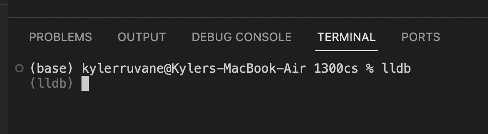

You can exit this program by typing 

```exit```

If it is not installed, your mac should prompt you if you want to install it. Say yes and go through the install. Verify it is installed by typing lldb in your terminal again and seeing the above screenshot.

### 3. Install VS Code Extension: CodeLLDB

Open the extensions tab on the left of VS Code and Search "CodeLLDB" and click install for the top result shown below.

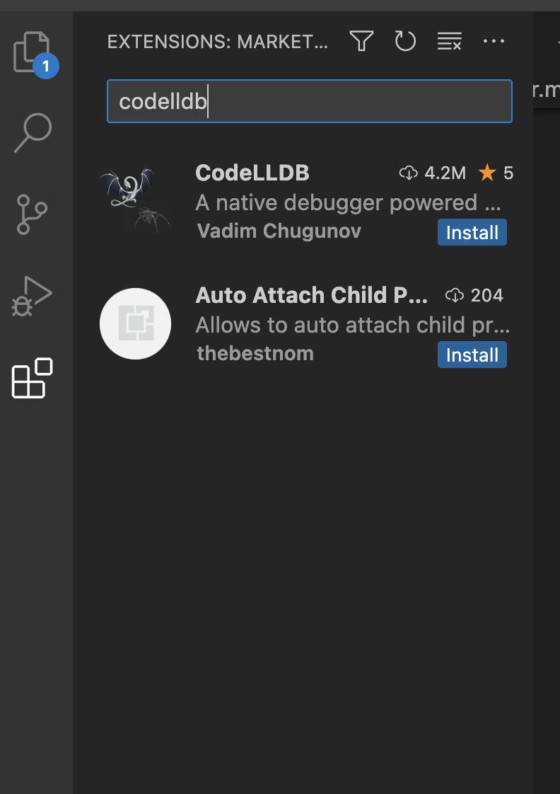

### 4. Click the 'Run and Debug' tab

If this is the first time you are using this tab, it will look like this 

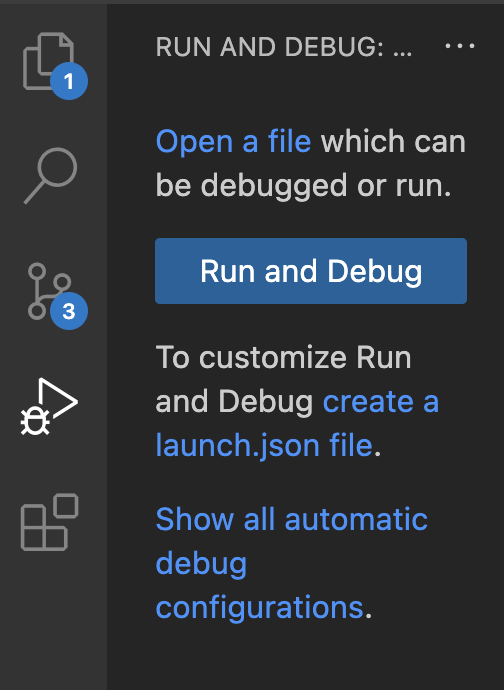

4-1: Press 'create a launch.json file'

4-2: Choose the second option 'LLDB' 

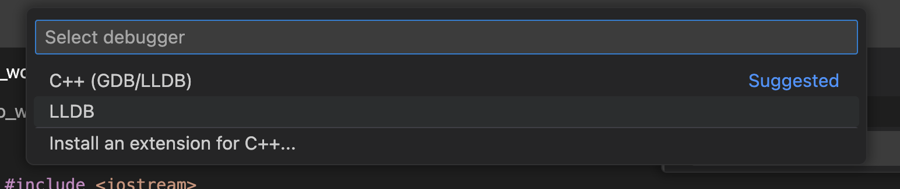

4-3: Replace launch.json

This should open a new file called launch.json.

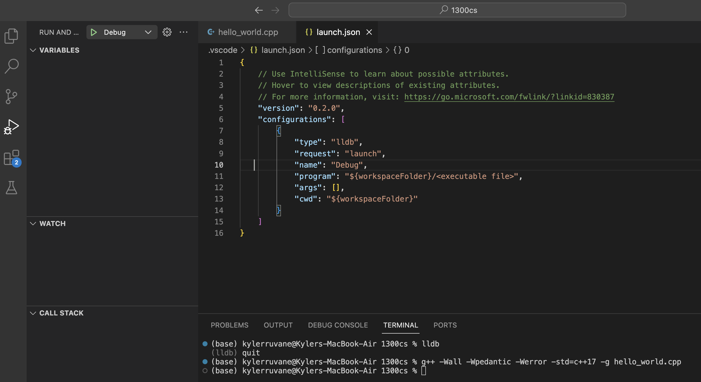

Delete everything in this file and replace it with

```json
{
    "version": "0.2.0",
    "configurations": [
        {
            "type": "lldb",
            "request": "launch",
            "name": "a.out debug",
            "program": "${workspaceFolder}/a.out",
            "args": [ ],
            "cwd": "${workspaceFolder}"
        }
    ]
}
```

Save the file with "Command + S" or "File > Save".

## Now Lets Debug

### 1. Add 'breakpoints' to your code

The red dot to the left of line 6 is a 'breakpoint'. Add your own by hovering your mouse just to the left of the line number you want to add a breakpoint to.

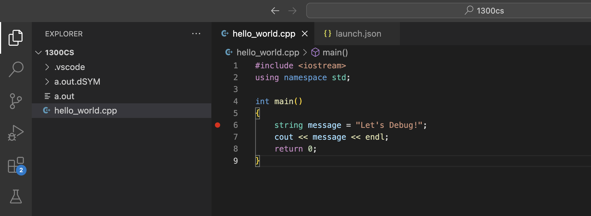

### 2. Compile it with -g

In your terminal type 

```g++ -Wall -Wpedantic -Werror -std=c++17 -g hello_world.cpp```

Note we have added the flag ```-g``` which tells the compiler to do extra stuff so we can debug the program. You should now see an a.out file and an a.out.dSYM folder.

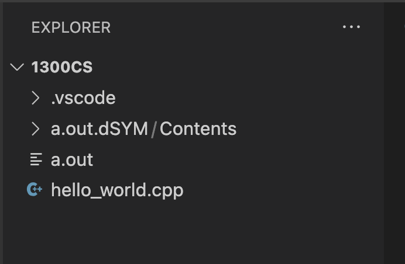

### 3. Press the 'Run and Debug' tab

This is the sideways triangle with a lady-bug on it.

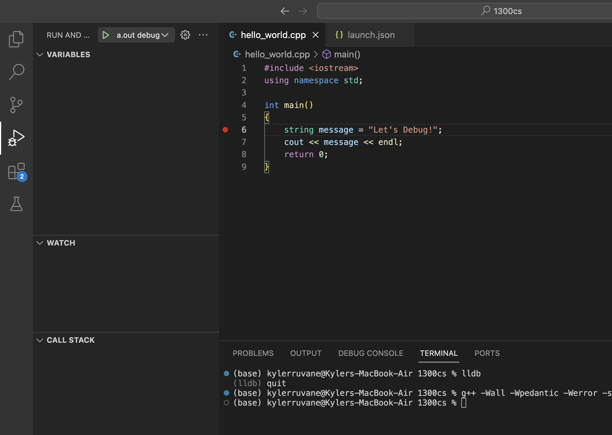

### 4. Press 'a.out debug' green triangle button

You are now debugging!

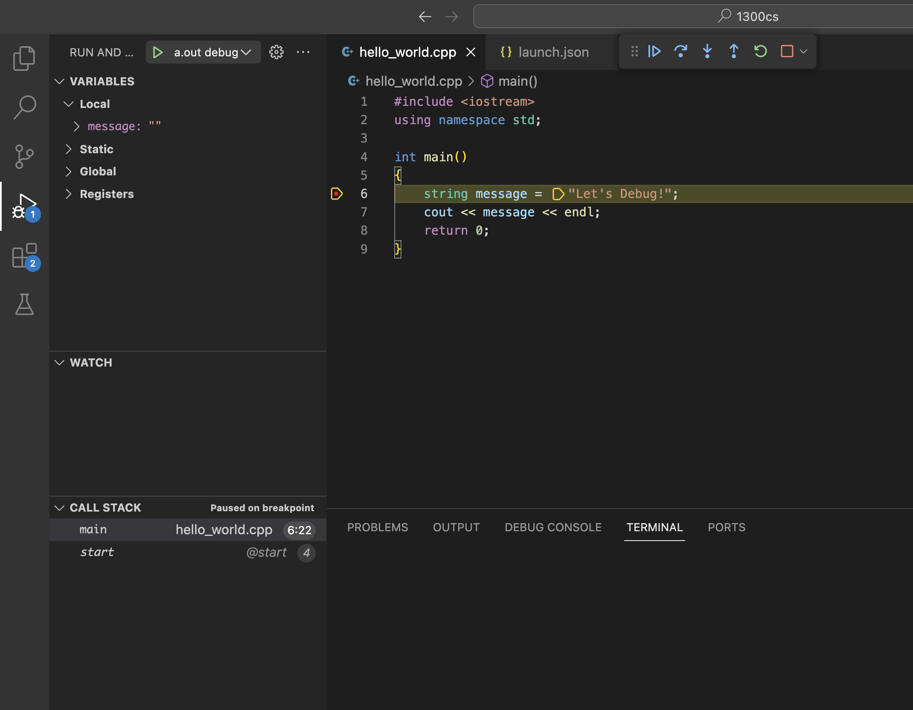

### 5. Control your program live

Your program will have paused at the first breakpoint it encountered, highlighting the line it is stuck on. Use the control panel to slowly walk through your code execution.

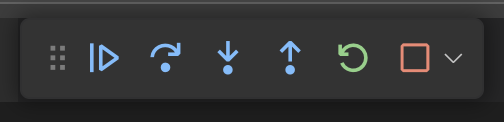

The buttons are

1. <b>Continue:</b> go until the next breakpoint is encountered
2. <b>Step Over:</b> go to the next line, skipping the details of functions
3. <b>Step Into:</b> go to the next line, if necessary jumping into a function that is called
4. <b>Step Out:</b> jump to the end of the function your are in, returning to wherever that function was called from
5. <b>Restart:</b> start the program over from the beginning
6. <b>Stop:</b> quit debugging

Most of the time you can do most of your debugging with just the Continue and the Step Over buttons as long as you have put breakpoints at all the points of your code you care about.

### 6. What should you look for?

The most important two pieces of information you get from debugging is 1. What lines of code are being executed when I run it and 2. What are the values of my variables during execution. 

For 1. you can see this in the main .cpp file with the active line being highlighted yellow. 

For 2. you can see this in the left panel where all of your in-scope variables will be listed with their value. You can see how their value changes as you step through the program execution.

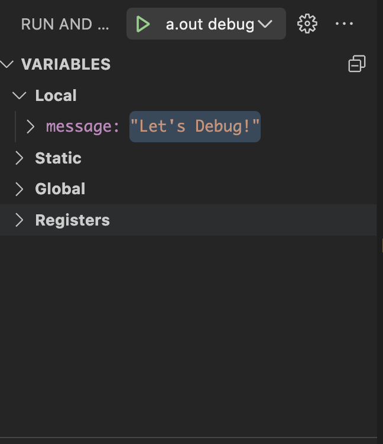