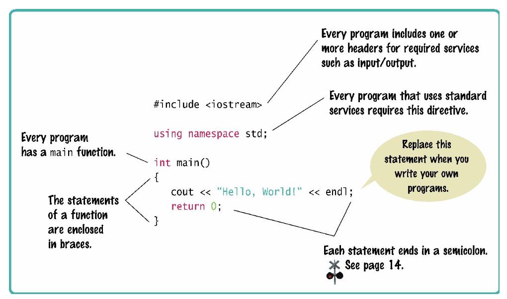
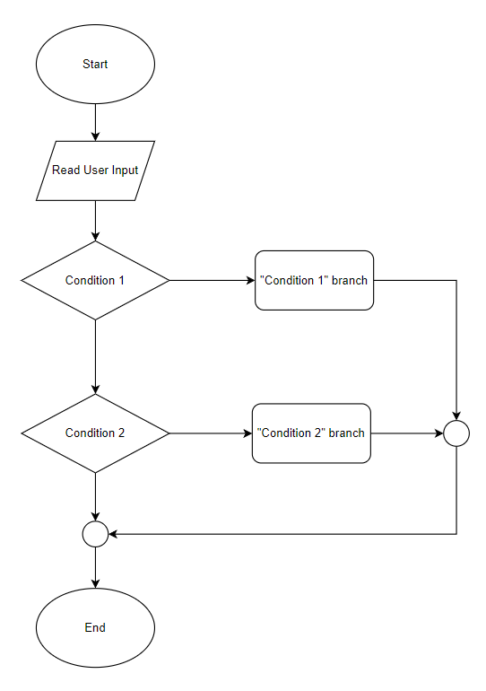
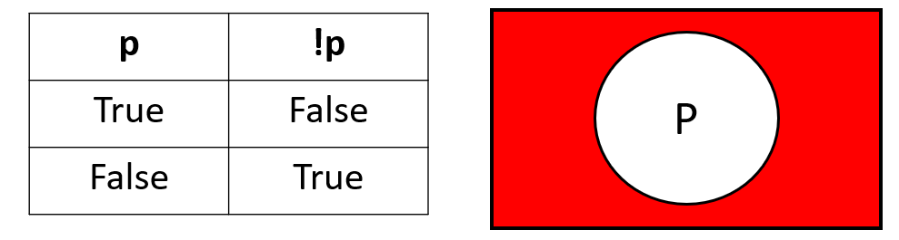

#### **CSCI 1300 CS1: Starting Computing: Midterm Guide**
#### **Naidu/Godley - Spring 2024**

# Table of contents

0. [Basic Structure of a Program](#basic_structure)
    1. [main() Function](#main_function)
1. [Pseudocode and Flowchart](#pseudocode_flowchart)
    1. [Pseudocode](#pseudocode)
    2. [Flowchart](#flowchart)
2. [Fundamental Data Types](#datatypes)
    1. [Variables](#variable)
    2. [Variable Types](#variable_types)
    3. [Constants](#constants)
    4. [Strings](#strings)
3. [Input and Output](#input_output)
4. [Arithmetic Operators](#arithmetic_operators)
5. [Decisions](#decisions)
    1. [Relational Operators](#relational_operators)
    2. [Logical Operators](#logical_operators)
    3. [Conditional Statements](#conditional_statement)
    4. [If Statements](#if_statements)
    5. [Switch Statements](#switch)
6. [Functions](#functions)
    1. [Syntax of Function](#syntax_function)
    2. [Function Call](#function_call)
    3. [Function Prototype](#function_prototype)
7. [Unit Testing](#testing)
    1. [Void Function Testing](#void_function_test)
    2. [Non-void Function Testing](#return_function_test)
    3. [Non-void Function Testing for Double](#double_function_test)
8. [While loop](#while)

## 0. The Basic Structure of a C++ Program <a name="basic_structure"></a>



*Brief C++ by Cay Horstmann*
*Copyright ©️ 2017 by John Wiley & Sons. All rights reserved.*

### 0.1 The `main()` Function in C++ <a name="main_function"></a>

- Every C++ program must contain a `main` function.
- The `main` function is called when the program starts and is the designated entry point to a program.

## 1. Pseudocode and Flowchart <a name="pseudocode_flowchart"></a>

### 1.1 Pseudocode <a name="pseudocode"></a>

Pseudocode is used to develop algorithms. An algorithm is a procedure for solving a problem.

An algorithm describes actions to be executed and the order in which those actions will be executed. In other words, an algorithm is merely the sequence of steps taken to solve a problem, like a recipe. An algorithm is not computer code. Algorithms are just the instructions that provide a clear path for you to write the computer code.

An algorithm for adding two numbers together:

```
print "How much water did you drink today? (in fl oz)"
Read user input intake
Compute remaining as goal (64) - intake
If intake <= 32:
      print "You’re very, very dehydrated! Get that water in! You have " + remaining + " fl oz left to drink."
Else if intake < 64:
      print "You’re doing great, but you’re still halfway to your goal! Get that water in! You have " + remaining + " fl oz left to drink."
Else if intake >= 64:
      print "You’ve hit your goal for the day! Great job getting hydrated!"
```

The main difference between an algorithm and a pseudocode is that an algorithm is a step-by-step procedure to solve a given problem, while a pseudocode is a method of writing an algorithm.

| **Algorithm**                                           | **Pseudocode**                                                                                          |
| ------------------------------------------------------- | ------------------------------------------------------------------------------------------------------- |
| An unambiguous specification of how to solve a problem. | An informal high-level description of the operating principle of a computer program or other algorithm. |
| It helps to simplify and understand the problem.           | A method of developing an algorithm.                                                                    |

Pseudocode is an informal language that helps programmers develop algorithms (or recipes). Although there are no hard and fast rules for pseudocode, there are some suggestions to help make pseudocode more understandable and easy to read.

For instance, consider indenting all statements showing a “dependency,” like statements that use: While, do, for, if.

Additionally, here are some common action keywords for pseudocode:
```
Input:		READ, OBTAIN, GET
Output:		PRINT, DISPLAY, SHOW
Compute:		COMPUTE, CALCULATE, DETERMINE
Initialize:		SET, INITIALIZE
Add one:		INCREMENT, BUMP
```

##### Example 1
```
If students grade is higher than or equal to 60
	Then Print, “Passed”
else
	Print, “Failed”
```

The above pseudocode would be used to develop the following C++ code.
C++ Source Code:
```cpp
if(grade > 60 || grade == 60)
{
	cout << “Passed” << endl;
}
else
{
	cout << “Failed” << endl;
}
```

##### Example 2
```
Set total to zero
initialize and type variables

While grade counter is less than or equal to ten
	Input the next grade score
	Add the grade score into the total
Set the class average to the total divided by ten

Print the class average.
```

C++ Source Code:
```cpp
double total = 0;
double grade = 1;
double score = 0;

while(grade <= 10)
{
    cout << “Enter a score: ”;
    cin >> score;
    cout << endl;
    total = total + score;
    grade++;
}

double average;
average = total / 10;
cout  << average;
```

### 1.2 flowchart <a name="flowchart"></a>

A flowchart shows the structure of decisions and tasks required to solve a problem. Some of the basic flowchart elements are shown in the following table.


##### Example



The simple example above shows a program that takes in a user input, checks the user input with an `if` and an `else if` statement, and terminates at the end.

## 2. Fundamental Data Types <a name="datatypes"></a>

### 2.1 Variables <a name="variable"></a>

A variable **stores** information that can change over time.

Variables have a **type**, an **identifier**, and a **value**.

In order for variable names to be valid, they must follow these guidelines:

1. Start with an underscore or an alphabet. The rest can be numbers, alphabets, or underscores.
2. Cannot consist of special characters (like $, %, #, etc.)
3. The names are case-sensitive, ie. `Celsius_value` is different from `celsius_value`.
4. Cannot use certain reserved words.

#### Syntax of a Variable

``` c++
type variable_name = value;
```

**Note**: The = symbol is the **assignment statement**. It stores a new value in a variable. It does not represent equality.

##### Example of a Variable

``` c++
int cat_age = 10;
```

### 2.2 Variables Types <a name="variable_types"></a>

When programming, we store the variables in our computer's memory, but the computer needs to know what kind of data we want to store in them since it is not going to occupy the same amount of memory to store a simple number as store a single letter or a large number, and they are not going to be interpreted the same way. Some commonly used data types in C++ are:

| Type  | Values they can store   | Example |
| --------- | ------------------------------------------------- | ----------------------------|
| `int` | Whole numbers. Can be positive or negative.| int my_int = 5;  |
| `float`   | Floating-point numbers (numbers with decimal points). Can be positive or negative. | float my_float = 4.4531; |
| `double`  | For double precision floating point numbers (numbers with decimal points). Can be positive or negative.   | double my_double = 4.4531; |
| `string`  | Character-based inputs. I.e. words and sentences.| string my_string = “Hello World”; |
| `char`| ASCII value ASCII value (from 0-127). I.e. characters | char my_char = 'c'; |
| `bool` |  They store the values `true` (1) or `false` (0).   They can be used to evaluate a logical condition in one part of a program.| bool my_bool = false; |

### 2.3 Constants <a name="constants"></a>

When a variable is defined with the reserved word `const`, its value can never change.

##### Example:
```
const int my_const_variable = 1;
```

### 2.4 Strings <a name="strings"></a>

We will take a closer look at strings, since they are one of the most used data types.

**What are strings?**

Many programs process text, not numbers. Text consists of characters: letters, numbers, punctuation, spaces, and so on.

A string is a **sequence of characters**. For example, the string `"Harry"` is a sequence of five characters.

1. Brief C++, Late Objects, 3e, Enhanced eText, n.d.

To create a new variable of type string, we follow the same syntax that we use for the other variable types, ie. `type identifier = value`. In the case of strings, we need to add double quotation marks to the characters that define the string. An example is shown next:

```cpp
string name = "Spongebob"
```

## 3. Input and Output <a name="input_output"></a>

In C++, one way we can achieve this exchange of information is by using **cout** (console out) and **cin** (console in) from the iostream library. Whenever you use **cout** or **cin**, you must include the **iostream** (input output stream) library and use the **std** (standard) namespace.

To provide a more readable and organized output, **endl** is often used. The **endl** manipulator is used to start a new line. It will allow the cursor to move to the beginning of the following line. See the example below.

##### Example Input (User input in **bold**)
```cpp
#include <iostream>
using namespace std;

int main()
{
   int number_1;
   int number_2;
   cout << "Please enter the first number:" << endl;
   cin >> number_1;
   cout << "Please enter the second number:" << endl;
   cin >> number_2;
   cout << "Sum of numbers: " << number_1 + number_2 << endl;
}
```
<pre>
Please enter the first number:
<b>1</b>
Please enter the second number:
<b>2</b>
Sum of numbers: 3
</pre>

## 4. Arithmetic Operators <a name="arithmetic_operators"></a>

| Symbol | Name                      | Functionality                                  | Example                   |
| ------ | ------------------------- | ---------------------------------------------- | ------------------------- |
| *    | Multiplication            | Multiplication between numbers.                | `4 * 5.1`                 |
| /    | Division                  | Division between numbers.                      | `0.4 / 5.9`               |
| +    | Addition                  | Addition between numbers.                      | `4.0 + 5`                 |
| -    | Subtraction               | Subtraction between numbers.                   | `4 - 5`                   |
| \%   | Modulus/modulo/mod        | Computes the remainder of an integer division. | `10 % 4`                   |
| ++   | Increment                 | Changes a variable by adding 1.              | `count++`                 |
| --   | Decrement                 | Changes a variable by subtracting 1.         | `count--`                 |
| +=   | Arithmetic and assignment | Shortcut for the operations + and =       | `total += price ` |

## 5. Decisions <a name="decisions"></a>

### 5.1 Relational Operators <a name="relational_operators"></a>

| Symbol   | Name                  | Functionality                                                                                             |
| -------- | --------------------- | --------------------------------------------------------------------------------------------------------- |
| `>`      | Greater than          | Returns `true`: `2 > 1`           |
| `>=`     | Greater than or equal | Returns `true`: `2 >= 2`  |
| `<`      | Less than             | Returns `true`:  `1 < 2` |
| `<=`     | Less than or equal    | Returns `true`: `1 <= 2` |           |
| `==`     | Equal to              | Returns `true`: `1==1` |                                   |
| `!=`     | Not equal/different   | Returns `true`: `1 != 2` |                               |

### 5.2 Logical Operators <a name="logical_operators"></a>

| Symbol | Name | Functionality |
|----|----|----|
| && | AND | returns true if and only if both operands are true
| \|\| | OR | returns true if one or both operands are true
| ! | NOT | returns true if the operand is false and false if the operand is true


#### Truth tables

Every logical operator will have a corresponding truth table, which specifies the output that will be produced by that operator on any given set of valid inputs. Below are truth tables for each of the logical operators specified above.

**AND ( && ):**
These operators return true if and only if both operands are True. This can be visualized as a Venn diagram where the circles are overlapping.


**OR ( || ):**
These operators return True if one or both of the operands are True. This can be visualized as the region of a Venn diagram encapsulated by both circles.


**NOT ( ! ):**
This operator returns the opposite of the operand. This can be visualized as the region of a Venn diagram outside the circle. Unlike AND and OR, the NOT operator has only one operand.



### 5.3 Conditional Statement <a name="conditional_statement"></a>

Conditional statements, also known as decision statements or branching statements, are used to make a decision based on condition. A condition is an expression that evaluates to a boolean value, either true or false. [Conditional Execution in C++](https://cal-linux.com/tutorials/conditionals.html) is a good online resource for learning about conditionals in C++.


### 5.4 If Statement <a name="if_statements"></a>

#### If Statements

An if statement in C++ is composed of a condition and a body. The body is executed only if the condition is true. The condition appears inside a set of parentheses following the keyword “if” and the body appears within a set of curly brackets after the condition:

The general format for **if statements** is:
```
if ( <CONDITION> )
{
	<BODY>
}
```

It is good practice to vertically align the open `"{"` and closed `"}"` curly brackets and to indent the body.

The condition is interpreted as a boolean value, either true or false. Be careful, most expressions in C++ have a boolean interpretation. For instance, non-zero numeric values are true.

#### Else Statement

If statements may be paired with else statements in C++. If the condition associated with the if statement is false, the body associated with the else statement is executed. The else statement body is enclosed in a set of curly brackets:
```cpp
if ( <CONDITION> )
{
	<BODY>
    // executed when CONDITION is true
}
else
{
	<BODY>
    // executed when CONDITION is false
}
```
An if statement does not need an else statement, but there must be an if statement before every else statement.

#### Else If Statement

Finally, an if statement may also be associated with any number of else-if statements. These statements each have an associated condition and an associated body. The body is executed if the condition is true and the conditions for all preceding if- and else-if statements in the same group are false. An else statement may be included at the end of the group but is not required. The else statement will be executed if all the previous conditions are false.

```cpp
if ( <CONDITION> )
{
	<BODY>
}
else if ( <CONDITION> )
{
	<BODY>
}
else if ( <CONDITION> )
{
	<BODY>
}
else
{
	<BODY>
}
```

### 5.5 Switch Statement <a name="switch"></a>

Switch case statements are a substitute for long if statements that compare a variable to several values.


#### Syntax

With the switch statement, the variable name is used once in the opening line. A case keyword is used to provide the possible values of the variable, which is followed by a colon and a set of statements to run if the variable is equal to a corresponding value.

##### example of a simple switch statement:
```cpp
switch (n){
     case 1:
          // code to be executed if n == 1;
          break;
     case 2:
          // code to be executed if n == 2;
          break;
     default:
          // code to be executed if n doesn’t match any cases
}
```

**Important notes to keep in mind when using switch statements :**
- The expression provided in the switch should result in a constant value; otherwise, it would not be valid.
    - switch(num)
        - allowed (num is an integer variable)
    - switch(‘a’)
        - allowed (takes the ASCII Value)
    - switch(a+b)
        - allowed, where a and b are int variables, which are defined earlier
- The **break** statement is used inside the switch to terminate a statement sequence. When a break statement is reached, the switch terminates, and the flow of control jumps to the next line following the switch statement.
- The break statement is optional. If omitted, execution will continue on into the next case. The flow of control will fall through to subsequent cases until a break is reached.
- The **default** statement is optional. Even if the switch case statement does not have a default statement, it would run without any problem.

## 6. Functions <a name="functions"></a>

A function in C++ is a block of code that performs a specific task. It is a way to group related code together and make it easier to read and understand. Functions can also be used to reuse code, which can make your programs shorter and easier to maintain.

### 6.1 Syntax of Function <a name="syntax_function"></a>

Here is the syntax for a function declaration in C++:

```return_type functionName(parameter_list);```

  * ```return_type``` is the data type of the value that the function returns. If the function does not return a value, then ```void``` is used as the return type.
  * ```functionName``` is the name of the function.
  * ```parameter_list``` is a list of variables that are passed to the function. The variables in the parameter list are called parameters.

##### Example:
Define a function in C++ that adds two numbers and returns the result
```cpp
int addNumbers(int a, int b) {
  int c = a + b;
  return c;
}
```
The function ```addNumbers()``` takes two parameters, both of data type `int`. It adds the two parameters and returns the result.

### 6.2 Calling a Function <a name="function_call"></a>

To call a function, you use its name followed by a list of ```arguments``` enclosed in parentheses. The arguments are the values that are passed to the function. For example, the following code calls the ```addNumbers()``` function to add 10 and 5:

```cpp
int result = addNumbers(10, 5);
```

In the above code 10 and 5 are called arguments. The ```variable``` will now contain the 15.

### 6.3 Function Prototype <a name="function_prototype"></a>

A function prototype in C++ is a declaration of a function. It tells the compiler the name of the function, its ```return type```, and the ```types of its parameters```. **The prototype does not contain the body of the function, only its signature**.

The following is a function prototype for a function that adds two numbers:

```cpp
int addNumbers(int a, int b);
```
This prototype tells the compiler that the function ```addNumbers()``` takes two parameters, a and b, which are integers, and returns an integer. **The body of the function is not specified in the prototype**.

Function prototypes are used for a variety of purposes. They can be used to:

  * Declare functions that are defined in other files.
  * Check the types of arguments passed to a function.
  * Allow the compiler to generate more efficient code.


## 7. Unit Testing <a name="testing"></a>

Every C++ program you write should include a main function that tests the function you wrote. There will be 3 different types of test cases you are expected to write depending on the return type of the function.
Listed below is how we expect you to test different types of functions. The process will be different
if you are testing a `void` function, a non-void function that returns an `int` or `bool`, or a non-void function
that returns a `double`.

### 7.1 Void Function with Printed Output <a name="void_function_test"></a>

For **void** functions that have printed output (i.e., functions that use `cout` to print to the terminal), call the testing function in the main function. Your tests should include the expected output in the comments.

See the sample code below:
```c++
void checkDiscount(double discount)
{
    if (discount >= 50)
    {
        cout << "Great discount!" << endl;
    }
    else
    {
        cout << "Not a great discount." << endl;
    }
    return;
}
int main()
{
    // test 1 for checkDiscount
    // expected output: "Great discount!"
    checkDiscount(82.7);

    // test 2 for checkDiscount
    // expected output: "Not a great discount."
    checkDiscount(22);

    return 0;
}
```

### 7.2 Non-void Function with a Return <a name="return_function_test"></a>

For functions that return a **bool, char or int**, use **assert statements**
from the **cassert** library (`#include <cassert>`) with a conditional expression.

Assert statements contain a conditional expression that will evaluate to `true` if the function's actual output matches what's expected. If the conditional expression evaluates to `false`, then your program will stop running after printing an error message.

For the purpose of this project, functions that return a `bool`, `char` or `int` can be compared to a specific value using the equality operator `==`.

Your test will look something like this:

`assert(<function call> == <value to compare to>);`

* `<function call>` is where you will call the function you want to test with its function parameters.
* `<value to compare to>` is the value you expect the function to return.
* `==` is the equality operator, and it compares the equality of both sides of itself.

See the sample code below:
```c++
#include <iostream>
#include <cassert>
using namespace std;

int addInts(int num1, int num2)
{
    // add num1 and num2 before returning
    return num1 + num2;
}

// isDrivingAge() returns true if the given age passed as a parameter
// is greater than or equal to 16, otherwise it returns false.
bool isDrivingAge(int age)
{
    return age >= 16;
}

int main()
{
    // test 1 for addInts
    assert(addInts(5, 6) == 11);

    // test 2 for addInts
    assert(addInts(10, 10) == 20);

    // test 3 for drivingAge
    assert(isDrivingAge(17) == true);

    // test 4 for drivingAge
    assert(isDrivingAge(14) == false);
}
```

### 7.3 Non-void Function That Returns Double <a name="double_function_test"></a>

For functions that return a **double**, you should use an **assert statement** from the **cassert** header (`#include <cassert>`) with a conditional expression like above. The difference is that you will also need to include the following function in your program:
```c++
/**
 * doublesEqual will test if two doubles are equal to each other within two decimal places.
 */
bool doublesEqual(double a, double b, const double epsilon = 1e-2)
{
    double c = a - b;
    return c < epsilon && -c < epsilon;
}
```
Because the `double` type holds so much precision, it will be hard to compare the equality of a function that returns a
double with another double value. To overcome this challenge, we can compare `double` values within a certain range
of precision or decimal places. The function above compares the equality of two variables, `a` and `b`, up to two decimal places. The function returns `true` if the values of `a` and `b` are equal to each other up to two decimal places.

You will be expected to use this function in conjunction with `assert` statements to test functions that return
the type double.

Your test will look something like this:

`assert(doublesEqual(<function call>, <value to compare to>));`

 * `<function call>` is where you will call the function you want to test with its function parameters
 * `<value to compare to>` is the `double` value you expect the function to return.


See the sample code below:
```c++
#include <iostream>
#include <cassert>
using namespace std;
/**
 * doublesEqual will test if two doubles are equal to each other within two decimal places.
 */
bool doublesEqual(double a, double b, const double epsilon = 1e-2)
{
    double c = a - b;
    return c < epsilon && -c < epsilon;
}
/**
 * reciprocal returns the value of 1 divided by the number passed into the function.
 */
double reciprocal(int num)
{
    return 1.0 / num;
}
int main()
{
    // test 1 for reciprocal
    assert(doublesEqual(reciprocal(6), 0.16));

    // test 2 for reciprocal
    double return_value = reciprocal(12);
    assert(doublesEqual(return_value, 0.083));
}
```
For test 1, `reciprocal(6)` is being called, and we expect the function to return the value `0.16`.
The return value of `reciprocal(6)` and `0.16` is passed in as parameters to the `doublesEquals` function,
which will then return `true` if these two values are equal or `false` if they are not.

## 8. While Loops <a name="while"></a>

*Loops* allow us to run a section of code multiple times. They will repeat the execution of a single statement or
group of statements as long as a specified condition is satisfied. If the condition is false, then the statement will not be executed.

### 8.1 Syntax of a while loop
```cpp
while (condition)
{
	//statement(s) to do something;
}
```
Here, `while` is a C++ reserved word, *condition* should be a Boolean expression that will evaluate to either **true** or **false**, and *statement(s) to do something* is a set of instructions enclosed by curly brackets. If the condition is **true**, then the specified statement(s) within the loop are executed. After running once, the Boolean expression is re-evaluated. If the condition is **true**, the specified statement(s) are executed again. This process of evaluation and execution is repeated until the condition becomes **false**.

##### Example 1
```cpp
int userChoice = 1;
while (userChoice != 0)
{
   cout << "Do you want to see the question again?" << endl;
   cout << "Press 0 if no, any other number if yes." << endl;
   cin >> userChoice;
}
```

Entering 0 will terminate the loop, but any other number will cause the loop to execute again.  **Note how we must initialize the condition before the loop starts.** Setting `userChoice = 1` ensures that the while loop will run at least once.

##### Example 2
```cpp
int i = 0;
while (i < 5)
{
	cout << i << endl;
	i = i + 2;
}
```
Notice how you must manually initialize `i=0` and then manually increment `i` by 2.
Inserting `cout` statements into your loops is a quick way to debug your code if something isn’t working to make sure the loop is iterating over the values you want to be using. A common error is to forget to update `i` within the loop, causing it to run forever, causing an infinite loop.
