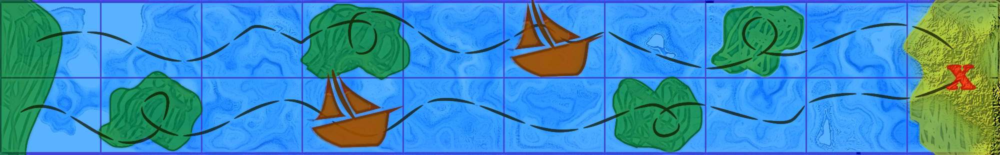
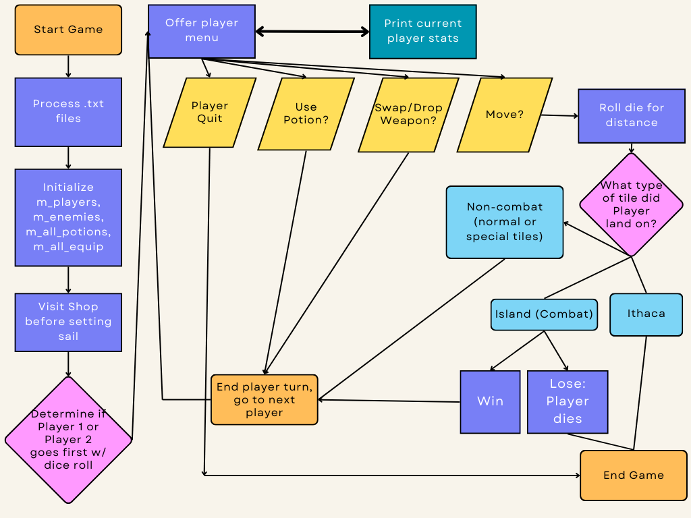
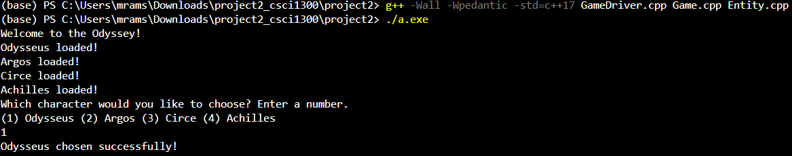
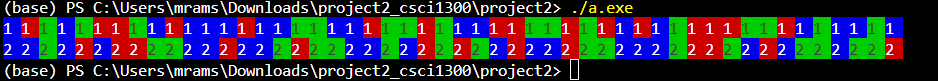
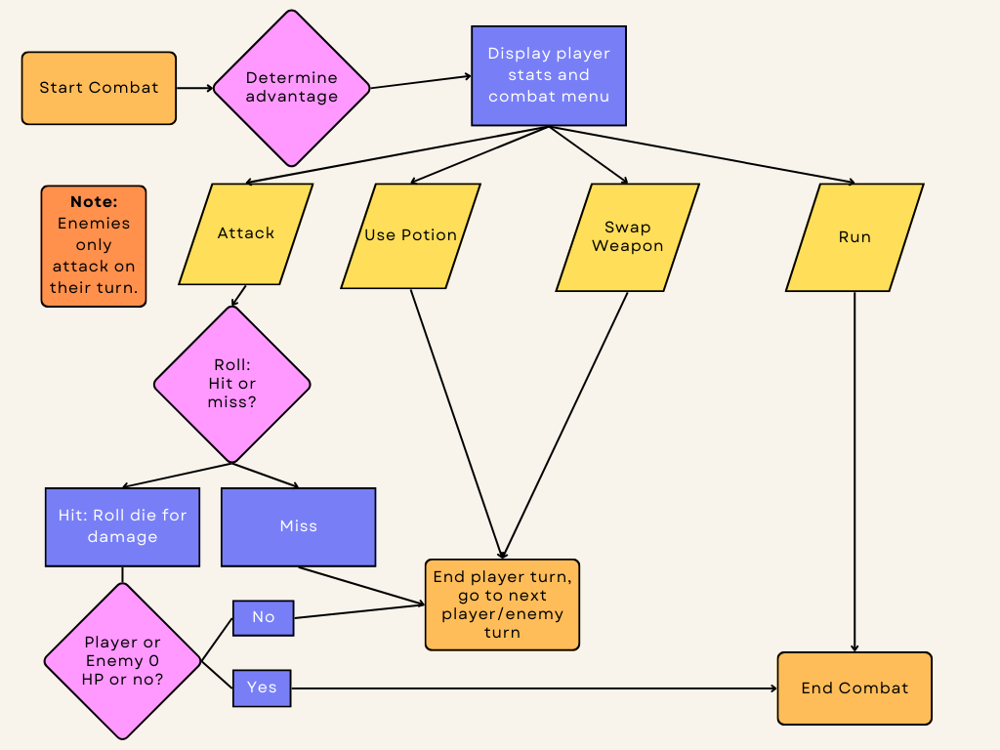

#### **CSCI 1300 CS1: Starting Computing: Project 2**
#### **Godley/Naidu - Spring 2024**
#### **Due: Thursday, April 25th by 11:59pm MDT**

# The Odyssey


For the Final Project, you will implement a text-based 2-player battle board game in C++ that draws inspiration from Homer's "The Odyssey".

Players will engage in combat, find hidden treasures, and encounter obstacles in this game all on their quest to make it back home.

The objective of our game is simple - lead your chosen character(s) on a journey within the Aegean Sea, with the ultimate goal of reaching Ithaca. This path contains islands (green tiles), water (blue tiles), and special tiles (red). Each type of tile will have different events and rules. There will also be a handful of special tiles that add unique elements to the game. 

We have outlined the critical components of the game below, but there are numerous opportunities for creative expression in how you choose to define details of your game. There is no CodeRunner that you have to match precisely, so take advantage of the flexibility here -- whenever we do not explicitly provide details on a given mechanic in the game, please use your own intuition to design an interesting and cohesive game.

## Table of Contents

[Starting the Game](#starting-the-game)

- [Character Selection Menu](#character-selection-menu)
- [After Character Selection](#after-character-selection)
- [Loading Game Data](#loading-game-data)
   - [Loading Equipment and Potions](#loading-equipment-and-potions)
   - [Loading Entities](#loading-entities)
      - [Loading Inventories within the Entity class](#loading-inventories-within-the-entity-class)

[Characters](#characters)

[Enemies](#enemies)

- [Island Enemies](#island-enemies)
- [Epic Encounter Enemies](#epic-encounter-enemies)

[Item Shop](#item-shop)

- [Item Shop Menu](#item-shop-menu)
- [Purchasing Available Items](#purchasing-available-items)

[The Game Board](#the-game-board)

- [Display board game](#display-board-game)
- [Travelling](#travelling)
- [Normal Tiles](#normal-tiles)
- [Island Tiles](#island-tiles)
- [Special Tiles](#special-tiles)
  - [Hidden Treasures](#hidden-treasures)
  - [Riddles](#riddles)

[Item Shop](#item-shop)

- [Item Shop Menu](#item-shop-menu)
- [Purchasing Available Items](#purchasing-available-items)

[Combat](#combat)

- [Combat Menu](#combat-menu)
- [Island Combat Rules](#island-combat-rules)
   - [Island Combat Battle Order](#island-combat-battle-order)
   - [Attacking](#attacking)
   - [Defeating Enemies](#defeating-enemies)
- [Epic Encounter Combat Rules](#epic-encounter-combat-rules)
   - [Epic Battle Order](#epic-battle-order)
- [Weapon Elements and Enemies](#weapon-elements-and-enemies)
   - [Elemental Bonuses](#elemental-bonuses)
   - [Elemental Weaknesses](#elemental-weaknesses)
- [Condition](#condition)

[Calamities](#calamities)

[Ending the Game](#ending-the-game)

[Recommended Classes and Structs](#recommended-classes-and-structs)
- [Game class](#game-class)
- [Entity class](#entity-class)
- [Map class](#map-class)
- [Potion struct](#potion-struct)
- [Equipment struct](#equipment-struct)

[Expected Deliverables](#expected-deliverables)

[Checklist](#checklist)

[Requirements](#requirements)

- [Minimum Requirements](#minimum-requirements)
- [Extra Credit](#extra-credit)

[Interview Grading](#interview-grading)

[Timeline](#timeline)

[Project 2 Points](#project-2-points)

## Gameplay

The game can be summarized by these core concepts:
1. The game starts by selecting your character from a list of available characters. Each character has a different set of attributes.
2. The map is a 2-lane path (one lane for each player), with a single Player in each lane. Players navigate by rolling a 6-sided die to determine how far forward they move.
3. Players alternate taking turns across the map.
4. There are some special tiles on the gameboard where special effects are applied if the player lands on them. They can alter the player's position or attributes.
5. The players must manage their stamina levels. If a player's stamina level drops to zero, they will miss out on two turns until they regain some stamina to move ahead in the game.
6. Shops are available on some tiles where players can use their gold coins to purchase a variety of items. Some items have special effects depending on the character holding it.
7. Players can trigger combat with either Island or Epic enemies.
8. Calamities frequently occur.
9. Players can utilize potions to enhance their attributes or impact their opponents during their journey through the Mediterranean.
10. The player who reaches Ithaca first OR the last player standing wins the game.
11. If both players die (can happen in Epic Encounter Combat), then both players lose.

# Starting the Game



Each run of the game should have a randomized Map. The minimum requirement for the number of tiles on the gameboard is 100 (it is a 2-D array/2 lanes, so 50 per array/lane).

You should begin by loading the equipment, potions, entities, and riddles from the text files.

Then greet the players and present the character menu.

## Character Selection Menu

The menu displays the available characters that the player can choose from.
Each player gets to select a character from a list of unique characters, each with distinct amounts of gold, stamina, HP, defense, condition, and starting equipment. 
For each player, a character selection menu is displayed.
Make sure a character is chosen only once in the game.
Once the players select their characters, they start the game with the resources allotted to their characters.

Below is an example of the type of output we're looking for, although adding more information about the character choices to add creativity and flavor is welcome. The four characters we made are available as the last four lines in [the Entity text file](data/entity.txt), but you are welcome to add more. 



## After Character Selection
The players have a chance to visit a shop before setting sail (so after character selection and moving forward). See [Item Shop](#item-shop).

For each non-Combat turn in the game, you should (1) display the game board and (2) display the Main Menu which has the following options:

```
1. Move
2. Swap/Drop Weapon
3. Use Potion
4. Print Player Stats
5. Quit
```
If you would like to add more flavor text to this menu, feel free. 

Move, Swapping a Weapon, Dropping a Weapon, and Use Potion all take up one single turn.
The menu above displays swapping and dropping as one menu choice. If you would like to split "Swap/Drop Weapon" into two separate menu choices, feel free.
A Player can Print Player Stats as many times as they would like, and it doesn't end the turn.
Quitting immediately declares the other remaining player the winner, and ends the game.

## Loading Game Data

There are a few provided files which contain the information for Entities, Potions, and Equipment. 

``You are welcome to split the files up as you see fit - for example, we split entity.txt into two files (characters.txt and enemies.txt) in the provided GameDriver.cpp example.``

### Loading Equipment and Potions

Equipment and Potions are written in the [items.txt](/data/items.txt) file. This file holds the name, description, item type, effect value, elemental type (defaulted to None for Potions), and the price on each line, separated by a vertical bar, |. 

Here is an example of the content in the file:
```
name|description|type|effect value|element|price
Bow of Odysseus|Increases player weapon damage by 10|D|10|W|100
Shield of Achilles|Increases player defense by 10|S|10|E|100
Circe's Wand|Increases player weapon damage by 15|D|15|W|125  
```

See [the Equipment struct](#equipment-struct) for details on how to interpret these listed values.

**You should re-use the structs created in Homework 7 and modify them accordingly.**

### Loading Entities

The list of characters Players can choose from, Island enemies, and Epic enemies are in the [entity.txt](/data/entity.txt) file. Each line is separated by vertical bars, |. The list of items are separated by commas.

Here is a sample content from the file:
```
name|type|hp|stamina|defense|condition|advantage|elemental weakness|gold|starting items|number of items|ultimate
Odysseus|P|100|100|0|H|False|W|50|Health Potion, Bow of Odysseus|1,1|Odyssey's End
Argos|P|120|100|20|H|False|W|75|Health Potion, Argos' Fangs|1,1|none
Calypso's Nymphs|I|220|50|40|H|True|W|75|Health Potion, Nymph's Shield|1,1|none
```

Entities that are eligible to be chosen by players (also called 'characters') are denoted by their type being 'P'.
Entities that are considered Island enemies are denoted by their type being 'I'.
Entities that are considered Epic enemies are denoted by their type being 'E'.

For more details on how to interpret these listed values, see [the Entity class](#entity-class). Here is an explanation of how to read the example line above: it gives us the data to define Odysseus, a playable character ('P'), who starts with 100 health, 100 stamina, 0 defense points, and in the healthy state ('H'). He does not have advantage when deciding who goes first in the game ('False'). He is weak to water elemental damage ('W'). He starts with 50 gold, one Health Potion, and one Bow of Odysseus. The last parameter tells us his Ultimate Ability is called "Odyssey's End"; implementing Ultimate Abilities is an extra credit opportunity further explained in [the Extra Credit section](#extra-credit).

## Inventory

#### Loading Inventories within the Entity class

An Entity has starting items that are always listed as with the Potion first, and their Equipment second.

If you choose to follow the [Recommended Classes and Structs](#recommended-classes-and-structs), it is suggested that:

- Potions will go into the Entity's Potion inventory (variable name should be '_potions' or similar, which is a list of Potions).
- On load-in, Equipment will always go into the Entity's currently equipped inventory.
- When purchasing Equipment from a store or looting, Equipment will always go into the excess inventory.

#### Inventory Actions

In the non-Combat menu and Combat menu, there are references to being able to swap and drop weapons.

**Swapping** refers being able to switch Equipment. In the recommended Entity class (see [Recommended Classes and Structs](#recommended-classes-and-structs)), that implies switching Equipment between the '_equipped' and '_inventory' private variables. Players can have 1 Weapon or 1 Weapon and 1 Shield available to them in combat. Swapping should allow the player to either:
1. Change out an existing item with a new one from their inventory, or 
2. equip a new item from their inventory. 

e.g. If I entered combat with just Odysseus' Bow equipped, I can use a turn to equip a Shield item and bolster my defenses.

**Dropping** refers to being able to get rid of an item/remove it from what you currently have equipped or your inventory (where your excess stuff is).

**You are welcome to implement the Inventory as you see fit, but you must have the ability to Swap and Drop Equipment enabled.**

The Recommended Classes/Structs outline has the inventory split into (1) currently equipped, (2) excess inventory, (3) and a Potion inventory inside of the Entity class (satisfies minimum implementation requirements).

## Characters

We have provided 4 characters for this game: Odysseus, Achilles, Circe, and Argos. Their details are provided in the [Entity text file](/data/entity.txt). Feel free to add more characters, or to tweak the values to balance your game as you see fit.

Each character has a distinct amount of gold, stamina, HP, defense, condition, and starting equipment. They also have Ultimate abilities, which is an extra credit opportunity. See [Extra Credit](#extra-credit).

``Stamina and HP are capped at 100. Stamina, HP, and gold cannot be negative.``

## Enemies

The game includes Island enemies and Epic Encounter enemies, as discussed in [Loading Entities](#loading-entities). We have created several provided in the entity text file, but you can expand upon this list as you see fit. Feel free to add your favorite monsters from Greek mythology!

### Island Enemies

``The player will randomly encounter one of these enemies whenever they land on an Island.`` Refer to the [entity.txt](/data/entity.txt) file for corresponding stats. 

- Sirens
- Giants
- Cicones
- Lotus Eaters
- Laestrygonians
- Circe's Enchantresses
- Calypso's Nymphs

### Epic Encounter Enemies

**These enemies trigger when two players land next to each other or are otherwise, in the same column.**

Epic Encounter enemies have more Defense and their weapons hit harder. Their weapons are also unique, and can only be found by defeating them.

- Scylla
   - Description: A multi-headed sea monster that dwells in a narrow strait.

- Cyclops
   - Description: A one-eyed monster named Polyphemus.

- The Laestrygonian King
  - Description: His demeanor exudes a commanding presence, striking fear into the hearts of those who dare to challenge him. 

# The Game Board

The Map class is provided to you to help with traversing the game board. The layout of the board is a 2-D array with 100 total tiles. Each lane in this array has 50 tiles. See [Minimum Requirements](#minimum-requirements) for details regarding how many island and special tiles are required at minimum. 

## Display board game
To visualize the game board in the terminal, the complete trail is displayed. It is a double-laned map, and randomly contains green tiles representing islands on the way to Ithaca. In addition to these island tiles, there are also randomly placed special red tiles. Blue tiles indicate water and are normal tiles.

Below is output from the MapDriver.cpp file (**NOTE:** this map does NOT adhere to the minimum requirements - it is just a demonstration of Map class functionality). The accompanying Map.h and Map.cpp files are also provided to you which include the basic Constructor, Parameterized Constructor, Setter/Getter for a position, and the initializeMap() function.



``You MUST alter the initializeMap() function so that it can produce a game board that (1) adheres to the tile requirements and (2) is randomized with each new game.``

``You also need to be able to keep track of where each Player is. Suggestion: Say I followed the recommended classes (see [Recommended Classes and Structs](#recommended-classes-and-structs)) and has a Game class. I would create a private variable in the Game class to track corresponding position index for each player.``

``You should create a function that prints the game board for you, so you can easily display it with the non-Combat menu.`` This is discussed here: [After Character Selection](#after-character-selection). The gist of it is demonstrated in the [MapDriver.cpp](MapDriver.cpp) file.

To indicate the position of each player on the tile, the player's unique identifier is used to mark their presence. This is indicated by the '1' and '2' you see on each tile -- you will need to edit this so that the numbers do not appear in every tile.

You will need to edit the tile generation. You should also make edits to identify final tile as Ithaca by making the color of the tile different from the other tiles. Various colors are defined and provided to you to choose from in the provided files. **Make sure your game board generation fulfills the minimum requirements**; beyond that you may exercise as much creativity with the board as you choose.

You are encouraged to tweak any colors or probabilities of events and add additional options to make the game more interesting or aesthetic.

## Travelling
To traverse this journey, players roll a 6-sided die to determine how many spaces forward they can move.

``Moving uses stamina. Lose 3 stamina for every turn you choose to move. If you hit 0 stamina, you lose your turn. Passively gain 10 stamina if you cannot move for some reason. I.e. I hit 0 stamina, and lose my current turn. But when my turns comes up again, I will have passively gained 10 stamina at that point.``

(If you want to modify the stamina expenditure system to increase gameplay complexity, you may do so -- for example, you could instead make stamina usage proportionate with the distance they move or something similar).

Then, depending on what type of tile the player lands on, their journey changes.

## Normal Tiles
These are denoted by blue, as they represent the water you're sailing on. There is a 30% chance of having a [calamity](#calamities) happen while moving through normal tiles. Otherwise, nothing happens.

## Island Tiles
Upon encountering an island (green) tile, a message in the terminal informs the player of the enemy you will fight. Enemies are randomly chosen from the list of [island enemies](#island-enemies).

Islands are unavoidable. Players cannot skip over islands.

- If the tile directly in front of the player is an island (meaning moving 1 space would land them there) and the player rolls a 2 and chooses to move directly forward, the player will land on the island regardless. The player would NOT skip the island.

Island tiles always have an item store. After combat, a prompt reveals the store's presence, inviting you to explore.
Here, you can exchange your gold for an item or potion that could turn the tide of your adventure. The item store is discussed more in the [Item Store](#item-store) section.

## Special Tiles
Upon encountering a special (red) tile, a message in the terminal informs of the unique find.
The type of special tile dictates the message you receive, with each tile offering its own distinct effect

Specific messages are shown based on the type of special tile:

- Shortcut Tile: Your spirits soar as you're propelled four tiles ahead. Ithaca isn't far.
   - **(Shortcut tiles also do NOT permit the player to skip Island tiles.)**
   - This movement forward happens immediately upon landing on this tile.
   - This movement does NOT consume stamina.
- Siren's Song Tile: As the Siren's Song echoes through the air, you sense its magical pull, an otherworldly force that toys with the hearts of those who dare to listen. You stop in your tracks. You cannot move on your next turn only.
- Helios' Beacon Tile: As you stand in the brilliance of Helios' Beacon, you feel the warmth of the sun god's favor shining upon you. You feel luckier. Reduce calamity chances by 5%, permanently (Note: it should only reduce the calamity chance for the player who landed on the tile).
- Nymph's Spring Tile: In the embrace of the Nymph's Spring, you feel the embrace of nature itself. Your stamina is replenished.

### Hidden Treasures

Sometimes on special (red) tiles, hidden treasures are waiting to be found. There needs to be three hidden treasures in each lane on the board randomly.

When you land on a red tile concealing a hidden treasure, a prompt reveals the treasure's presence.
You can attempt to unlock it by solving a riddle. [See Riddles](#1-riddles) for more details.
Successfully solving the riddle allows you to claim the treasure, while an incorrect answer results in a missed opportunity.

The reward is worth the effort, as these treasures can bring various benefits. Once the puzzle is solved, the player gets rewarded with one of the following:

1. Stamina Refill (30% chance):
   The amount of stamina replenished is a random event, with the player receiving between 10 to 30 units of stamina.
   However, it's important to note that a player's maximum stamina is capped at 100.

2. Gold Windfall (30% chance):
   The amount of gold retrieved is random, with the player receiving a windfall of between 20 to 40 gold coins.
   However, be aware that a player can carry a maximum of 500 gold coins, ensuring they don't become weighed down by their riches.

3. Damage Buff (40% chance):
   The amount of damage permanently added to the player's main weapon is random, with the player's damage buff being between 5-10 damage.
   There is no cap on how much a weapon can be buffed.
   If the Player is not holding a weapon in their equipped inventory, then this does nothing.

## Riddles:
These are a set of questions and answers that are stored in a text file. We provide a few riddles in the [riddles.txt](/data/riddles.txt) file but feel free to add/modify the riddles as you’d like.
If you accept the challenge to answer the puzzle, the game retrieves a random question from the list of questions. 

Should you succeed, buff a random attribute's maximum amount by 5. Viable attributes are character HP, Stamina, Defense, or Damage.

The riddles are written in the [riddles.txt](/data/riddles.txt) text file. This file holds the question and the answer in each line, separated by a vertical bar, |.

Here is the content of the file:

```
What gets wet while drying? (single word, lowercase)|towel  
How many letters are in the alphabet? (integer)|11
What are the next three letters in this sequence: OTTFFSS? (no spaces, uppercase)|ENT
```

### Item Shop

When you land on a tile with an item shop, you can purchase Weapons and Potions using your gold reserves. You will visit the item shop (1) before beginning the game (after both players choose their characters and before moving on the map) and (2) post-combat, whenever they successfully eliminate an Island enemy.

#### Item Shop Menu:

Each item store sells 3 Potions and 3 Equipment items. Stock is limited to 1 per item. These are randomized choices out of the lists in the Game class that hold the information for all available Potions and Equipment in the game (i.e _allPotions and _allEquip). 

**Epic Enemy weapons cannot be bought at the store. They are indicated as such by having a 0 cost. They can only be acquired by a Player by looting a defeated Epic Enemy.**

The item store menu displays all of the items for sale (all relevant information to a Potion or Equipment item - see Potion and Equipment struct info), their current stock, and the price per item.

How the Item Store Menu looks and the flavor text is purely up to you, but it must have these choices available to the Player:

```
1. Buy Weapon
2. Buy Potion
3. Leave Shop
```

#### Purchasing Available Items:
A player can only purchase one Weapon item and one Potion item from an item store at any given time.

Be aware that you have to store the items possessed by a player in their Potion inventory and Equipment inventory arrays.

If your Potion inventory/Equipment inventory array is at capacity and you find/purchase a potion/weapon, you should implement a substitution menu option. Ensure to ask the player if they wish to substitute any items they have for the new potion or weapon, and swap based on the user's answer.

Likewise, players must have enough gold to purchase that item successfully. After purchasing an item, print the new amount of gold held by the player. Players cannot have negative gold or otherwise purchase things they cannot afford!

# Combat

Players will be engaging in combat with various monsters throughout the game.

There are two types of combat available - Island Combat and Epic Encounter Combat. 

Island Combat is 1 player vs. 1 enemy.
Epic Encounter Combat is 2 players vs. 1 enemy.

Below is a flowchart depicting the flow of Island combat. The flow of Epic Encounter Combat is not much different, save for adding in another player and some differences in determining who goes first. It is outlined more in [Epic Encounter Combat Rules](#epic-encounter-combat-rules).



Below is a sample run of combat with an Island enemy, the Sirens. It doesn't have every rule implemented in it (for example, this run ignores armor within its damage calculation and doesn't do any elemental bonuses) but generally demonstrates what is expected out of battle.

```
(base) PS C:\Users\mrams\Downloads\project2_csci1300\project2> ./a.exe
Player: Argos
HP: 120
Stamina: 100
Defense: 20
Condition: H
Gold held: 50
Enemy wins initiative roll.
Commencing battle.
Remember: On their turn, Enemies only attack.
Hit successful! Deals 7 damage!
Player HP before: 120
Player HP after: 113
Swapping turns!
Current Player Stats
Player: Argos
HP: 113
Stamina: 100
Defense: 20
Condition: H
Gold held: 50
Current Enemy Stats
Player: Sirens
HP: 150
Stamina: 100
Defense: 25
Condition: H
Gold held: 25
Which action would you like to take?
1. Attack
2. Use Potion
3. Swap Weapon
4. Attempt to Run
1
Hit successful! Deals 7 damage!
Enemy HP before: 150
Enemy HP after: 143
Swapping turns!
Remember: On their turn, Enemies only attack.
Hit successful! Deals 10.5 damage!
Player HP before: 113
Player HP after: 102.5
Swapping turns!
Current Player Stats
Player: Argos
HP: 102.5
Stamina: 100
Defense: 20
Condition: H
Gold held: 50
Current Enemy Stats
Player: Sirens
HP: 143
Stamina: 100
Defense: 25
Condition: H
Gold held: 25
Which action would you like to take?
1. Attack
2. Use Potion
3. Swap Weapon
4. Attempt to Run
2
Haven't implemented Potions yet!
But let's pretend I did and +10 HP with Entity getters/setters.
Player 1 HP Before: 102.5
Player 1 HP After: 112.5
Swapping turns!
Remember: On their turn, Enemies only attack.
Hit successful! Deals 14 damage!
Player HP before: 112.5
Player HP after: 98.5
Swapping turns!
Current Player Stats
Player: Argos
HP: 98.5
Stamina: 100
Defense: 20
Condition: H
Gold held: 50
Current Enemy Stats
Player: Sirens
HP: 143
Stamina: 100
Defense: 25
Condition: H
Gold held: 25
Which action would you like to take?
1. Attack
2. Use Potion
3. Swap Weapon
4. Attempt to Run
3
Haven't implemented Swapping function yet!
But let's pretend I did and change weapon with Entity getters/setters.
Player 1 Weapon Before: Bow of Odysseus
Player 1 Weapon After: King's Blade
Swapping turns!
Remember: On their turn, Enemies only attack.
Hit successful! Deals 24.5 damage!
Player HP before: 98.5
Player HP after: 74
Swapping turns!
Current Player Stats
Player: Argos
HP: 74
Stamina: 100
Defense: 20
Condition: H
Gold held: 50
Current Enemy Stats
Player: Sirens
HP: 143
Stamina: 100
Defense: 25
Condition: H
Gold held: 25
Which action would you like to take?
1. Attack
2. Use Potion
3. Swap Weapon
4. Attempt to Run
1
Miss!
Swapping turns!
Remember: On their turn, Enemies only attack.
Hit successful! Deals 28 damage!
Player HP before: 74
Player HP after: 46
Swapping turns!
Current Player Stats
Player: Argos
HP: 46
Stamina: 100
Defense: 20
Condition: H
Gold held: 50
Current Enemy Stats
Player: Sirens
HP: 143
Stamina: 100
Defense: 25
Condition: H
Gold held: 25
Which action would you like to take?
1. Attack
2. Use Potion
3. Swap Weapon
4. Attempt to Run
1
Miss!
Swapping turns!
Remember: On their turn, Enemies only attack.
Hit successful! Deals 24.5 damage!
Player HP before: 46
Player HP after: 21.5
Swapping turns!
Current Player Stats
Player: Argos
HP: 21.5
Stamina: 100
Defense: 20
Condition: H
Gold held: 50
Current Enemy Stats
Player: Sirens
HP: 143
Stamina: 100
Defense: 25
Condition: H
Gold held: 25
Which action would you like to take?
1. Attack
2. Use Potion
3. Swap Weapon
4. Attempt to Run
1
Hit successful! Deals 45.5 damage!
Enemy HP before: 143
Enemy HP after: 97.5
Swapping turns!
Remember: On their turn, Enemies only attack.
Hit successful! Deals 21 damage!
Player HP before: 21.5
Player HP after: 0.5
Swapping turns!
Current Player Stats
Player: Argos
HP: 0.5
Stamina: 100
Defense: 20
Condition: H
Gold held: 50
Current Enemy Stats
Player: Sirens
HP: 97.5
Stamina: 100
Defense: 25
Condition: H
Gold held: 25
Which action would you like to take?
1. Attack
2. Use Potion
3. Swap Weapon
4. Attempt to Run
2
Haven't implemented Potions yet!
But let's pretend I did and +10 HP with Entity getters/setters.
Player 1 HP Before: 0.5
Player 1 HP After: 10.5
Swapping turns!
Remember: On their turn, Enemies only attack.
Hit successful! Deals 28 damage!
Player HP before: 10.5
Player HP after: 0
Battle ended.
```

## Combat Menu
The menu presented to the player will first present their current stats. 

Finally, it gives the player the following choices: Attack, Use potion, Swap Equipment, and Run.

## Island Combat Rules

1. Players MUST have at least 1 Weapon Equipped at all times.
2. Players can have any of the following combinations equipped on them for combat: 1 Weapon OR 1 Weapon and 1 Shield.

Players and enemies both have a set amount of starting health points (HP) and a Defense Stat.
The first to 0 HP is the loser of the battle. If a Player hits 0 HP, then the game ends. 

### Island Combat Battle Order

Battle order is determined by Advantage.

Players or Enemies with Advantage always go first. If both the Player and Enemy has Advantage (or likewise, neither has Advantage), then roll a die. Highest roll goes first.

If there is a draw (both the Player and the Enemy roll the same), reroll.

### Attacking

Enemies are not smart, so they can only Attack on their turn.

The Defense stat for a player applies to all attacks. I.e. If Cyclops has 15 Defense and Odysseus hits for 17, the damage Cyclops takes is calculated as the following:

(Odysseus Damage - Cyclops Defense Stat) = Damage taken by Cyclops.
   - If the result of this equation is zero or negative, then Cyclops would take 1 damage -- we do not want combat to become an infinite loop.

#### The damage of the weapon represents a range. I.e. If a weapon says it deals 15 damage, then it has the possibility of dealing anywhere between 1-15 damage. You can use rand() to help with randomly generating a number within a range.

For every 1 pt of damage taken by a player, the player's HP reduces by 2.5.
For every 1 pt of damage taken by an enemy, the enemy's HP reduces by 3.5.

If a player's or enemy's HP is 0 or negative, the combat ends.

Players and enemies have a 20% chance to miss their attacks. Missed attacks deal no damage to their target and ends the turn.

### Running

If you're in too deep, you are welcome to flee the combat. This ends combat immediately. Successfully running away should not be guaranteed, but you can choose how likely it is and how that probability is determined.

If you Run, you cannot do the following
- No shop available to you after combat
- No ability to loot the enemy (since you didn't defeat it)
- Lose 35 stamina immediately

There is an extra credit opportunity available here - see option 9 in [Extra Credit](#extra-credit).

### Defeating Enemies

After combat ends, Players have an opportunity to loot defeated enemies for their gold and items. 

Remember that players can only hold a certain amount of weapons/shields and potions in their respective inventories.

Likewise, each Island has a Shop. The Player can choose if they would like the visit the Shop after combat ends.

## Epic Encounter Combat Rules

1. Players MUST have at least 1 Weapon Equipped at all times.
2. Players can have any of the following combinations equipped on them for combat: 1 Weapon OR 1 Weapon and 1 Shield.

Epic encounters occur when both Player 1 and Player 2 land in the same column. In these fights, both players fight the single Epic enemy together.

Players and enemies both have a set amount of starting health points (HP) and a Defense Stat.
The first side to 0 HP is the loser of the battle. The fight continues, even if one player dies - the remaining player has a chance to defeat the Epic Encounter enemy alone. If this player is successful in doing so, combat ends and the game ends with that player as the winner (last person standing).

If both Players die in battle, the combat ends and the game ends. Neither player is the winner.

There is no difference in how damage is calculated against the Epic Enemy in Epic Encounter Combat. 

**A primary difference is that when Epic Enemies attack, they attack BOTH players simultaneously. I.e. If Scylla attacks for 30 damage, that is 30 damage directed towards Player 1 and Player 2. You must take each Player's individual defenses into account when determining how much HP each Player loses.**

### Epic Battle Order
**Epic Encounter enemies have Advantage and thus, always attack first. Players then attack in order (Player 1 first, Player 2 second).** 

Order is not determined by any dice rolling here except for the situation below, which is only relevant if you choose to complete that extra credit assignment.

#### Niche Situations (Only for those who complete the Circe's Brew Extra Credit)
If you decide to complete the Circe's Brew extra credit, note the following situation:
   - If a Player has the Wolf buff, then roll 2 dice. Have one roll represent the Epic enemy, and the other roll represent the Player with the Wolf buff. Highest roll goes first. 2nd highest roll goes second. Remaining players go last.
   - On the off chance both Player 1 and Player 2 have the Wolf buff, then everyone rolls a die and follow the Highest->Lowest roll to determine turn order.

### Weapon Elements and Enemies

There are four elements available to Weapons: Fire, Earth, Air, and Water. Enemies can have Elemental Bonuses or Weaknesses.

#### Elemental Bonuses

Water weapons deal double damage to Fire enemies. 

Fire weapons deal double damage to Air enemies. 

Air weapons deal double damage to Earth enemies. 

Earth weapons deal double damage to Water enemies.

For clarification, say a Fire weapon's damage is 30 and we are against a Wind enemy.
That Fire weapon's damage range then goes up to 60 (Possible damage range is 1-60).

#### Elemental Weaknesses

Water weapons deal 50% damage to Earth enemies.

Earth weapons deal 50% damage to Air enemies.

Air weapons deal 50% damage to Fire enemies.

Fire weapons deal 50% damage to Water enemies.

For clarification, say a Fire weapon's damage is 30 and we are against a Water enemy.
That Fire weapon's damage range then goes down to 15 (Possible damage range is 1-15).

### Condition

Player characters and enemies all have a condition, denoted as either 'H' (healthy), 'P' (poisoned), 'D' (diseased).

A Healthy character is fine and has no negative effects.

A Poisoned character takes loses 5 HP for every turn until cleansed. 

A Diseased character takes loses 5 stamina every turn until cleansed.

**If you gain either the Poisoned or Diseased condition during combat, it stays with you, even after battle unless it is cleansed.**
**If you had the Poisoned or Diseased condition before entering combat, it will be with you during that fight unless it is cleansed.**

Cleansing occurs only via a Cleansing Potion.

# Calamities

In this unpredictable world, calamities can strike when you least expect them, adding a twist to your journey.
Each turn in the game, after the player moves ahead to a regular tile, there is a 40% chance a calamity might occur.

If a calamity occurs at the end of a particular turn, choose one of the following events according to the probability.

We provide probabilities but feel free to change the probabilities or even add additional calamities.
When the calamity happens, be sure to print the accompanying message to announce it.

1. (45% Chance) Stormy Seas - A sudden storm arises, battering the player's ship and causing damage to their vessel.
   You move back a random amount of spaces (1-3 max). A message announces the calamity:
   "With each passing moment, the storm grows fiercer, testing your courage and resolve as you struggle to keep your ship afloat amidst the wrath of Poseidon."

   Note: If you move backwards and where you would land happens to be an island, you do not land on the island again. You land on the tile before the island.

2. (35% Chance) Plague Outbreak - A mysterious illness begins to overtake your body.
   You gain the Disease condition. A message informs you:
    "The spread of the plague seems unstoppable, defying your best efforts to contain it and leaving you to confront the harsh reality of your own mortality."

3. (20% Chance) Poisonous Rats - Seems you have some stowaways.
   You gain the Poison condition. A message informs you:
   "Much to your dismay, it seems you are not the only one on your ship."

**Note:** If you want to implement "positive events" (we all deserve good things), you are free to include those as well. :3

# Ending the Game

Ithaca is at the end of the map. The first player to hit the end wins.

The game can also end earlier if one or both players die in combat. The remaining living player will be considered the winner in the first case, and neither will be the winner in the second case.

Once the game ends, your program should print a message congratulating the winning player on their success, if there is one. If there isn't one, display the stats as described below for both players.

You should also print the following statistics for each player in the game:

1. Name of the player and their character
2. Whether they are the winner or loser, or if game ended in draw
3. Amount of Gold Left
4. HP Left
5. Stamina Left
6. Remaining equipment

Save the final stats of the game in a file named results.txt. You can choose the format of this file.

## Recommended Classes and Structs

Minimum requirements include the creation of 2 classes (not including the provided Map class) and 1 struct.

``You have the freedom to create your own classes and structs as needed. What we are providing below are recommendations.``

``Remember, all classes should have a Constructor, Parameterized Constructor, appropriate getters and setters, and helper functions as needed. Include meaningful comments.``

## Game Class

This class would contain functions that assist with general gameplay.

**Private variables**:

- _players (data type: list of Entities)
   - minimum 2 players
- _enemies (data type: list of Entities)
   - need to determine number of enemies total
- _allPotions (data type: list of Potions)
   - contains all possible Potions in the game
- _allEquip (data type: list of Equipment)
   - contains all possible Equipment in the game

**Public functions**:

- combat(Entity player, Entity enemy) (suggested data type: int) 
   - with the int data type, it can return gold from a defeated enemy
   - otherwise, it can return -1 if the player dies or runs from the fight
   - you may want a second function that takes in two players instead of one for Epic combat
- shop(Potion all_potions[], Equipment all_equip[]) (suggested data type: void)
   - takes in m_allPotions and allEquip to randomize shop options from those lists 
- loadEntity() (suggested data type: void)
   - loads in information for players and enemies, creates Entities using that information, and populates Game class members
- playGame(); (suggested data type: void)
   - controls the main flow of the game(i.e. combat, players taking turns, etc.)

Some recommended helper functions for the Game class could be a function that controls printing the main menu or functions which help with specific parts of combat such as using a character's Ultimate ability (extra credit opportunity) or Epic Encounter specific combat rules.

Some recommended additional private variables could be something that holds the total amount of damage dealt by each player throughout the game, or the total amount of gold spent by each player throughout the game. (Connected to extra credit opportunity - see below: [Extra Credit](#extra-credit)). 

## Entity Class

This class would contain functions that assist with Entity-exclusive activities.

**Private variables**:

- _name (data type: string)
- _HP (data type: double)
- _stamina (data type: double)
- _defense (data type: double)
- _condition (data type: char)
- _advantage (data type: bool)
- _potions (data type: list of Potions)
   - contains Potions currently held by player
   - maximum 3 slots for 3 stacks of unique potions
   - stack amount is unlimited
- _equipped (data type: list of Equipment)
   - contains Equipment currently held by player
   - maximum 2 equipped
   - can equip a either weapon and shield or weapon and weapon
- _inventory (data type: list of Equipment)
   - this represents a character’s inventory/ NOT CURRENTLY equipped
- _items (data type: list of integers)
   - maximum 2 integers
   - First number represents total player stock of potions, second number represents total player stock of equipment (in equipped and inventory)
- _calamity (data type: float)
   - corresponds to the probability of the player encountering a calamity

**Public Functions**:

- swap(int userChoice) (suggested data type: void)
   - user can change weapons or potions depending on userChoice
- drop(int userChoice) (suggested data type: void)
   - user can drop weapons or potions depending on userChoice
- usePotion(int userChoice) (suggested data type: void)
   - user can use potion depending on userChoice
- updateEquipment(int equipIndex, Equipment weapon) (suggested data type: void)
   - uses given weapon to update weapon at a particular index (equipIndex)

## Map Class

This class is provided to you to help with the board. More details about displaying the game board, tiles, and moving can be found in [The Game Board](#the-game-board).

## Potion Struct

This struct would contain information for the potions in the game.

**Attributes**:

- name (data type: string)
- type (data type: char)
   - ‘H’=healing, ‘C’ = cleanse, ‘S’ = stamina, ‘U’ = ultimate
- effect value (data type: double)
   - default this to 0 for ‘C’ or ‘U’ potions
- price (data type: double)
- quantity (data type: int)
   - to help with keeping track of inventory

## Equipment Struct

This struct would contain information for the equipment in the game.

**Attributes**:

- name (data type: string)
- type (data type: char)
   - ('W' denotes a weapon, 'S' denotes a shield)
- element (data type: char)
   - ('W' = water, 'A' = air, 'F' = fire, and 'E' = earth)
- damage (data type: double)
   - damage weapons will have a value here, and their defense will be 0
- defense (data type:double)
   - shield weapons will have a value here, and their damage will be 0
- price (data type: double)

## Expected Deliverables

In your final submission, you will submit a zip file containing the following:

- All header files
- All corresponding implementation files
- A driver file titled "project2.cpp" which holds the main game
- Any other driver files you create

Driver files you create to test individual classes/class functions could also be helpful especially during interview grading for partial credit in case you cannot fully implement all aspects of the game into your project2.cpp file.

The provided files called GameDriver.cpp and MapDriver.cpp are examples of these types of files. They provide an environment to explicitly test functions related to the Game and Map classes, respectively.

**<ins>TEST AS YOU GO.</ins> Creating smaller driver files and using them as a testing ground as you build up your project2.cpp file will help you out a lot! Likewise, you can also use assert statements to help with confirming things are working as intended. An example of a file specifically to test these functions is provided in GameDriver.cpp, although you should make your own to match your own implementation style. See Recitation 9 for examples.**

 **<ins>Regardless, you MUST attempt to create the functioning game in project2.cpp, as much as you can get functioning.</ins>**

# Checklist

Below is our suggested sequence of components to code and test. We recommend testing the sections along the way. Some of the components are intertwined; therefore, you can leave a cout statement (placeholder) and come back later.

* Loading the game components
* Selecting the characters
* Base combat
* Move on the map by rolling a die
* Add the tile effects
  * Island tile effects
  * Same tile / Epic Encounters combat
  * Special/Hidden treasure tiles
* Item store components
* Puzzle
  * Riddles
* The calamities
* Ultimate abilities/Circe's Brew/Extra Credit

# Requirements

The minimum requirements for this final project are in the following sections. You are not allowed to use pointers or global variables in the project.

## Minimum Requirements
Your implementation of The Odyssey should have the following:
1. A minimum of 50 tiles each in two lanes on the board, with at least 3 green tiles and 4 red tiles per lane.
2. The shape of the game board is a 2-D array with 2 lanes. Each lane has 50 tiles.
3. 2-player format is implemented.  
4. At least 4 red tiles with a minimum of 25% chance of any tile being a red tile.
5. At least 3 item stores, excluding the one you visit at the beginning of the game.
6. At least 3 hidden treasures in the game.
7. A minimum of 4 characters that the players can select from.
8. A minimum of 4 different potion types that can effectively be used.
9. A minimum of 4 different weapon types that can effectively be used.
11. A minimum of 3 classes implemented.
12. A minimum of 1 struct implemented.
13. A minimum of 3 calamities.
14. Writing the game stats to a file when the game ends.
15. Appropriate methods for each class (including getters, setters, default constructors, and parameterized constructors as needed).
16. Code is commented appropriately.

Your project implementation must include at least the following:
1. 6+ if-else statements
2. 6+ loops (while loops, for loops, do-while, in total)
3. 2+ nested loops
4. 3+ classes
5. 1+ struct
6. An array of struct or class objectsas a data member in one class
7. File IO (both reading from a file and writing to a file)
8. Your project must have an interactive component (ask the user for input, create a menu for choices, etc.).
9. Game stats should be displayed as instructed during combat turns. This will help with code debugging.

## Extra Credit

Following are some extra credit opportunities available for this project. Files needed for these are [adv_entity.txt](/data/adv_entity.txt) and [adv_items.txt](/data/adv_items.txt).

1. **Present your project (10 points)** during the lecture or through a video.
   * **Lecture**: A sign-up sheet will be shared a week before class presentations
   * **Video**: Make a 5-minute (&plusmn; 1 min) video explaining:
      * The project idea
      * Implementation and approach
      * A demonstration of the working project

2. **Ultimate ability (12 points possible total - 3 pts per character Ultimate ability)**
   Implement the Ultimate Abilities for the characters to be used in combat.

   Ultimate Abilities are unique empowered spells or attacks available to the player. These abilities have one charge total - meaning once they are used in one battle, they cannot be used again. Ultimate ability charges can be replenished by using a Philter of Wisdom potion (available via [adv_items.txt](/data/adv_items.txt) file).

   Ultimate abilities for each character and enemy are listed below:

   - Odysseus
      - Ultimate Ability: Odyssey's End
      - Description: Deliver a fatal blow to an opponent, a testament to your resilience and determination to overcome all obstacles standing in your path.
      - Details: Deals 50 damage to a target. If the target has 5% HP left or less, execute the target.
   - Achilles
      - Ultimate Ability: Trickster's Gambit
      - Description: Create an illusion of yourself, confusing your opponents.
      - Details: Halve your enemy's damage for the rest of the fight.
   - Circe
      - Ultimate Ability: Circe's Dominion
      - Description: Bend the will of your enemy and make them damage themselves.
      - Details: On your opponent's turn, they do not attack you. Instead they deal damage to themselves using their own weapon. It cannot miss.
   - Argos
      - Ultimate Ability: Loyal Companionship
      - Description: Through the trials of battle, our bond remains unbroken, our loyalty unwavering.
      - Details: Take 2% of Odysseus' Defense stat and his current weapon's damage. Permanently add it to your own.

   A suggestion to implementing this is to create a helper function that is used within your Game class combat() function.

3. **Implement weapons/items located in the [adv_items.txt](/data/adv_items.txt) file (12 points possible total - 1 pt per weapon/item)**
The weapons in the [adv_items.txt](/data/adv_items.txt) file have unique abilities that are a mix of special effects or boosters when being held by certain characters.
Demonstrate implementation of these special effects within combat.

4. **Detailed Stats Page  (8 points):**
Rather than just showing players ending stats, display and record stats such as "Total Damage dealt in the entire match", "Total amount of gold looted", and "Total number of misses in combat per player".

5. **Implement Circe's Brew (Hidden Treasure Reward) (10 points):**
The following Hidden Treasure Reward can be implemented for extra credit. If you implement it, then choose a custom % chance for it.
Then alter the % chances of the Stamina Refill, Gold Windfall, and Damage Buff rewards so that it equals out to 100%.

   Circe's Brew (Custom chance):

   This item has a chance to the player to shapeshift into various animals:
      - Serpent (30% Chance): You've become an elusive serpent.
         - Poisoned Strikes - Your current weapon's attacks can Poison the opponent.
      - Lion (40% Chance): You've become a ferocious lion.
         - Regal Strength - Your attacks deal 10 bonus damage.
      - Wolf (30% Chance): You've become an agile wolf.
         - Swift Strikes - Gain advantage in your battles and always attack first.

6. **A Better Shop  (5 points):**
Our current shop is kind of lame. Spruce the shop and allow us to sell items and get some gold back too. You may use the item's normal buying price as the selling price.

7. **...But Two Swords are Mightier than the Pen  (3 points):**
Enable players to dual-wield 2 Weapons. (If you need to make changes to how the damage is determined with dice rolling, then make sure to comment it in/explain why you made those changes.)

8.  **Where Do You Think You're Going??? (3 points):**
Enable enemy Opportunity Attacks against the Player. If you're unfamiliar, Opportunity Attacks in DnD refer to automatic attacks that happen against an enemy when they try to flee. So in our case, we have an option to Run in the combat menu. Give the enemy an additional chance (you decide what % it is) to hit the Player if they try to run. 

# Interview Grading

The Project 2 interview grading scheduler will be available on Canvas before the deadline of this project. 

``If you don’t sign-up for and attend an interview between April 26th and May 2nd or you miss your interview appointment, then no points will be awarded for the project.``

During the interview grading, TAs will be playing your game and asking conceptual questions. They will also ask about your project functionality and implementation.

# Timeline

- **Friday, April 12th at 11:59 pm: Submit class files & Code Skeleton.** Your .h files should be complete with all the data members and member functions you will be using for each class. For the class implementation .cpp files, you should fully implement simple functions like your getters and setters. For more complex functions, you can include the function prototype with detailed comments.

- **Wednesday, April 17th at 11:59 pm: Interview Grading Sign-Up deadline.** You must sign up for an interview grading timeslot no later than April 17th. The interviews will take place between April 26th and May 2nd. If you don't sign-up or miss your interview, then no points will be awarded for the project.

- **Thursday, April 25th at 11:59 pm: Final Deliverables.** Your project will be due on Thursday, April 25th at 11:59 pm. You must submit a zip file to the Project 2 assignment on Canvas, including all .h and .cpp files. The submission should compile and run. TAs will also be grading comments and style.

- **Saturday, April 27th at 11:59 pm: Project Report.** Write a 1-2 page report containing the following reflection questions:

  - How did you prepare for the project?
  - How did you develop our code skeleton? In what way(s) did you use your code skeleton?
  - Reflect on how you could have done better or how you could have completed the project faster or more efficiently.
  - In addition, write a paragraph answering the following question, in the context of the Project in CSCI 1300: Did you have any false starts, or begin down a path only to have to turn back when figuring out the strategy/algorithm for your Final Project program? Describe in detail what happened, for example, what specific decision led you to the false starts, or, if not, why do you think your work had progressed so smoothly. In either case, give a specific example.
  - The report should be a 1-inch margin, single space, 12pt font size, Times New Roman. Submit a report as PDF to Project 2 Report on Canvas.

- **Sunday, April 28th at 11:59 pm: Project 2 Quiz.** Complete the project 2 quiz.

# Project 2 Points

Project 2 is worth 250 points. Here is a summary of the points.

| **Criteria**                                                      | Points |
| ----------------------------------------------------------------- | ------ |
| Code Skeleton                                                     |   10   |
| Project Report                                                    |   10   |
| Minimum Implementation Requirements                               |   30   |
| Game Functionality                                                |   75   |
| Game Compilation, Algorithm, Comments, Style, Interview Questions |   75   |
| Project 2 Quiz                                                    |   50   |
| Total                                                             |   250  |


**Note:** 
 - If your code does not compile, you cannot score above 70 points for the project
 - The use of global variables, stringstream and pointers will result in a 0 on the entire project
