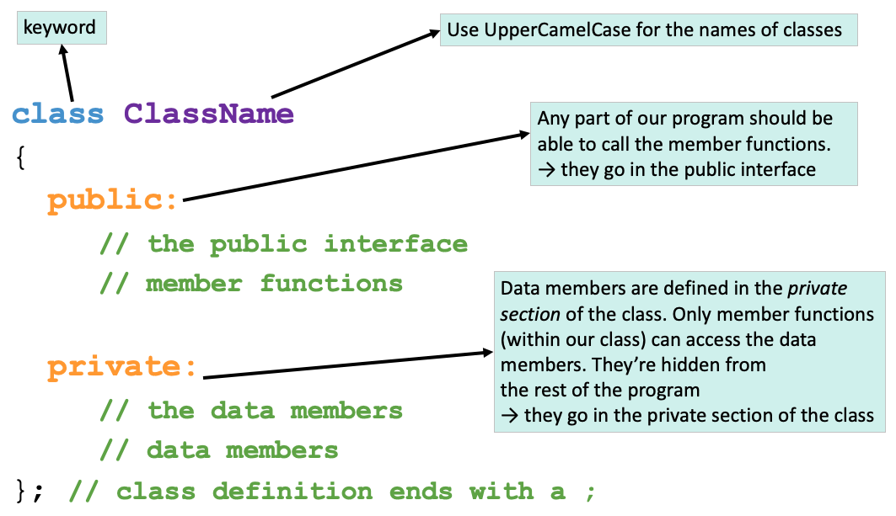

#### **CSCI 1300 CS1: Starting Computing: Study Guide: Week 10**
#### **Naidu/Godley - Spring 2024**

# Table of contents
1. [File Input](#fileinput)
2. [Reading Inputs](#readinput)
3. [File Output](#fileoutput)
4. [Structures](#structs)
5. [Classes](#classes)
    1. [Class Name](#className)
    2. [Access Specifiers](#accessSpecifiers)
    3. [Data Members and Member Functions](#dataMembers)
    4. [Accessing Data Members](#accessingDataMembers)
    5. [Defining Member Functions](#definingMemberFuncs)
6. [Header and Source Files](#headerAndSourceFiles)
    1. [Header File](#headerFiles)
    2. [Source File](#sourceFiles)
    3. [How to compile multiple .cpp and .h files](#howToCompile)
7. [Reminders](#reminders)
8. [Vocabulary](#vocabulary)
9. [Pre-Quiz](#pre-quiz)

## File Input <a name="fileinput"></a>

So far in class, we've been using the `iostream` standard library. This library has provided us with methods like `cin` and `cout`. `cin` is the method that reads from standard input (i.e., in the terminal via the keyboard) and `cout` is for writing to standard output.

In this study guide, we'll cover file input, allowing you to read information from a file. To do this, we'll need to include C++'s `fstream` library, which is short for "file stream".

**Reading Lines From A File**

**Step 1. Make a stream object.** <br/>
Create an object (a variable) of file stream type. If you want to open a file for reading only, the `ifstream` object should be used (short for “input file stream”).

*Example*
```cpp
// Create an input file stream object
ifstream file_in;
```

**Step 2. Open a file.** <br/>
 Once you have a file stream object, you need to open the file. To do this, use the `ifstream` object's `open()` method (function), which takes only one parameter: the file name as a string (surrounded by " " if the file name is given directly).

*Example*
```cpp
// Open myTextFile.txt with the file stream object
file_in.open("myTextFile.txt");  
```

**Alternative: steps 1 and 2. Making a stream object and opening a file**

Creating a file stream object and opening the file together is also possible. In this example, we would pass the filename when declaring the object. Note that this is another way of opening the file; you only have to open the file in one way.

*Example*
```cpp
// Creating the object and opening the file
ifstream file_in("myTextFile.txt");
```

**Step 3. Checking for open files.** <br/>
It is always good practice to check if the file has been opened properly and take appropriate action if it is not. To check if a file was successfully opened, you may use the `fail()` **or** `is_open()` methods.

`fail()`: This method will return a boolean value `true` if the file fails to open and `false` otherwise.

*Example*
```cpp
if (file_in.fail()) // true when file fails to open
{
    cout << "Could not open file." << endl;
    return -1; // return to terminate the program; -1 to indicate that the program didn't function as expected
}
// Do things with the file
```

`is_open()`: This method will return a boolean value `true` if the file has successfully opened and `false` otherwise.

*Example*
```cpp
if (file_in.is_open()) // true when file opens successfully
{
    // Do things with the file
}
else
{
    cout << "Could not open file." << endl;        
}
```

**Step 4. Read lines from the file.** <br/>
To read a line from the file, you can use `getline(file_in, line)`, which returns true as long as an additional line has been successfully assigned to the variable line. Once no more lines can be read, `getline` returns false. So we can set up a while loop where the condition is the call to `getline`.

`.eof()`: This method will return a boolean value `true` if all the data in the file was processed and `false` otherwise.

Note: we will discuss other methods of reading inputs in the [Reading Input section](#readinput).

*Example*
```cpp
string line = "";
int line_idx = 0;
// Read each line from the file
while (!file_in.eof()) // continue looping as long as there is data to be processed in the file
{
    // Get the next line from the file and store it in the 'line' variable
    getline(file_in, line);

    // Print each line read from the file
    cout << line_idx << ": " << line << endl;

    // Increment index(count of lines in the file)
    line_idx++;   
}
```

**Step 5. Closing a file.** <br/>
When you are finished processing your files, it is recommended to close all the opened files before the program is terminated. You can do this by using the `.close()` function on your file stream object.

*Example*
```cpp
// Closing the file
file_in.close();
```

**Step 6. Putting it all together.** <br/>
If we combine all the previous steps, this is the final piece of code we get.

*Example*
```cpp
// Create an input file stream object
ifstream file_in;

// Open myTextFile.txt with the file stream object
file_in.open("myTextFile.txt");

// Check if file opened successfully
if (file_in.fail())
{
    cout << "Could not open file." << endl;
    return -1;
}
else
{
    // Do things with the file
    string line = "";
    int line_idx = 0;

    // Read each line from the file
    while (!file_in.eof())
    {
        // Gets line of text from file_in, stores it in line
        getline(file_in, line);

        // Print each line read from the file
        cout << line_idx << ": " << line << endl;

        // Increment index (count of lines in the file)
        line_idx++;   
    }
}

// closing the file
file_in.close();
```

## Reading Inputs <a name="readinput"></a>
There are multiple ways we can read inputs from the text file. Some of them may be familiar, while others may be new. For demonstration purposes, let's assume the "myTextFile.txt" file to look like the following:

```
This is a quick example.
By using this text file, we can see how we are reading.
```

### Reading word
You already know how to read input by each word using the `>>` operator. Reading one word at a time from the stream is very similar: instead of using the `cin`, we will replace that with the stream object we created.

*Example*
```cpp
// Initialize the stream object and the string variable
ifstream file_in("myTextFile.txt");
string word;

// Read the first word
file_in >> word;

// printing variable word
cout << word << endl;
```

By using the `>>` operator, the output will be:
```cpp
This
```

### Reading characters
You can read one character at a time using `get()`. The function will read one character at a time, which means it will also read white space and special characters.

*Example*
```cpp
// Initialize the stream object and the string variable
ifstream file_in("myTextFile.txt");
char character;

// read the first character
file_in.get(character);

// printing the first character
cout << character << endl;
```

The `get()` function will store the first letter into the variable character. The output will be:
```
T
```


If you read the character and regretted it, you can put the character back into the stream and allow that character to be read again. This function is called `unget()`.

*Example*
```cpp
// defining the stream object and variable that we will use
char character;
string word;
ifstream file_in("myTextFile.txt");

file_in.get(character);
// You may do many different operations and decide when you want to unget a character
if(isupper(character))
{
	file_in.unget();
	file_in >> word;
}

cout << "After unget(): " << word << endl;

// Closing the file and reopening it to show the same example without the unget
file_in.close();
file_in.open("myTextFile.txt");
file_in.get(character);

file_in >> word;

cout << "Without unget(): " << word << endl;
```

We have the following output:
```
After unget(): This
Without unget(): his
```

### Reading lines
Lastly, you can read the input one line at a time using the `getline()` function.

*Example*
```cpp
// Initialize the stream object and the string variable
ifstream file_in("myTextFile.txt");
string line;

// Read the first line
getline(file_in, line);

cout << line << endl;
```

We have the following output:
```cpp
This is a quick example.
```

### Notes for reading inputs
The above examples in this section only read a single word/character/line. If you want to read all the content within the file, you have to put that in a loop. Additionally,  recall from Project 1 that using `>>` and `getline()` can cause unwanted behaviors. Please stick to one method, either `>>` or `getline()`. Switching in between `get()` and `>>` is fine.

## File Output <a name="fileoutput"></a>
We discussed reading from a file in the [file input section](fileinput). Here, we will show how we can write to a file. First, you define an `ofstream` variable and open the file you would like to write to. Then you can write to the output file using the same operation you used with `cout`, `<<`, and `endl`.

*Example*
```cpp
// Create the output file object
ofstream file_out;
// Opening the output file
file_out.open("output.txt");

// Writing something to the output file
file_out << "writing a sentence to the output file" << endl;

// Writing the value of the variable to the file
string test_string = "you can also write the content of the variable";
file_out << test_string << endl;
file_out.close();
```

The output.txt will have the following content:
```cpp
writing a sentence to the output file
you can also write the content of the variable
```

## Structures <a name="structs"></a>

A struct, short for structure, is a user-defined data type in C++ that allows you to combine data items of different types under a single name. It's particularly useful when you need to group related data. In C++, we can define a **structure** using the keyword `struct` like so:

```cpp
struct State
{
    string name;
    int area;
};                   // <-- semicolon after struct definition
```

This defines a new type, `State`, that you can use to declare variables, e.g.

```cpp
//create a State variable with no name or area
State empty_state;

//create a State variable with a name and area
State colorado{"Colorado", 104094};
```

The variables `empty_state` and `colorado` both have two named attributes, called **members** - `name` and `area`. We can access each member using dot notation, e.g.

```cpp
//set members for empty_state
empty_state.name = "Texas";
empty_state.area = 268596;

//get members for colorado
cout << colorado.name << " has an area of " << colorado.area << " square miles." << endl;
```

Expected output:
```
Colorado has an area of 104094 square miles.
```

If we want to compare two structs, we cannot do so directly. Instead, we must compare each data member individually to see if they match, e.g.

```cpp
//compare each data member one by one
if(colorado.name == empty_state.name && colorado.area == empty_state.area)
{
    cout << "These are the same state!" << endl;
}
else
{
    cout << "These are not the same state!" << endl;
}
```

Expected output:
```
These are not the same state!
```

If we need to store multiple struct objects, you can put them into an array. For example, we can create an array of states. We can assign each element in two different ways, as shown below. To access a member of a struct, you need to access the element in the array with the bracket operator and then use the dot operator.

```cpp
// Declare an array variable
State all_states[50];

all_states[0] = {"Colorado", 104094};

all_states[1].name = "Texas";
all_states[1].area = 268596;
```

## Classes <a name="classes"></a>

When writing complex programs, sometimes the built-in data types (such as `int`, `char`, `string`)
don’t offer developers enough functionality or flexibility to solve their problems.
A solution is for the developer to create their own custom data types called classes.
Classes are user-defined data types that hold their own data members and member functions. These data members and member functions can be accessed and used by creating an instance of that class. The instances of classes are called objects. Essentially, a class acts as a blueprint for each type of object, and each class can be customized to the programmer's needs.

String, for example, is a class in C++ that holds data (the characters comprising the string) and supports useful member functions like `substr`, which operate on this data.

Below is an example of the basic definition of a class in C++.



Let’s break down the main components of this diagram:

### Class Name <a name="className"></a>

A class is defined in C++ using the keyword `class` followed by the name of the class.
The body of the class is defined inside the curly braces and terminated by a semicolon at the end.
This class name will be how you reference any _variables_ or _objects_ you create of that type.
For example:
`ClassName objectName;`

The above line would create a new **object** (variable) with the name `objectName` and of type `ClassName`,
and this object would have all the properties that you have defined within the class ClassName.

### Access Specifiers <a name="accessSpecifiers"></a>

Access specifiers in a class are used to set the accessibility of the class members.
That is, they restrict access to the class members through outside functions.

Consider the following analogy:

Imagine an intelligence agency like the CIA that has 10 senior members.
Such an organization holds various sorts of information and needs some way of determining who has access to any given piece of information.
Some information concerning classified or dangerous operations may only be accessible to the 10 senior members of the agency and not directly accessible to any other person.
This data would be **private**.

In a class, like in our intelligence agency, these **private** data members are only accessible by a class's member functions and not directly accessible by any object or function outside the class.

Some other information may be available to anyone who wants to know about it.
This is **public** data.
Even people outside the CIA can know about it, and the agency might release this information through press releases or other means.
In terms of our class, this **public** data can be accessed by any member function of the class, as well as outside functions and objects, even other classes. The public members of a class can be accessed from anywhere in the program using the direct member access operator (**.**) with the object of that class.

### Data Members and Member Functions <a name="dataMembers"></a>

Data members are the data variables, and member functions are the functions used to manipulate these variables; together, data members and member functions define the properties and behavior of the objects in a Class.

The data members declared in any class definition can be fundamental data types (like `int`, `char`, `float`, etc.), arrays, or even other classes.

For example, for string objects, the data member is a `char array[]` that holds all of the individual letters of your string.
Some of a string’s member functions that we have used already are functions like `.substr()` and `.length()`.

### Accessing Data Members <a name="accessingDataMembers"></a>

Keeping with our intelligence agency example, the code below defines a class that holds information for any general agency.
In the `main` function, we then create a new `IntelligenceAgency` object called `CIA`, and we set its `_organization_name` to “CIA” by using the access operator (.) and the corresponding data member’s name.
However, we cannot access the `_classified_intelligence` data member in the same way.
Not everyone has access to that private data.

Instead, we need to use a member function of the IntelligenceAgency class, `getClassifiedIntelligence()`, in order to see that information.
This allows us to control the release of private information by our IntelligenceAgency.

Additionally, the main function includes four different ways of creating objects with descriptions in the comments next to it.

```c++
class IntelligenceAgency
{
    public:
        IntelligenceAgency();         // Default constructor
        IntelligenceAgency(string classified_intelligence); // Parameterized constructor  
        string _organization_name;
        string getClassifiedIntelligence();
        void setClassifiedIntelligence(string classified_intelligence);

    private:
        string _classified_intelligence;
};

int main()
{
    IntelligenceAgency CIA;
    CIA._organization_name = "CIA";
    cout << CIA._classified_intelligence; // gives an error
    cout << CIA.getClassifiedIntelligence();

    // four types of constructor calls
    IntelligenceAgency abc; // creating an IntelligenceAgency object with the default constructor
    IntelligenceAgency xyz = IntelligenceAgency(); // creating an IntelligenceAgency object with the default constructor
    IntelligenceAgency pqr("PQR"); // creating an IntelligenceAgency object with a paramaterized constructor
    IntelligenceAgency rst = IntelligenceAgency("RST"); // creating an IntelligenceAgency object with a paramaterized constructor
}

```

### Defining Member Functions <a name="definingMemberFuncs"></a>

You may have noticed that we declared various member functions in our class definition,
but we did not specify how they would work when called.
The body of the function still needs to be written.
The solution is to define a function, such as `getClassifiedIntelligence()`, corresponding to our class’s functions.
But how does our program know that these functions are the same as the ones we declared in our class?
You as the developer need to explicitly tell the computer that these functions you are defining are the same ones you declared earlier.

```c++
IntelligenceAgency::IntelligenceAgency()
{
    _classified_intelligence = " ";
}         
IntelligenceAgency::IntelligenceAgency(string classified_intelligence)
{
    _classified_intelligence = classified_intelligence;
}
string IntelligenceAgency::getClassifiedIntelligence() const
{
    return _classified_intelligence;
}
void IntelligenceAgency::setClassifiedIntelligence(string classified_intelligence)
{
    _classified_intelligence = classified_intelligence;
}
```

We start the definition as we do any function with the return type.
Then, we have to add a specifier, `IntelligenceAgency::`, that lets our program know that this function and the one we declared inside the class are the same.
We can see that this function returns the class’ `classified_intelligence` to the user.

Functions like `getClassifiedIntelligence()` are called **accessor/getter functions**.
This is because they retrieve or ‘get’ the private data members of a class object and return it to the program so that these values may be used elsewhere.

The second function, `setClassifiedIntelligence(string classified_intelligence)`, is called a **mutator/setter function**.
These allow functions from other parts of our program to modify or ‘set’ the private data members of our class objects.
Getters and setters are the functions that our program uses to interact with the private data members of our class objects.

## Header and Source Files <a name="headerAndSourceFiles"></a>

Creating our own classes with various data members and functions increases the complexity of our program.
As our programs become more complex and includes many functionality, keeping all our code in a single cpp file makes our code difficult to maintain. Therefore, we split our code into multiple files where each file contains only one part of functionality of the program.
To do this, we split our code into 2 types of files called header and source files. The header files mostly include the definition of classes and function prototypes. The source files include the implementation or body of classes and functions.

### Header file <a name="headerFiles"></a>

Header files have `.h` as their filename extensions.
In a header file, we declare one or more of the complex structures (classes) we want to develop.
In a class, we define member functions and member attributes. These functions and attributes are the building blocks of the class.

**Example file 0:** ClassName.h
```c++
#ifndef CLASSNAME_H
#define CLASSNAME_H
#include <iostream>
using namespace std;
class ClassName
{
    public:
    .
    .
    .
    private:
    .
    .
    .
};
#endif
```

**Example file 1:** IntelligenceAgency.h
```c++
#ifndef INTELLIGENCE_AGENCY_H
#define INTELLIGENCE_AGENCY_H
#include <iostream>
using namespace std;
class IntelligenceAgency
{
    public:
        IntelligenceAgency();         // Default constructor
        IntelligenceAgency(string classified_intelligence); // Parameterized constructor  
        string _organization_name;
        string getClassifiedIntelligence() const;
        void setClassifiedIntelligence(string classified_intelligence);

    private:
        string _classified_intelligence;
};
#endif
```

### Source file <a name="sourceFiles"></a>

Source files are recognizable by the `.cpp` extension.
In a source file, we implement the class defined in the header file.
Since we are splitting the development of actual code for the class into a definition (header file) and an implementation (source file),
we need to link the two somehow.

```c++
//IntelligenceAgency Example
#include "IntelligenceAgency.h"
```
OR
```c++
//General Example
#include "ClassName.h"
```
In the source file, we will include the header file that defines the class so that the source file is “aware” of where we can retrieve the definition of the class.
We must define the class definition in every source that wants to use our user defined data type (our class).
When implementing each member function, our source files must tell the compiler that these functions are actually the methods defined in our class definition using the syntax that we showed earlier.

### How to compile multiple .cpp and .h files <a name="howToCompile"></a>

In some homeworks and project, it will be necessary to write multiple files (.h and .cpp) and test them before submitting them.
You need to compile and execute your code using the command line.
Make sure that you start by changing directories so that you are in the folder where your solution’s files are stored.
In this example, our folder will be called `homework_x`. To change to this directory, use:

```
cd homework_x/
```

**When compiling from the command line, you need to specify every .cpp file in your project.**
This means that when you call the g++ compiler, you need to explicitly name the files you’re compiling:

```
g++ -Wall -Werror -Wpedantic -std=c++17 file1.cpp file2.cpp main.cpp
```

The compiling command results in the creation of an executable file. **Note that header files (`.h`) are NOT included in compilation commands.**
If you did not specify a name for this executable, it will be named `a.out` by default.
To execute this file, use the command:

```
./a.out
```

You can add the `-o` flag to your compiling command to give the output file a name:

```
g++ -Wall -Werror -Wpedantic -std=c++17 -o myName.out -std=c++17 file1.cpp file2.cpp main.cpp
```

And then run the file with
```
./myName.out
```

## Reminders <a name="reminders"></a>
Here is a collection of useful things:

- Setting decimal points in cout (remember to include ```<iomanip>```!):

    ```cout << fixed << setprecision(number of decimal points) << floating point value << endl```

    As an example, try running this program to see the difference:
    ```cpp
    #include <iostream>
    #include <iomanip>
    using namespace std;

    int main()
    {
        cout << 7.0/13.0 << endl;
        cout << fixed << setprecision(2) << 7.0/13.0 << endl;
        return 0;
    }
    ```

- Code compilation with g++:

  ```cpp
  g++ -Wall -Werror -Wpedantic -std=c++17 name_of_source_file.cpp
  ```

- Using the ```-o``` option provided by g++ to name your executable [OPTIONAL]:

  ```cpp
  g++ -Wall -Werror -Wpedantic -std=c++17 name_of_source_file.cpp -o nameOfExecutable
  ```

- Good coding style: <br>
  - Name variables well, for example: ```double d = 42.0167``` is confusing, whereas ```double height_of_rectangle = 42.0167``` is clearer about what the variable represents
  - Name functions well, for example: ```int Func(int x);``` is confusing, whereas ```int calculateSquare(int x);``` is clearer about what the function does
  - Variables should be named using snake-case, where_all_words are all lowercase and separated by underscores: this_is_snake_case.
  - Functions should be named using camel-case, where all words except the first start with an uppercase letter, and there are no separators: thisIsCamelCase.
  - Indent things properly! If-else blocks should be well-spaced and indented, function blocks as well, etc. Use tab to increase indent, and shift+tab to decrease indent.
  - Remember to comment your code! Comment lines start with ```//```
  - Good places to put comments include (but are not limited to!): next to function prototypes, next to variable declarations, and next to important lines, such as numerical calculations, etc.
  - These conventions will make your code easier to read and understand

For more information, please refer to [week 3 study guide](https://github.com/CSCI1300-StartingComputing/CSCI1300-Spring2024/blob/main/week3/StudyGuide_week3.md#compiling-a-c-program-).

## Vocabulary <a name="vocabulary"></a>
* **Struct/Structure** - A blueprint for aggregating items of arbitrary types into a single value.
* **Instance** - An object of a class or struct, representing a unique entity with its own set of data and behaviors.
* **Object-Oriented Programming** - A programming paradigm centered around the concept of object, which encapsulate data and behavior.
* **Member Functions** - A function that is defined within a class that operate on object's data and can be invokes on instance of that class.
* **Encapsulation** - The hiding of the implementation details and providing a clear interface for interacting with object.
* **Data Members** - A variable that is associated with a class or struct that hold data specific to each instance of the class or struct.
* **Constructor** - A special member function responsible for initializing newly created objects.
* **Default Constructor** - A constructor that can be invoked with no parameter.
* **Parameterized Constructor** - A constructor that accepts parameters, allowing for customizable initialization of objects.
* **Object** - An instance of class or struct, possessing its own set of attributes and behaviors as defined by class or struct.
* **Access Specifier** - A reserved word that determines the accessibility of class members, such as private and public.
* **Accessor/Getter** - A member function that provides read-only access to data members of a object.
* **Mutator/Setter** - A member function that modifies the data member of an object. 
-----
## Recitation 9: pre-quiz <a name="pre-quiz"></a>

### Question 1

What is a struct? How can you declare a struct in C++? 

### Question 2

How do you access members of a struct?

### Question 3

Can a struct contain another struct as a member variable?

### Question 4

The program below creates an instance of a struct and prints the information out.
```cpp
#include <iostream>

using namespace std;

// Define the struct for Book.
struct Book
{
    string title;
    int year;
    string author;
};

int main()
{
    // Create an instance of Book
    Book book;

    // Assign values to book's attributes (see expected output below)
    _________ // FILL IN THIS LINE
    _________ // FILL IN THIS LINE
    _________ // FILL IN THIS LINE

    // Print out the book's information
    cout << "Title: " << book.title << endl;
    cout << "Year: " << book.year << endl;
    cout << "Author: " << book.author << endl;

    return 0;
}
```

Expected output:

```cpp
Title: Harry Potter and the Chamber of Secrets
Year: 1998
Author: J.K.Rowling
```

### Question 5

The program created two instances of Student and compared their department.
```c++
#include <iostream>

using namespace std;

struct Student
{
    string name;
    int age;
    string dept;
};

int main()
{
    // Create two instances of Student;
    Person person_one = {"Anna", 20, "Computer Science"};
    //Initialize person_two (see expected output below)
    Person person_two = ______________________________________ // FILL IN THIS LINE

    // compares the two Students's Department

    if(____________________________________) // FILL IN THIS LINE
    {
        cout << person_one.name << " and " << person_two.name << " are in the same department: " << person_two.dept << endl;
    }
}

```

Expected output:

```cpp
Anna and Amy are in the same department: Computer Science
```

