#### **CSCI 1300 CS1: Starting Computing: Homework 7**
#### **Naidu/Godley - Spring 2024**
#### **Due: Friday, April 5th by 5:00pm MDT**

# Table of contents
1. [Objectives](#objectives)
2. [Questions](#questions)
    1. [Question 1](#question1)
    2. [Question 2](#question2)
    3. [Question 3](#question3)
    4. [Question 4](#question4)
    5. [Question 5](#question5)
    6. [Question 6](#question6)
    7. [Question 7](#question7)
3. [Overview](#overview)
    1. [Checklist](#checklist)
    2. [Grading Rubric](#grading)


# Objectives <a name="objectives"></a>

* Understand modeling the problem using Classes
* Understand how to work with classes and file I/O

# Questions<a name="questions"></a>

**Warning:** you are not allowed to use global variables, string streams, vectors, pointers, and references for this homework.

If you are suspected of using an outside source to complete homework, you may be called for an in-person interview and could risk losing points for the assignment.

For questions that require the use of classes or functions, coderunner will check if you have written the classes and functions correctly. DO NOT WRITE ALL YOUR CODE IN ```main()```! Your code will NOT compile if you do not have the correct function. See below for an example of what this could look like: <br>

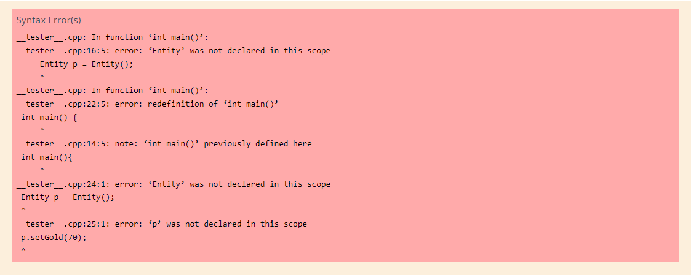


## Question 1 (10 points): Galaxy Class <a name="question1"></a>

Create a class `Galaxy` by splitting the code into the following files:
- A header file ```Galaxy.h``` to declare the definition of the class
- An implementation file ```Galaxy.cpp``` to implement the class defined in the header
- A driver file ```GalaxyDriver.cpp``` that contains the `main` function

The Galaxy class comprises of the following attributes:

**Data members (private)**

| **Member Type** | **Member Name** | **Description** |
|-----------------|-----------------|-----------------|
| ```string```    | _name      | Name of the Galaxy      |
| ```const static int```       | _MAX_SIZE       | Maximum size of the ```_radii``` array; will be ```10``` for this question     |
| ```int[]```       | _radii       | Array containing the radius of Planets in the Galaxy. The size of this array is ```_MAX_SIZE```     |
| ```int```       | _current_size       | Number of planets in the ```_radii``` array     |

**Member Functions (public)**

| **Function** | **Description** |
|-----------------|-----------------|
|Default constructor|Creates a new instance of ```Galaxy``` by setting ```_name``` to an empty string, ```_current_size``` to ```0``` and each radius in the ```_radii``` array to ```0```|
|```Galaxy(string)```|Creates a new instance of ```Galaxy``` with ```_name``` as the string parameter. The ```_current_size``` is set to ```0``` and each radius in the ```_radii``` array is ```0```|
|```Galaxy(string, int[], int)```|Creates a new instance of ```Galaxy``` with ```_name``` as the string parameter, ```_current_size``` as the int parameter, and fills the ```_radii``` array. <br/>*See Function Specification table below for more details*  |
|```string getName()```| Returns the ```_name``` of the Galaxy |
|```int getCurrentSize()```| Returns the ```_current_size``` of the Galaxy |
|```void setName(string)```| Sets the ```_name``` to the value of the string parameter |
|```int getRadius(int)```| Returns radius at the provided index in the ```_radii``` array. If the index is greater than or equal to ```_current_size```, return `-1` |
|```bool addRadius(int)```| Returns true if the new radius can be added to the ```_radii``` array. If the ```_current_size``` is already equal to ```_MAX_SIZE```, return false. <br/>*See Function Specification table below for more details* |
|```double getAverageRadius()``` | Calculates and returns the average radius of the Planets in the Galaxy.<br/>*See [Question 2](#question2) for more details* |

*Function Specifications*:

<table>
<tr>
<td>

Function: <br>
```Galaxy(string, int[], int)```
</td>
<td>

```cpp
Galaxy(string name, int radii[], int arr_size)
```

</td>
</tr>
<tr>
<td> Purpose: </td>
<td>

This parameterized constructor creates a new instance of the ```Galaxy``` class.
- Set ```_name``` to ```name```.
- Set ```_current_size``` to ```arr_size``` if ```arr_size``` doesn't exceed ```_MAX_SIZE```. Otherwise,  ```_current_size``` is set to ```_MAX_SIZE``` (See Error Handling section)
- Assign the elements from the ```radii[]``` array to the ```_radii[]``` array, up to the size indicated by ```_current_size```.

</td>
</tr>
<tr>
<td> Parameters: </td>
<td>

string ```name```: The name of the Galaxy <br>
int ```radii[]```: Array of radius of Planets in the Galaxy <br>
int ```arr_size```: The size of ```radii[]``` array <br>

</td>
</tr>
<tr>
<td> Return Value: </td>
<td>

- The constructor doesn't return any value
- The constructor should not print anything
</td>
</tr>

<tr>
<td> Error Handling/Boundary Conditions: </td>
<td>

- If ```arr_size``` exceeds ```_MAX_SIZE```, only the first ```_MAX_SIZE``` elements will be stored in the ```_radii``` array. Do NOT print any other statements to showcase this scenario.

</td>
</tr>
<tr></tr>
<tr>
<td> Example: </td>
<td>

Note: This is only an example usage of the function; you need to develop your own function to fulfill the requirement for this problem. <br>
Sample Code: <br>

```cpp
// Assume the proper libraries are included
// Assume the proper implementation of the class is included

int main()
{
    string name = "Andromeda";
    int arr_size = 8;
    int radii[arr_size] = {10, 20, 30, 40, 50, 60, 70, 80};
    Galaxy new_galaxy = Galaxy(name, radii, arr_size);
}
```

The expected contents of the ```new_galaxy``` object created: <br>
```
_name = Andromeda
_MAX_SIZE = 10
_current_size = 8
_radii[] = {10, 20, 30, 40, 50, 60, 70, 80, 0, 0}
```

</td>
</tr>
</td>
</tr>
</table>

*Function Specifications*:

<table>
<tr>
<td>

Function: <br>
```addRadius(int)```
</td>
<td>

```cpp
bool addRadius(int radius)
```

</td>
</tr>
<tr>
<td> Purpose: </td>
<td>

Adds the provided ```radius``` to the ```_radii``` array.
</td>
</tr>
<tr>
<td> Parameters: </td>
<td>

int ```radius```: The value of radius to be added <br>
</td>
</tr>
<tr>
<td> Return Value: </td>
<td>

- ```bool``` : A boolean value indicating whether the new ```radius``` was successfully added to the ```_radii``` array. <br>
- The function should not print anything.
</td>
</tr>

<tr>
<td> Error Handling/Boundary Conditions: </td>
<td>

- If ```_current_size``` is already equal to ```_MAX_SIZE```, do not add/modify any contents and return ```false```
- If the ```radius``` is non-positive, do not add/modify any contents and return ```false```
- Return ```true``` if none of the above conditions hold true
</td>
</tr>
<tr></tr>
<tr>
<td> Example: </td>
<td>

Note: This is only an example usage of the function; you need to develop your own main function to fulfill the requirement for this problem.<br>

Sample Code: <br>

```cpp
// Assume the proper libraries are included
// Assume the proper implementation of the Galaxy class is included

int main()
{
    string name = "Andromeda";
    const int ARR_SIZE = 8;
    int radii[ARR_SIZE] = {10, 20, 30, 40, 50, 60, 70, 80};
    Galaxy new_galaxy = Galaxy(name, radii, ARR_SIZE);
    cout << new_galaxy.addRadius(90) << endl;
}
```
The expected return value after the function call: <br>
```
true
```
The expected contents of ```new_galaxy``` object after the function call: <br>
```
_name = "Andromeda"
_MAX_SIZE = 10
_current_size = 9
_radii[] = {10, 20, 30, 40, 50, 60, 70, 80, 90, 0}
```

</td>
</tr>
</td>
</tr>
</table>

*Sample runs:* <br>
Refer to the example above for sample usage of the function.
<table>
<tr>
<td> Example 1: </td>
<td>
Input for the function call:

```cpp
string name = "MilkyWay";
const int ARR_SIZE = 3;
int radii[ARR_SIZE] = {10, 20, 30};
Galaxy new_galaxy = Galaxy(name, radii, ARR_SIZE);
cout << new_galaxy.addRadius(-40) << endl;
```

The expected return value after the function call: <br>
```
false
```
The expected contents of ```new_galaxy``` object after the function call: <br>
```
_name = "MilkyWay"
_MAX_SIZE = 10
_current_size = 3
_radii[] = {10, 20, 30, 0, 0, 0, 0, 0, 0, 0}
```

</td>
</tr>

<tr></tr>

<tr>
<td> Example 2: </td>
<td>
Input for the function call:

```cpp
string name = "Orion";
const int ARR_SIZE = 10;
int radii[ARR_SIZE] = {10, 20, 30, 40, 50, 60, 70, 80, 90, 100};
Galaxy new_galaxy = Galaxy(name, radii, ARR_SIZE);
cout << new_galaxy.addRadius(40) << endl;
```

The expected return value after the function call: <br>
```
false
```
The expected contents of ```new_galaxy``` object after the function call: <br>
```
_name = "Orion"
_MAX_SIZE = 10
_current_size = 10
_radii[] = {10, 20, 30, 40, 50, 60, 70, 80, 90, 100}
```
</td>
</tr>
</table>


Develop and validate your solution in VS Code. Once you are happy with your solution, go to coderunner on Canvas and paste the code from the header `Galaxy.h` and the implementation `Galaxy.cpp` files into the answer box. (You are not expected to complete the implementation of the `getAverageRadius()` function for this question as it is a part of question 2. However, make sure to add this function in your header file). Do not paste your driver code.

## Question 2 (5 points): Find Average Radius of a Galaxy<a name="question2"></a>
Write a member function `getAverageRadius()` in the Galaxy class to find the average radius of the planets in the `_radii` array.

*Function Specifications*:

<table>
<tr>
<td>

Function: <br>
```getAverageRadius()```
</td>
<td>

```cpp
double getAverageRadius()
```

</td>
</tr>
<tr>
<td> Purpose: </td>
<td>
Calculates and returns the average radius of the Planets in the Galaxy.
</td>
</tr>
<tr>
<td> Parameters: </td>
<td>
This member function takes no parameters.
</td>
</tr>
<tr>
<td> Return Value: </td>
<td>

- ```double``` : The average radius of all planets in the Galaxy.
- The function should not print anything.
</td>
</tr>

<tr>
<td> Error Handling/Boundary Conditions: </td>
<td>

- Return ```0``` if the ```_current_size``` is zero.

</td>
</tr>
<tr></tr>
<tr>
<td> Example: </td>
<td>

Note: This is only an example usage of the function; you need to develop your own main function to fulfill the requirement for this problem.<br>

Sample Code: <br>

```cpp
// Assume the proper libraries are included
// Assume the proper implementation of the Galaxy class is included

int main()
{
    string name = "Andromeda";
    const int ARR_SIZE = 8;
    int radii[ARR_SIZE] = {10, 20, 30, 40, 50, 60, 70, 80};
    Galaxy new_galaxy = Galaxy(name, radii, ARR_SIZE);
    cout << fixed<< setprecision(2) << new_galaxy.getAverageRadius() << endl;
}
```

The expected output after the function call: <br>
```
45.00
```

</td>
</tr>
</td>
</tr>
</table>


*Sample runs:* <br>
Refer to the example above for sample usage of the function.
<table>
<tr>
<td> Example 1: </td>
<td>
Input for the function call:

```cpp
string name = "MilkyWay";
const int ARR_SIZE = 3;
int radii[ARR_SIZE] = {10, 20, 30};
Galaxy new_galaxy = Galaxy(name, radii, ARR_SIZE);
cout << fixed<< setprecision(2) << new_galaxy.getAverageRadius() << endl;
```

The expected output after the function call: <br>
```
20.00
```

</td>
</tr>

<tr></tr>

<tr>
<td> Example 2: </td>
<td>
Input for the function call:

```cpp
string name = "Orion";
const int ARR_SIZE = 5;
int radii[ARR_SIZE] = {10, 20, 30, 50, 70};
Galaxy new_galaxy = Galaxy(name, radii, ARR_SIZE);
cout << fixed<< setprecision(2) << new_galaxy.getAverageRadius() << endl;
```


The expected output after the function call: <br>
```
36.00
```

</td>
</tr>
</table>

Develop and validate your solution in VS Code. Once you are happy with your solution, go to coderunner on Canvas and paste the code from the header `Galaxy.h` and the implementation `Galaxy.cpp` files into the answer box. Do not paste your driver code.

## Question 3 (5 points): Galaxy with the largest average radius<a name="question3"></a>
Write a function ```findGalaxyWithLargestAverageRadius()``` to find the Galaxy in the ```galaxies``` array with the largest average radius of planets. The function specification is provided below.<br>

*Function Specifications*:

<table>
<tr>
<td>

Function: <br>
```findGalaxyWithLargestAverageRadius (Galaxy[], const int)```
</td>
<td>

```cpp
string findGalaxyWithLargestAverageRadius(Galaxy galaxies[], const int ARR_SIZE)
```

</td>
</tr>
<tr>
<td> Purpose: </td>
<td>

Finds the name of the galaxy in the ```galaxies``` array with the largest average radius of the planets.
</td>
</tr>
<tr>
<td> Parameters: </td>
<td>

Galaxy ```galaxies[]```: Array of Galaxy objects <br>
const int ```ARR_SIZE```: The size of ```galaxies``` array <br>
</td>
</tr>
<tr>
<td> Return Value: </td>
<td>

- ```string``` : The name of the galaxy with the largest average radius
- The function should not print anything.
</td>
</tr>

<tr>
<td> Error Handling/Boundary Conditions: </td>
<td>

- If multiple galaxies have the same largest average radius, return the name of the first galaxy with the largest average radius found in the array.

</td>
</tr>
<tr></tr>
<tr>
<td> Example: </td>
<td>

Note: This is only an example usage of the function; you need to develop your own main function to fulfill the requirement for this problem.<br>

Sample Code: <br>

```cpp
// Assume the proper libraries are included
// Assume the proper implementation of the Galaxy class is included

int main()
{
    const int ARR_SIZE = 3;
    int radii_1[3] = {10, 20, 30};
    int radii_2[4] = {10, 20, 30, 40};
    int radii_3[4] = {20, 40, 10, 10};
    Galaxy galaxy_1 = Galaxy("Andromeda", radii_1, 3);
    Galaxy galaxy_2 = Galaxy("MilkyWay", radii_2, 4);
    Galaxy galaxy_3 = Galaxy("Orion", radii_3, 4);
    Galaxy galaxies[ARR_SIZE] = {galaxy_1, galaxy_2, galaxy_3};
    cout << findGalaxyWithLargestAverageRadius(galaxies, ARR_SIZE) << endl;
}
```

The expected output after the function call: <br>
```
MilkyWay
```

Explanation: <br>
```
Average radius of galaxy_1 = 20.00
Average radius of galaxy_2 = 25.00
Average radius of galaxy_3 = 20.00
galaxy_2 has the largest average radius, so we return the name of galaxy_2, i.e., MilkyWay
```

</td>
</tr>
</td>
</tr>
</table>

*Sample runs:* <br>
Refer to the example above for sample usage of the function.
<table>
<tr>
<td> Example 1: </td>
<td>
Input for the function call:

```cpp
int radii_1[3] = {10, 20, 30};
int radii_2[4] = {10, 10, 10, 10};
int radii_3[4] = {20, 40, 10, 10};
Galaxy galaxy_1 = Galaxy("Andromeda", radii_1, 3);
Galaxy galaxy_2 = Galaxy("MilkyWay", radii_2, 4);
Galaxy galaxy_3 = Galaxy("Orion", radii_3, 4);
```

The expected output after the function call: <br>
```
Andromeda
```

Explanation: <br>
```
Average radius of galaxy_1 = 20.00
Average radius of galaxy_2 = 10.00
Average radius of galaxy_3 = 20.00
galaxy_1, galaxy_3 share the same largest average radius, so we return the name of galaxy_1, i.e., Andromeda
```

</td>
</tr>

<tr></tr>

<tr>
<td> Example 2: </td>
<td>
Input for the function call:

```cpp
int radii_1[5] = {5, 15, 20, 30, 40};
int radii_2[4] = {20, 40, 30, 20};
int radii_3[4] = {20, 40, 10, 10};
Galaxy galaxy_1 = Galaxy("Andromeda", radii_1, 5);
Galaxy galaxy_2 = Galaxy("MilkyWay", radii_2, 4);
Galaxy galaxy_3 = Galaxy("Orion", radii_3, 4);
```

The expected output after the function call: <br>
```
MilkyWay
```

Explanation: <br>
```
Average radius of galaxy_1 = 22.00
Average radius of galaxy_2 = 27.50
Average radius of galaxy_3 = 20.00
galaxy_2 has the largest average radius, so we return the name of galaxy_2, i.e., MilkyWay
```

</td>
</tr>
</table>

Develop and validate your solution in VS Code. Once you are happy with your solution, go to coderunner on Canvas and paste the code from the header `Galaxy.h`, the implementation `Galaxy.cpp`, and the function `findGalaxyWithLargestAverageRadius` into the answer box. Do not paste your driver code.

## Questions 4 through 7: The Odyssey <a name="odyssey"></a>
The theme for the final project is the game of Odyssey. To prepare for the final project, you have decided to implement some functionality that can be reused. In this homework, you'll focus on developing two classes, an ```Entity``` class and a ```Game``` class, along with crafting a basic main menu and loading game data to kickstart the game.

## Question 4 (5 points): Entity Class <a name="question4"></a>

In this question, you will create an `Entity` class that will be used as characters in the game.

Create a class `Entity` by splitting the code into the following files:
- A header file ```Entity.h``` to declare the definition of the class
- An implementation file ```Entity.cpp``` to implement the class defined in the header
- A driver file ```EntityDriver.cpp``` that contains the `main` function

The Entity class consists of the following attributes and functions: <br>

**Data Members (private)**

| **Member Type** | **Member Name** | **Description** |
|-----------------|-----------------|-----------------|
|```string```|	```_name```| Name of the entity |
|```double```|	```_hp```	| Entity's health points, representing its health or vitality |
|```int```|	```_gold```	| The amount of gold the entity possesses |
|```char```	|```_condition```|	Entity's current condition, represented by a single character: *'H' - Healthy*, *'D' - Diseased*, *'P' - Poisoned*|
|```bool```| ```_is_enemy``` | Specifies if the entity is an enemy |

| **Function** | **Description** |
|-----------------|-----------------|
| ```Default Constructor```| Creates a new instance of Entity with `_gold` and `_hp` as zero, `_name` as an empty string, `_condition` as `H` and `_is_enemy` as false. |
|```Entity(string, double, int, char, bool)```| Creates a new instance of Entity and sets the data members accordingly. <br/>*See Function Specification table below for more details*|
|```string getName()```|	Returns the name of the entity|
|```double getHP()```|	Returns the current health points `_hp` of the entity |
|```char getCondition()```|	Returns the current condition of the entity (`H`, `D`, or `P`)|
|```int getGold()```	|Returns the amount of gold the entity possesses |
|```bool getIsEnemy()```	|Returns if the entity is an enemy |
|```void setName(string name)```	|Sets the name of the entity |
|```void setHP(double HP)```	|Sets the health points `_hp` for the entity to `hp` only if it is a non-negative value, else it is not changed |
|```void setCondition(char condition)```	|Sets the condition of the entity (`H`, `D`, or `P`) to the given value `condition` only if it is one among `H`, `D` or `P`, else it is not changed |
|```void setGold(int gold)```	|Sets the amount of `_gold` the entity possesses to the given value `gold` only if it is a non-negative value, else it is not changed |
|```void setIsEnemy(bool is_enemy)```	|Sets if the entity is an enemy based on the boolean parameter |
|```void printStats()```	|Prints the stats of the entity <br/>*See Function Specification table below for more details* |

*Function Specifications*:

<table>
<tr>
<td>

Function: <br>
```Entity(string, double, int, char, bool)```
</td>
<td>

```cpp
Entity(string name, double hp, int gold, char condition, bool enemy)
```

</td>
</tr>
<tr>
<td> Purpose: </td>
<td>
    This parameterized constructor creates a new instance of the Entity class and sets the data members as provided.
</td>
</tr>
<tr>
<td> Parameters: </td>
<td>

string `name`: The name of the Entity<br>
double `hp`:  Health points of the Entity <br/>
int `gold`: Amount of gold of the Entity <br/>
char `condition`: The condition of the Entity (`H`, `D` or `P`) <br/>
bool `enemy`: Specifies if the Entity is an enemy <br/>

</td>
</tr>
<tr>
<td> Return Value: </td>
<td>

- The constructor doesn't return any value
- The constructor should not print anything
</td>
</tr>

<tr>
<td> Error Handling/Boundary Conditions: </td>
<td>

- `_hp` is set to the value `hp` only if it is a non-negative value, else it is set to 0
- `_gold` is set to the given value `gold` only if it is a non-negative value, else it is set to 0
- `_condition` is set to the given value `condition` only if it is one among `H`, `D`, or `P`, else it is set to `H`.

</td>
</tr>

<td> Example: </td>
<td>

Note: This is only an example usage of the function; you need to develop your own main function to fulfill the requirement for this problem.<br>

Sample Code: <br>

```cpp
// Assume the proper libraries are included
// Assume the proper implementation of the Entity class is included

int main()
{
    Entity entity1("John", 8.2, 12, 'P', false);
}
```
The expected contents of the `entity1` object created: <br>
```
_name = John
_hp = 8.2
_gold = 12
_condition = P
_is_enemy = false
```

</td>
</tr>
</td>
</tr>
</table>

*Function Specifications*:

<table>
<tr>
<td>

Function: <br>
```printStats()```
</td>
<td>

```cpp
void printStats()
```

</td>
</tr>
<tr>
<td> Purpose: </td>
<td>
    This member function prints the stats of the entity.
</td>
</tr>
<tr>
<td> Parameters: </td>
<td>
The function takes no parameters.<br>
</td>
</tr>
<tr>
<td> Return Value: </td>
<td>

- `void`: The function doesn't return any value <br/>
- All `double` values should be printed up to `2` decimal places <br>
- Print `Yes` or `No` depending on the value of the attribute `_is_enemy`
</td>
</tr>

<td> Example: </td>
<td>

Note: This is only an example usage of the function; you need to develop your own main function to fulfill the requirement for this problem.<br>

Sample Code: <br>

```cpp
// Assume the proper libraries are included
// Assume the proper implementation of the Entity class is included

int main()
{
    Entity entity1("John", 8.2, 12, 'P', false);
    entity1.printStats();
}
```
The expected return value after the function call: <br>
```
John's stats:
HP: 8.20
Condition: P
Gold: 12
Is Enemy: No
```

</td>
</tr>
</td>
</tr>
</table>

Develop and validate your solution in VS Code. Once you are happy with your solution, go to coderunner on Canvas and paste the code from the header `Entity.h` and the implementation `Entity.cpp` files into the answer box. Do not paste your driver code.

## Question 5 (5 points): Game Class <a name="question5"></a>

Create a class `Game` by splitting the code into the following files:
- A header file ```Game.h``` to declare the definition of the class
- An implementation file ```Game.cpp``` to implement the class defined in the header
- A driver file ```GameDriver.cpp``` that contains the `main` function

The Game class consists of the following attributes and functions: <br>

**Data members (private)**
| **Member Type** | **Member Name** | **Description** |
|-----------------|-----------------|-----------------|
|```Entity```|	```_players[2]```|	Array storing player objects |
|```Entity```|	```_enemies[2]```|	Array storing enemy objects |
|```int```	|```_num_players```	| Current number of players in the game |
|```int```	|```_num_enemies```| Current number of enemies in the game |

**Member Functions (public)**

| **Function** | **Description** |
|-----------------|-----------------|
|Default constructor|Creates a new instance of ```Game``` with empty `_players` and `_enemies` arrays and sets `_num_players` and `_num_enemies` to 0 |
|```int getNumPlayers()```| Returns the current number of players `_num_players` |
|```int getNumEnemies()```| Returns the current number of enemies `_num_enemies` |
|```void setPlayersList(Entity[], int)```| Sets the `_players` array with the provided array of objects. The number of objects in the array is specified by the int parameter. If the number of objects is greater than 2, only the first two objects are considered. The data member `_num_players` is updated accordingly. |
|```void setEnemiesList(Entity[], int)```| Sets the `_enemies` array with the provided array of objects. The number of objects in the array is specified by the int parameter. If the number of objects is greater than 2, only the first two objects are considered. The data member `_num_enemies` is updated accordingly. |
|```bool setPlayer(int, Entity)```| Replaces a player object at the given index in the `_players` array. <br/>*See Function Specification table below for more details* |
|```Entity getPlayer(string)```| Returns an object from the `_players` array based on the provided name |
|```bool setEnemy(int, Entity)```| Replaces an enemy object at the given index in the `_enemies` array. <br/>*See Function Specification table below for more details* |
|```Entity getEnemy(string)```| Returns an object from the `_enemies` array based on the provided name |
|```int findPlayer(string)```| Returns the index of the player object in the  `_players` array based on the provided name. <br/>*See Function Specification table below for more details*  |
|```int findEnemy(string)```| Returns the index of the enemy object in the  `_enemies` array based on the provided name. <br/>*See Function Specification table below for more details*  |
|```void printAllStats()```|	Prints stats of all the players and enemies. <br/>*See Function Specification table below for more details*|


*Function Specifications*:

<table>
<tr>
<td>

Function: <br>
```setPlayer(int, Entity)```
</td>
<td>

```cpp
bool setPlayer(int index, Entity new_player)
```

</td>
</tr>
<tr>
<td> Purpose: </td>
<td>

Replace the player object in the `_players` array at the given index with the new object.
</td>
</tr>
<tr>
<td> Parameters: </td>
<td>

int ```index```: index of the player object in the `_players` array <br>
Entity ```new_player```: The new object which replaces an older object in the `_players` array <br>
</td>
</tr>
<tr>
<td> Return Value: </td>
<td>

`bool`: Returns `true` if the new object replaces an older object in the `_players` array; `false` if the attribute `index` is not within the boundaries of the `_players` array.
</td>
</tr>

<tr>
<td> Error Handling/Boundary Conditions: </td>
<td>

- Returns `false` if the attribute `index` is not within the size of the `_players` array.

</td>
</tr>
<tr></tr>
<tr>
<td> Example: </td>
<td>

Note: This is only an example usage of the function; you need to develop your own main function to fulfill the requirement for this problem.<br>
Sample Code: <br>

```cpp
// Assume the proper libraries are included
// Assume the proper implementation of the Entity class and Game class are included

int main()
{
    Entity player1("Odysseus", 100, 50, 'H', false);
    Entity player2("Achilles", 80, 100, 'H', false);
    Entity player3("Hercules", 110, 70, 'H', false);
    Entity enemy1("Sirens", 100, 50, 'H', true);
    Entity enemy2("Scylla", 200, 50, 'H', true);
    Entity enemy3("Cicones", 50, 40, 'H', true);
    Entity players[2] = {player1, player2};
    Entity enemies[2] = {enemy1, enemy2};
    int num_players = 2;
    int num_enemies = 2;
    Game new_game = Game(players, enemies, num_players, num_enemies);

    int index = new_game.findPlayer("Odysseus");
    cout << "Status of setting player at index " << index << " is " << new_game.setPlayer(index, player3) << endl;

    index = new_game.findPlayer("Harry");
    cout << "Status of setting player at index " << index << " is " << new_game.setPlayer(index, player1) << endl;

}
```
The expected output after the function call: <br>
```
Status of setting player at index 0 is 1
Status of setting player at index -1 is 0
```

</td>
</tr>
</td>
</tr>
</table>

*Function Specifications*:

<table>
<tr>
<td>

Function: <br>
```setEnemy(int, Entity)```
</td>
<td>

```cpp
bool setEnemy(int index, Entity new_enemy)
```

</td>
</tr>
<tr>
<td> Purpose: </td>
<td>

Replace the enemy object in the `_enemies` array at the given index with the new object.
</td>
</tr>
<tr>
<td> Parameters: </td>
<td>

int ```index```: index of the enemy object in the `_enemies` array <br>
Entity ```new_enemy```: The new object which replaces an older object in the `_enemies` array <br>
</td>
</tr>
<tr>
<td> Return Value: </td>
<td>

`bool`: Returns `true` if the new object replaces an older object in the `_enemies` array; `false` if the attribute `index` is not within the boundaries of the `_enemies` array.
</td>
</tr>

<tr>
<td> Error Handling/Boundary Conditions: </td>
<td>

- Returns `false` if the attribute `index` is not within the size of the `_enemies` array.

</td>
</tr>
<tr></tr>
<tr>
<td> Example: </td>
<td>

Note: This is only an example usage of the function; you need to develop your own main function to fulfill the requirement for this problem.<br>
Sample Code: <br>

```cpp
// Assume the proper libraries are included
// Assume the proper implementation of the Entity class and Game class are included

int main()
{
    Entity player1("Odysseus", 100, 50, 'H', false);
    Entity player2("Achilles", 80, 100, 'H', false);
    Entity player3("Hercules", 110, 70, 'H', false);
    Entity enemy1("Sirens", 100, 50, 'H', true);
    Entity enemy2("Scylla", 200, 50, 'H', true);
    Entity enemy3("Cicones", 50, 40, 'H', true);
    Entity players[2] = {player1, player2};
    Entity enemies[2] = {enemy1, enemy2};
    int num_players = 2;
    int num_enemies = 2;
    Game new_game = Game(players, enemies, num_players, num_enemies);

    int index = new_game.findEnemy("Scylla");
    cout << "Status of setting enemy at index " << index << " is " << new_game.setEnemy(index, enemy3) << endl;

    index = new_game.findEnemy("Hector");
    cout << "Status of setting enemy at index " << index << " is " << new_game.setEnemy(index, enemy1) << endl;

}
```
The expected output after the function call: <br>
```
Status of setting enemy at index 1 is 1
Status of setting enemy at index -1 is 0
```

</td>
</tr>
</td>
</tr>
</table>

*Function Specifications*:

<table>
<tr>
<td>

Function: <br>
```findPlayer(string)```
</td>
<td>

```cpp
int findPlayer(string name)
```

</td>
</tr>
<tr>
<td> Purpose: </td>
<td>

Finds the index of the player object in the `_players` array whose name matches the provided name.
</td>
</tr>
<tr>
<td> Parameters: </td>
<td>

string ```name```: Name of the player <br>
</td>
</tr>
<tr>
<td> Return Value: </td>
<td>

`int`:Returns the `index` of the object in the `_players` array.
</td>
</tr>

<tr>
<td> Error Handling/Boundary Conditions: </td>
<td>

- Returns `-1` if the attribute `name` doesn't match the name of any object in the `_players` array.

</td>
</tr>
<tr></tr>
<tr>
<td> Example: </td>
<td>

Note: This is only an example usage of the function; you need to develop your own main function to fulfill the requirement for this problem.<br>
Sample Code: <br>

```cpp
// Assume the proper libraries are included
// Assume the proper implementation of the Entity class and Game class are included

int main()
{
    Entity player1("Odysseus", 100, 50, 'H', false);
    Entity player2("Achilles", 80, 100, 'H', false);
    Entity player3("Hercules", 110, 70, 'H', false);
    Entity enemy1("Sirens", 100, 50, 'H', true);
    Entity enemy2("Scylla", 200, 50, 'H', true);
    Entity enemy3("Cicones", 50, 40, 'H', true);
    Entity players[2] = {player1, player2};
    Entity enemies[2] = {enemy1, enemy2};
    int num_players = 2;
    int num_enemies = 2;
    Game new_game = Game(players, enemies, num_players, num_enemies);


    cout << "Status of finding player with name Odysseus: " << new_game.findPlayer("Odysseus") << endl;

    cout << "Status of finding player with name Hercules: " << new_game.findPlayer("Hercules") << endl;

}
```
The expected output after the function call: <br>
```
Status of finding player with name Odysseus: 0
Status of finding player with name Hercules: -1
```

</td>
</tr>
</td>
</tr>
</table>


*Function Specifications*:

<table>
<tr>
<td>

Function: <br>
```findEnemy(string)```
</td>
<td>

```cpp
int findEnemy(string name)
```

</td>
</tr>
<tr>
<td> Purpose: </td>
<td>

Finds the index of the enemy object in the `_enemies` array whose name matches the provided name.
</td>
</tr>
<tr>
<td> Parameters: </td>
<td>

string ```name```: Name of the enemy <br>
</td>
</tr>
<tr>
<td> Return Value: </td>
<td>

`int`: Returns the `index` of the object in the `_enemies` array.
</td>
</tr>

<tr>
<td> Error Handling/Boundary Conditions: </td>
<td>

- Returns `-1` if the attribute `name` doesn't match the name of any object in the `_enemies` array.

</td>
</tr>
<tr></tr>
<tr>
<td> Example: </td>
<td>

Note: This is only an example usage of the function; you need to develop your own main function to fulfill the requirement for this problem.<br>
Sample Code: <br>

```cpp
// Assume the proper libraries are included
// Assume the proper implementation of the Entity class and Game class are included

int main()
{
    Entity player1("Odysseus", 100, 50, 'H', false);
    Entity player2("Achilles", 80, 100, 'H', false);
    Entity player3("Hercules", 110, 70, 'H', false);
    Entity enemy1("Sirens", 100, 50, 'H', true);
    Entity enemy2("Scylla", 200, 50, 'H', true);
    Entity enemy3("Cicones", 50, 40, 'H', true);
    Entity players[2] = {player1, player2};
    Entity enemies[2] = {enemy1, enemy2};
    int num_players = 2;
    int num_enemies = 2;
    Game new_game = Game(players, enemies, num_players, num_enemies);

    cout << "Status of finding enemy with name Cicones: " << new_game.findEnemy("Cicones") << endl;

    cout << "Status of finding enemy with name Scylla: " << new_game.findEnemy("Scylla") << endl;

}
```
The expected output after the function call: <br>
```
Status of finding enemy with name Cicones: -1
Status of finding enemy with name Scylla: 1
```

</td>
</tr>
</td>
</tr>
</table>


*Function Specifications*:

<table>
<tr>
<td>

Function: <br>
```printAllStats()```
</td>
<td>

```cpp
void printAllStats()
```

</td>
</tr>
<tr>
<td> Purpose: </td>
<td>

Prints the stats of all the player and enemy entities.<br>
Each entity's stats are separated by a dashed line (See sample output) <br>
**Hint**: Use the `printStats()` member function from the Entity class here.
</td>
</tr>
<tr>
<td> Parameters: </td>
<td>
This member function takes no parameters.
</td>
</tr>
<tr>
<td> Return Value: </td>
<td>

- `void`: The function doesn't return any value <br/>
- The function prints out the stats of all the player and enemy entities.
</td>
</tr>

<td> Example: </td>
<td>

Note: This is only an example usage of the function; you need to develop your own main function to fulfill the requirement for this problem.<br>

Sample Code: <br>

```cpp
// Assume the proper libraries are included
// Assume the proper implementation of the Entity class and Game class are included

int main()
{
    Entity player1("Odysseus", 100, 50, 'H', false);
    Entity player2("Achilles", 80, 100, 'H', false);
    Entity enemy1("Sirens", 100, 50, 'H', true);
    Entity players[2] = {player1, player2};
    Entity enemies[2] = {enemy1};
    int num_players = 2;
    int num_enemies = 1;
    Game new_game = Game(players, enemies, num_players, num_enemies);
    new_game.printAllStats();
}
```
The expected output after the function call: <br>
```
Odysseus's stats:
HP: 100.00
Condition: H
Gold: 50
Is Enemy: No
----------------------------------------------
Achilles's stats:
HP: 80.00
Condition: H
Gold: 100
Is Enemy: No
----------------------------------------------
Sirens's stats:
HP: 100.00
Condition: H
Gold: 50
Is Enemy: Yes
----------------------------------------------
```

</td>
</tr>
</td>
</tr>
</table>

Develop and validate your solution in VS Code. Once you are happy with your solution, go to coderunner on Canvas and paste the code from the headers `Game.h`, `Entity.h`, and the implementation files `Game.cpp` and `Entity.cpp` into the answer box. Do not paste your driver code.

## Question 6 (5 points): Loading Characters <a name="question6"></a>
Our game for the project will begin by loading data from the provided text files. In this question, the sample outputs are from loading data from [players.txt](input_files/players.txt) and [enemies.txt](input_files/enemies.txt). The CodeRunner will use the data from [players_full.txt](input_files/players_full.txt), [enemies_full.txt](input_files/enemies_full.txt), [players_full_invalid.txt](input_files/players_full_invalid.txt), [enemies_full_invalid.txt](input_files/enemies_full_invalid.txt)

Write a function ```loadCharacters()``` that reads data from a text file and fills an array of Entity objects. The text file contains information about different characters, with each character's information separated by the character ```|``` and each character listed on a new line. The function specification is provided below.<br>

*Function Specifications*:

<table>
<tr>
<td>

Function: <br>
```loadCharacters(string, Entity[], const int, bool)```
</td>
<td>

```cpp
bool loadCharacters(string filename, Entity characters[], const int CHARACTERS_SIZE, bool is_enemy)
```

</td>
</tr>
<tr>
<td> Purpose: </td>
<td>

Reads data from the text file ```filename``` and fills the array of Entity objects ```characters[]```. For each character, set the value of ```_is_enemy``` based on the provided `is_enemy` parameter.
</td>
</tr>
<tr>
<td> Parameters: </td>
<td>

string ```filename```: Name of the text file to be read <br>
Entity ```characters[]```: Array of Entity objects to be filled <br>
const int ```CHARACTERS_SIZE```: The size of ```characters``` array <br>
bool ```is_enemy```: Specifies if the character is an enemy
</td>
</tr>
<tr>
<td> Return Value: </td>
<td>

- ```bool``` : Checks if characters were successfully added into the array.
- The function should not print anything.
</td>
</tr>

<tr>
<td> Error Handling/Boundary Conditions: </td>
<td>

- Return ```false``` if the file cannot be opened.
- Empty lines should not be added to the array.
- Return ```true``` if the characters are successfully read and stored in the array
- The first line of the text file should not be used to create an object as it only contains the headers of the attributes.
</td>
</tr>
<tr></tr>
<tr>
<td> Example: </td>
<td>

Note: This is only an example usage of the function; you need to develop your own function to fulfill the requirement for this problem.<br>

Sample text file: <br>
```
name|HP|gold|condition
Odysseus|100|50|H
Achilles|80|100|H
```

Sample Code: <br>

```cpp
// Assume the proper libraries are included
// Assume the proper implementation of the Entity class is included

int main()
{
    string filename = "players.txt";
    const int PLAYERS_SIZE = 5;
    Entity players[PLAYERS_SIZE];
    bool is_enemy = false;
    cout << "Function returned value: " << loadCharacters(filename, players, PLAYERS_SIZE, is_enemy) << endl << endl;
    // Print the contents of the players array
    for (int i = 0; i < PLAYERS_SIZE; i++)
    {
        if (players[i].getName() != "")
        {
            players[i].printStats();
            cout << endl;
        }
    }
}
```

The expected output after the function call: <br>
```
Function returned value: 1

Odysseus's stats:
HP: 100.00
Condition: H
Gold: 50
Is Enemy: No

Achilles's stats:
HP: 80.00
Condition: H
Gold: 100
Is Enemy: No
```

</td>
</tr>
</td>
</tr>
</table>

*Sample runs:* <br>
Refer to the example above for sample usage of the function.
<table>
<tr>
<td> Example 1 </td>
<td>


Sample text file: <br>
```
name|HP|gold|condition
Sirens|100|50|H
Scylla|200|50|H
```

Input for the function call: <br>

```cpp

    string filename = "enemies.txt";
    const int ENEMIES_SIZE = 5;
    Entity enemies[ENEMIES_SIZE];
    bool is_enemy = true;
    cout << "Function returned value: " << loadCharacters(filename, enemies, ENEMIES_SIZE, is_enemy) << endl << endl;
    // Print the contents of the players array
    for (int i = 0; i < ENEMIES_SIZE; i++)
    {
        if (enemies[i].getName() != "")
        {
            enemies[i].printStats();
            cout << endl;
        }
    }
```

The expected output after the function call: <br>
```
Function returned value: 1

Sirens's stats:
HP: 100.00
Condition: H
Gold: 50
Is Enemy: Yes

Scylla's stats:
HP: 200.00
Condition: H
Gold: 50
Is Enemy: Yes
```

</td>
</tr>
</td>
</tr>
</table>

Develop and validate your solution in VS Code. Once you are happy with your solution, go to coderunner on Canvas and paste the `loadCharacters` function along with the code from the header `Entity.h` and the implementation file `Entity.cpp` into the answer box. Do not paste the driver code.


## Question 7 (7 points): Build the Menu <a name="question7"></a>
Let's create a game menu using the components from the previous questions. Write a program that loads the players and enemies from a file, allowing users to select and display their stats. <br/>

**Note**: After selecting the characters, make sure to create a Game object and store the characters in the Game object. This will be useful for project 2.

> **Note**: The following are the sample outputs only using [players.txt](input_files/players.txt) and [enemies.txt](input_files/enemies.txt).

```md
Select from the following options:
1. Select Players and Enemies
2. Display Players' stats
3. Display Enemies' stats
4. Edit a Player's Stats
5. Edit an Enemy's Stats
6. Exit
```
For option `1`, the program should validate the user input against the list of characters and continuously prompt the user until a valid input is provided. Furthermore, each character can only be selected once. This means that once a character is chosen, it should be **removed** from the list of available characters. Therefore, the program should display the updated list of available characters each time a new character selection is made.

> Please note that Blue is program output, and white is user input.
### Option 1

For this option, you have to read the characters from [players_full.txt](input_files/players_full.txt), [enemies_full.txt](input_files/enemies_full.txt) for players and enemies, respectively, to pass the test cases on coderunner ([players.txt](input_files/players.txt) and [enemies.txt](input_files/enemies.txt) are used in the screenshots to reduce the amount of text). Also, you have to re-read the characters from the files everytime the user selects this option in the menu. Two players and two enemies have to be selected in this option. Below are the sample runs:

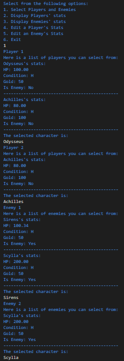

If a character entered is not found in the list, print a corresponding error message and re-prompt the user for input until the user enters a valid input.   

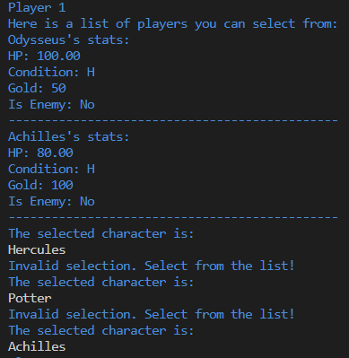

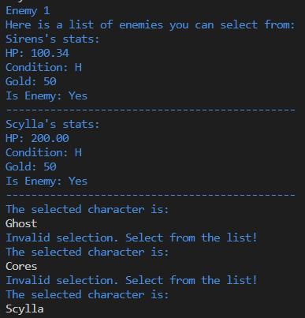


### Options 2 and 3
Below are the sample runs for displaying the stats for players and enemies:

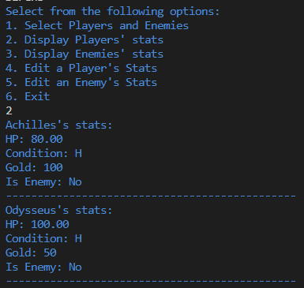

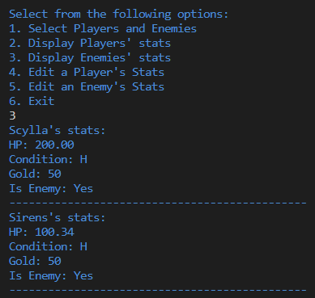

### Options 4 and 5
Below are the sample outputs for editing the stats of players and enemies:

```md
Editing player [player's name] stats:
1. Edit hp
2. Edit condition
3. Edit gold
```

```md
Editing enemy [enemy's name] stats:
1. Edit hp
2. Edit condition
3. Edit gold
```
#### Option 4
Top menu:<br/>
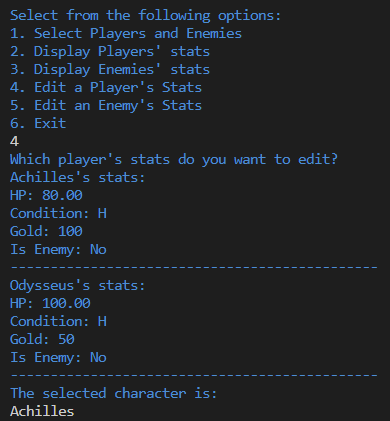

Similar to Option 1, the user input should be validated against the chosen characters and continuously prompt the user until a valid input is provided.

Sub menu:<br/>
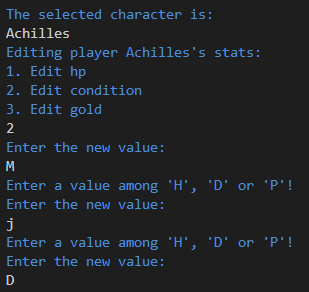

The value of `hp` should be a non-negative double value. The value of `gold` should be a non-negative integer value. The value of `condition` should be one among `H`, `D` or `P`.


### Option 5

The same set of validation used in Option 4 should be implemented here.

Top menu:<br/>
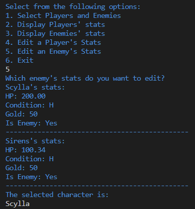

Sub menu:<br/>

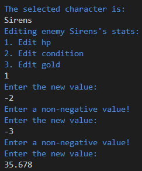


### Option 6
Below is the sample for Option 6

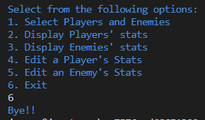

### Invalid Option
When the user enters input that is not between 1-6, following is the output:

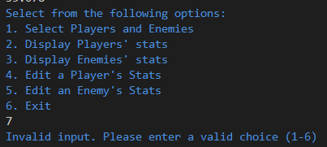

<br/>
<br/>

> **Note**: Use the following for all the dashed lines in the menu:

```
----------------------------------------------
```

<br/>

Develop and validate your solution in VS Code. Once you are happy with your solution, go to coderunner on Canvas and paste the driver code along with `loadCharacters` function, and the code from the headers `Entity.h`, `Game.h`, and the implementation files `Entity.cpp`, `Game.cpp` into the answer box.

# Overview  <a name="overview"></a>

## Checklist <a name="checklist"></a>
Here is a checklist for submitting the assignment:
1. Use your solutions developed in VS Code to complete the **Homework 7 - Coderunner** assignment on Canvas (Modules → Week 12). This will be published on Friday, March 22nd.
2. Complete the Homework 7 Quiz. This will be published on Sunday, March 24th.

## Grading Rubric <a name="grading"></a>
Note: Global variables, string streams, vectors, pointers, and references are not permitted in this homework. The use of global variables, string streams, vectors, pointers, and references will result in a 0 on the entire homework.

| **Criteria**                                | **Points** |
| ------------------------------------------- | ---------- |
| Question 1                                  | 10          |
| Question 2                                  | 5          |
| Question 3                                  | 5          |
| Question 4                                  | 5          |
| Question 5                                  | 5          |
| Question 6                                  | 5         |
| Question 7                                  | 7          |
| Homework 7 Quiz                             | 28         |
| Total                                       | 70      |
