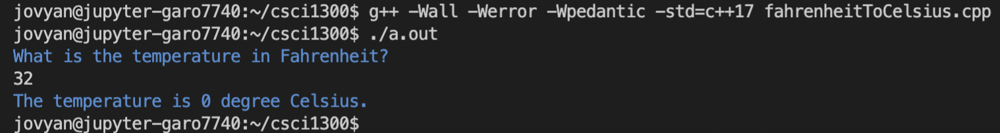
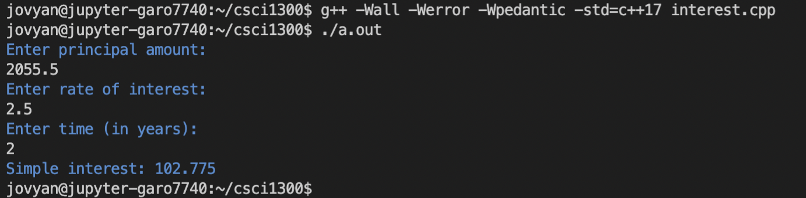
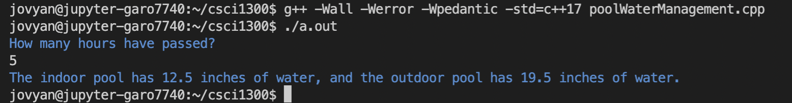
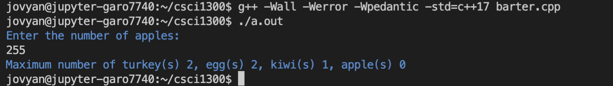
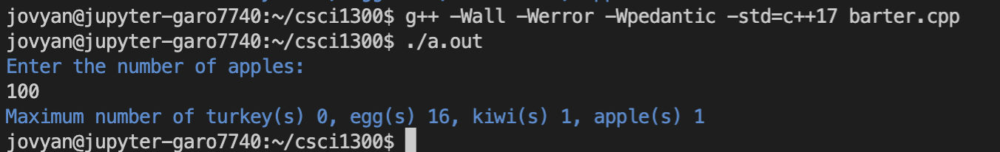

#### **CSCI 1300 CS1: Starting Computing: Homework 1**
#### **Naidu/Godley - Spring 2024**
#### **Due: Friday, January 26 by 5:00pm MST**


# Table of contents
1. [Objectives](#objectives)
2. [Questions](#questions)
    1. [Question 1](#question1)
    2. [Question 2](#question2)
    3. [Question 3](#question3)
    4. [Question 4](#question4)
    5. [Question 5](#question5)
    6. [Question 6](#question6)
3. [Submission Instructions](#submissions)
4. [Overview](#overview)
    1. [Checklist](#checklist)
    2. [Grading Rubric](#grading)

# Objectives <a name="objectives"></a>

* Compile and run C++ code
* Take user inputs and produce outputs
* Understand C++ data types
* Perform arithmetic operations

# Questions <a name="questions"></a>
## **Question 1 (2 points): Hello World** <a name="question1"></a>
The first program that we usually write in any programming language we’re learning is "Hello, World!". Create a program that prints “Hello, World!” to the screen (the output window in VS Code).

Expected output
```
Hello, World!
```
The file should be named _helloWorld.cpp_


The .cpp extension on the filename tells VS Code that the file should be read in the C++ programming language. Once you save it, the lines you write in the file should be color-coded to reflect what they do in the program. This is called syntax highlighting.

Here are some suggested steps:

**Step 1: Write Your Code** <br/>
In VS Code, enter the following hello world program:

```cpp
#include <iostream>
using namespace std;

int main(){
    cout << "Hello, World!" << endl;
    return 0;
}
```

**Step 2: Running Your Code from Command Line** </br>
Move to the “terminal” tab. Make sure you are inside the hmwk1 directory (you can type _pwd_ to see where you are). Type: </br>
``$ g++ -Wall -Werror -Wpedantic -std=c++17 helloWorld.cpp``

the ``-std=c++17`` option makes sure that the C++ version used to run the program is C++ 17. If you don’t give this option then the default version (which is usually C++98) is used.

The ``-Wall -Werror -Wpedantic`` will ensure that our code does not violate any standards.


This creates an executable called "a.out" (or "a.exe" for Windows). You can run it by typing

``$ ./a.out `` or ``$ ./a.exe``

Since no executable name was specified to g++, a.out is chosen by default. You can alternatively use the "-o" option to change the name :

``$ g++ -Wall -Werror -Wpedantic -std=c++17 helloWorld.cpp -o hello``

creates an executable called "hello" (see figure below). You can run it by typing

``$ ./hello``

Notice the output looks the same: "Hello, World!", followed by the return of the prompt, for new commands. (The blue text is the output from running the file.)


**Step 3: Submit to coderunner**<br/>
Head over to Canvas to the assignment **Homework 1: coderunner** in the Week 2 Module. Submit your solution for the first problem and press the Check button. You will see a report on how your solution passed the tests and the resulting score for the first problem. You can modify your code and re-submit (press “Check” again) as many times as you need to.


If the code runner says “incorrect”, click the “show difference” button.


It will highlight the differences between the expected output and the output your program produced. These outputs should be exactly the same, including upper/lower case, punctuation, and spaces. Otherwise, it’ll be marked as incorrect.


## **Question 2 (4 points): Hello You!** <a name="question2"></a>
If a program is more interactive, it’s fun! Create a program that takes a name as input and prints _“Hello, \<name>”_. Your output should be exactly the same as below, including the prompt for the user input.

**--- Sample run ---:** (Blue is program output, and white is user input.)


Develop and validate your solution in VS Code. Once you are happy with your solution, go to coderunner on Canvas and paste it into the answer box!

## **Question 3 (4 points): Fahrenheit to Celsius Converter** <a name="question3"></a>

Create a program that convert temperatures from Fahrenheit to Celsius.

```
Celsius = (Fahrenheit - 32) * (5.0 / 9.0)
```

The answer-box in coderunner is pre-loaded with following solution template for this question.

```cpp
#include <iostream>

using namespace std;

int main(){
    // declare all the variable
    double fahrenheit, celsius;

    // prompt the user & get their input
    cout << "<add question>" << endl; // EDIT THIS LINE TO PROMPT USER
    cin >> fahrenheit;

    // temperature calculation
    celsius = <add equation>; // EDIT THIS LINE TO CALCULATE TEMPERATURE
    // hint: use (5.0/9.0) instead of (5/9)

    cout << "The temperature is " << celsius << " degree Celsius." << endl;
    return 0;
}
```

**--- Sample run ---:** (Blue is program output, and white is user input.)



Develop and validate your solution in VS Code. Once you are happy with your solution, go to coderunner on Canvas and paste it into the answer box!

## **Question 4 (6 points): Calculate Simple Interest** <a name="question4"></a>

Create a program that calculates simple interest on a principal amount, for a given rate of interest over a period of time(years). You should prompt the user for the three inputs, i.e. amount, interest and time. The simple interest of an amount is calculated using the equation:

```
simple_interest = (amount * rate * time)/100
```

* **amount** is the principal amount
* **rate** is the rate of interest
* **time** is the period of time

**--- Sample run ---:** (Blue is program output, and white is user input.)



Develop and validate your solution in VS Code. Once you are happy with your solution, go to coderunner on Canvas and paste it into the answer box!

## **Question 5 (10 points): Pool Water Management** <a name="question5"></a>

You're in charge of maintaining a swimming pool with a minor leak. The pool has some water in it already and needs to be filled up. However, due to the leak, the water level decreases slightly every hour at a constant rate. Your program takes the hour as an input (as an integer) and predicts the pool's water level over time.


| **Pool**      | **Initial water level (inches)** | **Fill rate (inches/hour)** | **Leakage rate (inches/hour)** |
| ------------- | -------------------------------- | --------------------------- | ------------------------------ |
| Indoor pool   | 12                               | 0.4                         | 0.3                            |
| Outdoor pool  | 18                               | 0.7                         | 0.4                            |

**--- Sample run ---:** (Blue is program output, and white is user input.)



Develop and validate your solution in VS Code. Once you are happy with your solution, go to coderunner on Canvas and paste it into the answer box!

## **Question 6 (12 points): Barter System** <a name="question6"></a>

Bartering is the exchange of goods and services between two or more parties without the use of money. Below is the table of conversion values:

|   Items    |     Values |
| ---------- | -----------|
| 1 turkey   | 20 eggs    |
| 1 egg      | 2 kiwis    |
| 1 kiwi     | 3 apples   |

1 turkey is equal to 20 eggs, 1 egg is equal to 2 kiwis and 1 kiwi is equal to 3 apples.

Your program should take the number of apples as an input(integer) and and converts its value to the maximum number of turkeys, eggs, kiwis and apples that can be bought.

**--- Sample run 1 ---:** (Blue is program output, and white is user input.)


**--- Sample run 2 ---:** (Blue is program output, and white is user input.)


Develop and validate your solution in VS Code. Once you are happy with your solution, go to coderunner on Canvas and paste it into the answer box!

# Overview  <a name="overview"></a>
## Checklist <a name="checklist"></a>
Here is a checklist for submitting the assignment:
1. Use your solutions developed in VS Code to complete the **Homework 1: coderunner** assignment on Canvas (Modules → Week 2).
2. Complete Homework 1 Quiz, which will be published on Sunday, January 21st.


## Grading Rubric <a name="grading"></a>

| **Criteria**                                | Points |
| ------------------------------------------- | ------ |
| Question 1                  | 2     |
| Question 2                  | 4     |
| Question 3                  | 4     |
| Question 4                  | 6     |
| Question 5                  | 10    |
| Question 6                  | 12    |
| Homework 1 Quiz             | 12    |
| Total                                       | 50     |
