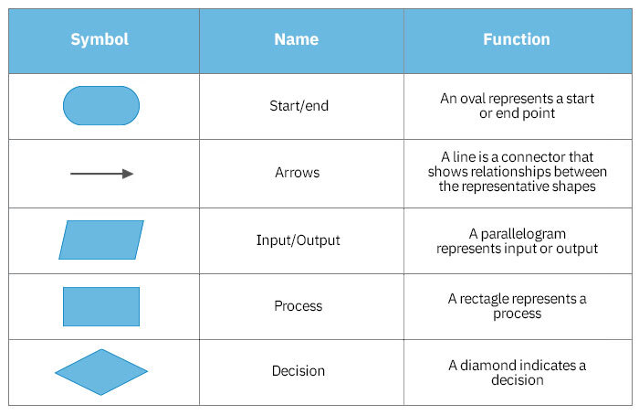
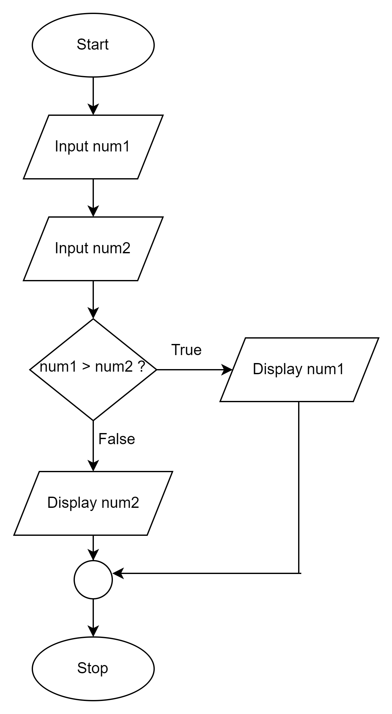
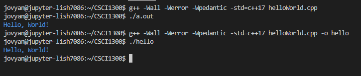
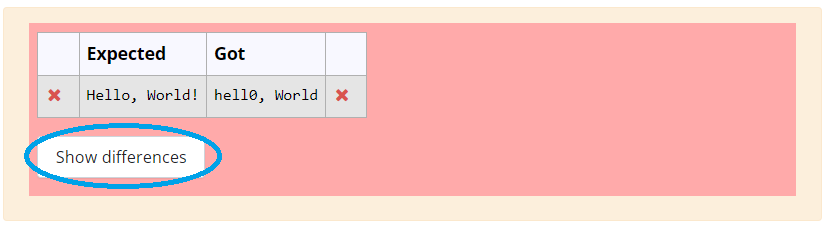

#### **CSCI 1300 CS1: Starting Computing: Study Guide: Week 3**
#### **Naidu/Godley - Spring 2024**

# Table of contents
1. [Relational Operators](#relational_operators)
2. [Logical Operators](#logical_operators)
3. [Conditional Statements](#conditional_statements)
4. [Pseudocode](#pseudocode)
5. [Flowchart](#flowchart)
6. [Coding Style](#coding_style)
    1. [Whitespace and Indentation](#whitespace_indentation)
    2. [Naming and Variables](#naming_variables)
    3. [Comments](#comments)
    4. [Compiling a C++ program](#compile)
7. [Vocabulary](#vocabulary)
8. [Pre-Quiz 2](#pre-quiz)

## Relational Operators <a name="relational_operators"></a>

A relational operator is a feature of a programming language that tests or defines some kind of relation between two entities. These include numerical equality (e.g., 5 == 5) and inequalities (e.g., 4 ≥ 3). Relational operators will evaluate to either True or False based on whether the relation between the two operands holds or not. When two variables or values are compared using a relational operator, the resulting expression is an example of a boolean condition that can be used to create branches in the execution of the program. Below is a table with each relational operator’s C++ symbol, definition, and an example of its execution.

| Operators | Definition | Example |
|-----|-----|-----|
| >  | greater than | 5 > 4 is TRUE |
| <  | less than | 4 < 5 is TRUE |
| >= | greater than or equal | 4 >= 4 is TRUE |
| <= | less than or equal | 3 <= 4 is TRUE |
| == | equal to | 5 == 5 is TRUE |

-----
## Logical Operators <a name="logical_operators"></a>

Logical operators are used to compare the results of two or more conditional statements, allowing you to combine relational operators to create more complex comparisons. Similar to relational operators, logical operators will evaluate to True or False based on whether the given rule holds for the operands. Below are some examples of logical operators and their definitions.

| Operators | Definition | Example |
|----|----|----|
| && | AND | returns true if and only if both operands are true
| \|\| | OR | returns true if one or both operands are true
| ! | NOT | returns true if the operand is false and false if the operand is true

### Truth tables

Every logical operator will have a corresponding truth table, which specifies the output that will be produced by that operator on any given set of valid inputs. Below are truth tables for each of the logical operators specified above.

**AND ( && ):**
These operators return true if and only if both operands are True. This can be visualized as a venn diagram where the circles are overlapping.


**OR ( || ):**
These operators return True if one or both of the operands are True. This can be visualized as the region of a venn diagram encapsulated by both circles.


**NOT ( ! ):**
This operator returns the opposite of the operand. This can be visualized as the region of a venn diagram outside the circle. Unlike AND and OR, the NOT operator has only one operand.


-----
## Conditional Statements <a name="conditional_statements"></a>
Conditional statements, also known as decision statements or branching statements, are used to make a decision based on condition. A condition is an expression that evaluates to a boolean value, either true or false. [Conditional Execution in C++](https://cal-linux.com/tutorials/conditionals.html) is a good online resource for learning about conditionals in C++.

**IF Statements:** An if statement in C++ is composed of a condition and a body. The body is executed only if the condition is true. The condition appears inside a set of parentheses following the keyword “if” and the body appears within a set of curly brackets after the condition:

The general format for **if statements** is:
```
if ( <CONDITION> )
{
	<BODY>
}
```

It is good practice to vertically align the open `"{"` and closed `"{"` curly brackets and to indent the body.

The condition is interpreted as a boolean value, either true or false. Be careful, most expressions in C++ have a boolean interpretation. For instance, non-zero numeric values are true. Assignment operations (single equal sign) are interpreted as true as well. A common mistake is to use a single equals sign inside a condition when a double equals sign is intended.

Unintended behavior when accidentally using assignment operation (= instead of ==) in conditional:
```cpp
// INCORRECT CODE
int x = 5;
if (x = 1) // one equal sign: changes value of x, will always evaluate to true
{
	cout << “The condition is true.” << endl;
}
cout << "x is equal to " << x << endl;
```
Example output:
<pre>
The condition is true.
x is equal to 1
</pre>

What you **actually** mean to do:
```cpp
// CORRECT CODE
int x = 5;
if (x == 1) // two equal signs, performs comparison
{
	cout << “The condition is true.” << endl;
}
cout << "x is equal to " << x << endl;
```
Example output:
<pre>
x is equal to 5
</pre>

Remember, “=” is for assignment and “==” is for checking equality.

**IF-ELSE Statements:** If statements may be paired with else statements in C++. If the condition associated with the if statement is false, the body associated with the else statement is executed. The else statement body is enclosed in a set of curly brackets:
```cpp
if ( <CONDITION> )
{
	<BODY>
    // executed when CONDITION is true
}
else
{
	<BODY>
    // executed when CONDITION is false
}
```
An if statement does not need an else statement, but there must be an if statement before every else statement.

**ELSE-IF Statements:** Finally, an if statement may also be associated with any number of else-if statements. These statements each have an associated condition and an associated body. The body is executed if the condition is true and the conditions for all preceding if- and else-if statements in the same group are false. An else statement may be included at the end of the group but is not required. The else statement will be executed if all the previous conditions are false.

```cpp
if ( <CONDITION> )
{
	<BODY>
}
else if ( <CONDITION> )
{
	<BODY>
}
else if ( <CONDITION> )
{
	<BODY>
}
else
{
	<BODY>
}
```

**Some examples:**

- If the int `num` is negative, print “Changing sign” and make it positive.
```cpp
if (num < 0)
{
	cout << “Changing sign” << endl;
	num = -1 * num;
}
```
- If the int `num` is 0, print “Can’t divide by 0!”. Otherwise, set num to 1000 divided by num.
```cpp
if (num == 0) //notice the double equals!
{
	cout << “Can’t divide by 0!” << endl;
}
else
{
	num = 1000 / num; //integer arithmetic
}
```
- If the int `num` is greater than 0 and less than 10, set num to 5 times itself. Otherwise, if num is greater than 100, set num to itself divided by 10.
```cpp
if (num > 0 && num < 10)
{
	num = 5 * num;
}
else if (num > 100)
{
	num = num / 10;
}
```
- Print “Positive” if the int num is positive, “Zero” if it is 0, and “Negative” if it is negative. Both of the approaches below work. Why? Can you think of other ways to achieve the same result?

Approach 1:
``` cpp
if ( num > 0 )
{
	cout << “Positive” << endl;
}
else if ( num == 0 )
{
	cout << “Zero” << endl;
}
else if ( num < 0 )
{
	cout << “Negative” << endl;
}
```
Approach 2:
```cpp
if ( num > 0 )
{
	cout << “Positive” << endl;
}
else if ( num == 0 )
{
	cout << “Zero” << endl;
}
else
{
	cout << “Negative” << endl;
}
```
- Let score be an int between 0 and 100. Print the letter grade associated with score (A: 90-100, B: 80-89, C: 70-79, D: 60-69, F: 0-59). Both of the approaches below work.

Approach 1:
```cpp
if (score >= 90 && score <= 100)
{
	cout << “A” << endl;
}
else if (score >= 80 && score <= 89)
{
	cout << “B” << endl;
}
else if (score >= 70 && score <= 79)
{
	cout << “C” << endl;
}
else if (score >= 60 && score <= 69)
{
	cout << “D” << endl;
}
else if (score >= 0 && score <= 59)
{
	cout << “F” << endl;
}
```

Approach 2:
```cpp
if (score >= 90 && score <= 100)
{
	cout << “A” << endl;
}
else if (score >= 80)  // this condition is checked only if the first condition fails, so score must be less 90
{
	cout << “B” << endl;
}
else if (score >= 70)
{
	cout << “C” << endl;
}
else if (score >= 60)  // this condition is check only if all the above conditions fail, so the score must be less than 70
{
	cout << “D” << endl;
}
else if (score >= 0)
{
	cout << “F” << endl;
}
```

### Rounding to required Decimal places
We use the `<iomanip>` library in C++ which helps in manipulating the output of the program. The two functions that we are going to be using here are `setprecision` and `fixed`.
**setprecision:** This function is mainly used in displaying significant digits and rounds off the last displayed digit. It takes in a parameter which defines how many digits are to be displayed in the output.
**fixed:** This function is used to display decimal numbers in fixed point notation. It enforces a consistent number of decimal places irrespective of their actual precision.
For example:
 Here's a snippet to print the speed of sprinter in Olympics upto 3 decimal places.
 ```cpp
 #include <iostream>
 #include <iomanip> // first we import the library

 using namespace std;

 int main()
 {
    double sprint_time = 19.1886;

    cout << fixed << setprecision(3) << "The sprint time in seconds : " << sprint_time << endl;
    return 0;
 }
 ```
Correct Output:
<pre>
The sprint time in seconds : 19.189
</pre>

If we **do not** use `fixed` function in our `cout` statement then,
Wrong Output:
<pre>
The sprint time in seconds : 19.2
</pre>
Note: Please use `fixed` function to set the number of decimal places to be outputed and use `setprecision(x)` (here `x` is the number of decimal places) to round to the last digit.  

-----
## Pseudocode <a name="pseudocode"></a>

Pseudocode is used to develop algorithms. An algorithm is a procedure for solving a problem.

An algorithm describes actions to be executed and the order in which those actions are to be executed. In other words, an algorithm is merely the sequence of steps taken to solve a problem; like a recipe. An algorithm is not computer code. Algorithms are just the instructions which provide a clear path for you to write the computer code.

Pseudocode is an informal language that helps programmers develop algorithms (or recipes). Although there are no hard and fast rules for pseudocode, there are some suggestions to help make pseudocode more understandable and easy to read.

As verbs, consider using the words:
```
Generate, Compute, Process, set, reset, increment, compute, calculate, add, sum, multiply, subtract, divide, print, display, input, output, edit, test, etc.
```

Be sure to indent if the indentation fosters understanding.
Being clear is the purpose of pseudocode, and a very desirable goal to strive for.

### Example 1.
pseudocode:
```
Read the length of the rectangle
Read the width of the rectangle
Compute the area of the rectangle as length times width.
```
C++ Source Code:
```cpp
double length = 0;
double width = 0;

cout << "What is the rectangle length?: " << endl;
cin >> length;

cout << "What is the rectangle width?: " << endl;
cin >> width;

cout << "The rectangle area is: " << length * width;
```

### Example 2.
pseudocode:
```
If students grade is higher than or equal to 60
	Then Print, “Passed”
else
	Print, “Failed”
```

The above pseudocode would be used to develop the following C++ code.
C++ Source Code:
```cpp
if(grade > 60 || grade == 60)
{
	cout << “Passed” << endl;
}
else
{
	cout << “Failed” << endl;
}
```

-----
## Flowchart <a name="flowchart"></a>

Flowchart is a graphical representation of an algorithm. It makes use of symbols that are connected among them to indicate the flow of information and processing. The following table summarizes some basic symbols used in flowchart design:



### Example
Consider the problem of taking two numbers as input from the user and printing the largest of the two.

Flowchart:



C++ Source Code:
```cpp
int num1, num2, largest;

cout << "Enter two numbers:\n";
cin >> num1;
cin >> num2;

if (num1 > num2)
{
    largest = num1;
}
else
{
    largest = num2;
}

cout << largest;
```

-----
## Coding Style <a name="coding_style"></a>

### Whitespace and indentation <a name="whitespace_indentation"></a>

**Whitespaces:** Whitespaces can set things off and reduce the strain on the reader's eyes. Because the compiler ignores whitespace, you can place things anywhere and format them however you want. Whitespace can come in several forms, including indentation.

**Indenting:** Increase your indentation by one increment of each brace "{" and decrease it once on each closing brace "}". Place a line break after every "{" or "}". Use Tab to increase indent and Shift+Tab to decrease indentation.

**Bad Example:** There is no indentation, and it is difficult to see where different portions of the code start and stop.
```cpp
int main(){int number = 0;
if(number < 5){
cout << "Less than 5" << endl;
}else{
cout << "Greater than 5" << endl;
}
number++;
}
```
Good Example: There is proper indentation, and the code is easier to read.
```cpp
int main()
{
    int number = 0;
    if(number < 5)
    {
        cout << "Less than 5" << endl;
    }
    else
    {
        cout << "Greater than 5" << endl;
    }
    number++;
}
```

### Naming and variables <a name="naming_variables"></a>
**Names:** Give variables descriptive names, such as first_name or homework_score. Avoid one-letter names like "a" or "x", except for loop counter variables such as "i".

Bad Example:
```cpp
int thing = 16;
double a = 2.2;
string x = "Michael";
```

Good Example:
```cpp
int cups_per_gallon = 16;
double lbs_per_kilo = 2.2;
string first_name = "Michael";
```


### Comments <a name="comments"></a>
* Your code should be well-commented. Use comments to explain what you are doing, especially if you have a complex code section. These comments are intended to help other developers understand how your code works. Single-line comments should begin with two forward slashes (//). Multi-line comments begin with one forward slash and an asterisk (/* ... comments here ... */).

* Examples:
    *  Single-line:
    ```cpp
    // CSCI 1300 Spring 2024
    ```
    * Multi-line:
    ```cpp
    /*
    Algorithm:
    Input: two numbers
    Output: sum of input numbers

    1. Ask the user to enter a number
    Save in variable number_1
    2. Ask the user to enter a number
    Save in variable number_2
    3. Compute sum
    sum = number_1 + number_2
    4. Display sum to user
    */
   ```

### Compiling a C++ program <a name="compile"></a>
The first program that we usually write in any programming language we’re learning is "Hello, World!". Create a program that prints “Hello, World!” to the screen (the output window in VS Code).

Expected output
```
Hello, World!
```
The file should be named _helloWorld.cpp_


The .cpp extension on the filename tells VS Code that the file should be read in the C++ programming language. Once you save it, the lines you write in the file should be color-coded to reflect what they do in the program. This is called syntax highlighting.

Here are some suggested steps:

**Step 1: Write Your Code** <br/>
In VS Code, enter the following hello world program:

```cpp
#include <iostream>
using namespace std;

int main(){
    cout << "Hello, World!" << endl;
    return 0;
}
```

**Step 2: Running Your Code from Command Line** </br>
Move to the “terminal” tab. Make sure you are inside the hmwk1 directory (you can type _pwd_ to see where you are). Type: </br>
``g++ -Wall -Werror -Wpedantic -std=c++17 helloWorld.cpp``

the ``-std=c++17`` option makes sure that the C++ version used to run the program is C++ 17. If you don’t give this option then the default version (which is usually C++98) is used.

The ``-Wall -Werror -Wpedantic`` will ensure that our code does not violate any standards.


This creates an executable called "a.out" (or "a.exe" for Windows). You can run it by typing

``./a.out `` or ``./a.exe``

Since no executable name was specified to g++, a.out is chosen by default. You can alternatively use the "-o" option to change the name :

``g++ -Wall -Werror -Wpedantic -std=c++17 helloWorld.cpp -o hello``

creates an executable called "hello" (see figure below). You can run it by typing

``./hello``

Notice the output looks the same: "Hello, World!", followed by the return of the prompt, for new commands. (The blue text is the output from running the file.)



**Step 3: Submit to CodeRunner**<br/>
Head over to Canvas to the assignment **Homework 2 - Coderunner** in the Week 3 Module. Submit your solution for the first problem and press the Check button. You will see a report on how your solution passed the tests and the resulting score for the first problem. You can modify your code and re-submit (press “Check” again) as many times as you need to.


If the code runner says “incorrect”, click the “show difference” button.


It will highlight the differences between the expected output and the output your program produced. These outputs should be exactly the same, including upper/lower case, punctuation, and spaces. Otherwise, it’ll be marked as incorrect.


-----
## Vocabulary <a name="vocabulary"></a>
* **expression** - sequence of operators, values, and variables that can be evaluated to produce a result. 
* **conditional** - evaluates an expression to determine if it is true or false. 
* **syntax error** - errors in the program that prohibit the source code from compiling. 
* **logical error** - errors in a program that produce unexpected results but it does not affect how the program is compiled. 

-----
## Recitation 2: pre-quiz <a name="pre-quiz"></a>

1. What is the difference between arithmetic and relational operators?

2. What are if/else statements in C++? How do you create flowcharts for them?

3. Fill in the blank with a condition that accounts for temperature in range of 50 degrees to 85 degrees (both inclusive).
```cpp
#include <iostream>
using namespace std;

int main()
{
    int temperature = 50;

    if (temperature > 85) {
        cout << "It's a hot day!";
    }
    ___________________________________________ { //FILL IN THIS LINE
        cout << "It's a pleasant day.";
    }
    else if (temperature > 25 && temperature < 50) {
        cout << "It's a cool day.";
    }
    else {
        cout << "It's a cold day.";
    }

    return 0;
}
```

4. Complete the following truth table to evaluate the expressions for (!a || !b).


| a | b | !a | !b | !a \|\| !b |
|---|---|----|----|------------|
| T | T |    |    |            |
| T | F |    |    |            |
| F | T |    |    |            |
| F | F |    |    |            |

5. Complete the following truth table to evaluate the expression (!a && b).

| a | b | !a | !a \&\& b |
|---|---|----|------------|
| T | T |    |            |
| T | F |    |            |
| F | T |    |            |
| F | F |    |            |
