#### **CSCI 1300 CS1: Starting Computing: Homework 2**
#### **Naidu/Godley - Spring 2024**
#### **Due: Friday, February 2nd by 5:00pm MST**

<br/>

# Table of contents
1. [Objectives](#objectives)
2. [Questions](#questions)
    1. [Question 1](#question1)
    2. [Question 2](#question2)
    3. [Question 3](#question3)
    4. [Question 4](#question4)
    5. [Question 5](#question5)
3. [Overview](#overview)
    1. [Checklist](#checklist)
    2. [Grading Rubric](#grading)

# Objectives <a name="objectives"></a>

* Compile and run C++ code
* Understand how to implement decisions using if statements in C++

# Questions <a name="questions"></a>

**Warning:** you are not allowed to use global variables and loops for this homework.

If you are suspected of using an outside source to complete homework, you may be called for an in person interview, and could risk losing points for the assignment.

## **Question 1 (2 point): Back to Boulder** <a name="question1"></a>
You are heading back to Boulder after the winter break, but it's snowing in Boulder. Write a C++ program to determine whether you need your snow boots based on the amount of snowfall. If the snowfall is more than 5 inches, display `You need your snow boots.`; otherwise, display `You don't need snow boots.`.

Make sure your program does input validation. If the user inputs a non-positive value for snowfall, print `Invalid snowfall amount.` and exit the program.

The answer box on coderunner is pre-loaded with the following solution template for this question.

```cpp
#include <iostream>

using namespace std;

int main()
{
    // declare all the variables
    int snowfall_amount;

    // prompt the user & get their input
    cout << "What is the amount of snowfall?" << endl;
    cin >> snowfall_amount;

    // input validation: snowfall amount must be positive
    ___________________________________ // FILL IN THIS LINE
    {
        cout << "Invalid snowfall amount." << endl;
        return 0;
    }

    // decide if you need to wear snow boots based on the snowfall amount
    ___________________________________ // FILL IN THIS LINE
    {
        cout << "You need your snow boots." << endl;
    }
    else
    {
        cout << "You don't need snow boots." << endl;
    }

    return 0;
}
```

**--- Sample run ---:** (Blue is program output, and white is user input.)

**Sample run 1**

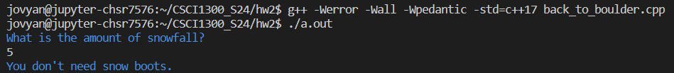

**Sample run 2**

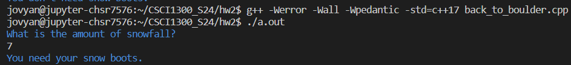

**Sample run 3**

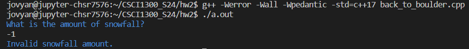

Develop and validate your solution in VS Code. Once you are happy with your solution, go to coderunner on Canvas and paste it into the answer box!

## **Question 2 (5 points): Minimum Balance** <a name="question2"></a>
You recently purchased a Starbucks membership card and deposited \$30 to your card. You must maintain a minimum balance of \$20 on the card. Write a C++ program that prompts the user for the amount they would like to use to purchase a beverage and determine if the transaction is successful. The transaction is successful if the balance in the card after the purchase is greater than or equal to \$20. If the transaction is successful, display the success message and the remaining balance. For example, `Transaction Successful! Your balance is $21.85`. If the transaction is not successful, display `Transaction Failed!`.

Ensure you are doing input validation; if the user inputs an amount less than or equal to 0, display ` Invalid input. Withdrawn amount must be a non-negative value. ` and exit.

**Note:** The balance should be formatted with a two-digit precision. You can use the `setprecision()` function with the fixed manipulator from the `<iomanip>` library to do so. Refer to the [study guide](https://github.com/CSCI1300-StartingComputing/CSCI1300-Spring2024/blob/main/week3/StudyGuide_week3.md#rounding-to-required-decimal-places) for more details.

Bad formatting: `10.8`

Good formatting: `$10.80`


**--- Sample run ---:** (Blue is program output, and white is user input.)

**Sample run 1**

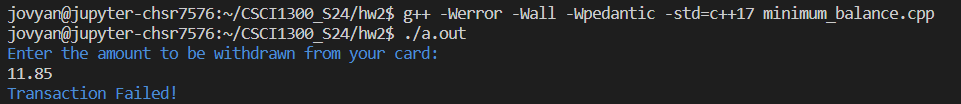

**Sample run 2**

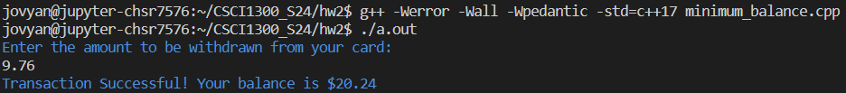

**Sample run 3**

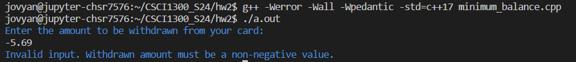

Develop and validate your solution in VS Code. Once you are happy with your solution, go to coderunner on Canvas and paste it into the answer box!

## **Question 3 (7 points): Nature Photography** <a name="question3"></a>
It's winter and a great time for nature photography. Write a C++ program that takes the temperature and wind speed to determine whether the weather conditions are suitable for photography. The ideal conditions are temperature between -10 to 10 degrees Celsius (both inclusive) and wind speed not exceeding 20 kph (kilometers per hour). If the conditions are suitable, display `The weather conditions are ideal for photography tomorrow.`; else, display `The weather conditions are not ideal for photography tomorrow.`

The input should be an integer (for temperature) and non-negative integer (for wind speed).

Ensure you are doing input validation similar to the last question. If the user inputs wind speed less than 0, display `Please enter valid input.` and exit.


**--- Sample run ---:** (Blue is program output, and white is user input.)

**Sample run 1**

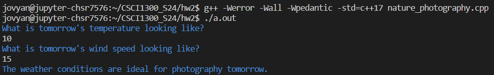

**Sample run 2**

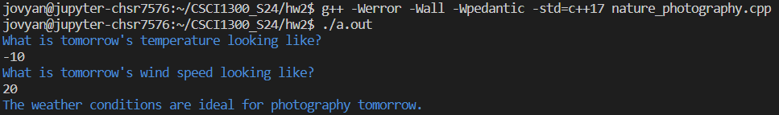

**Sample run 3**

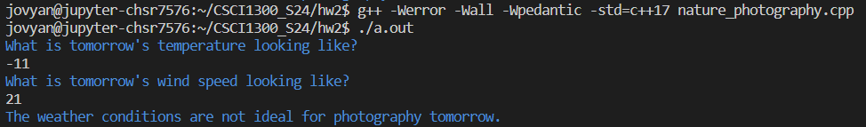

**Sample run 4**

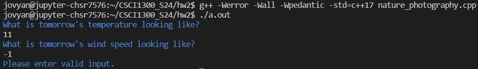

Develop and validate your solution in VS Code. Once you are happy with your solution, go to coderunner on Canvas and paste it into the answer box!


## **Question 4 (10 points): Skiing Time** <a name="question4"></a>
You want to start skiing this season, so you plan to buy a pass from a ski resort. The resort has 4 types of passes:

|Pass | Cost|
|----|----|
| Basic | $250.15 |
| Intermediate | $479.85 |
| Advanced | $684.29 |
| Premium | $950.33 |

Write a C++ program that will take the desired pass the user wishes to purchase and their budget to determine if it is within the user's budget. If the desired pass is within budget, display `Yes, this pass is within your budget!`; if not, display `Sorry, this pass is outside your budget.`.

The program should take a non-negative number for budget and character input( _B, I, A, or P_ ) for pass from the user.

Ensure that you do input validation. If the budget the user enters is less than 0 or the desired pass is not one among B, I, A, or P, then print ` Please enter valid input. ` and exit the program.

**--- Sample run ---:** (Blue is program output, and white is user input.)

**Sample run 1**

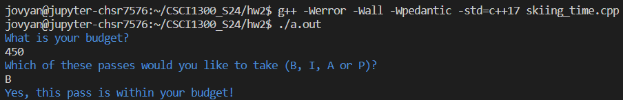

**Sample run 2**

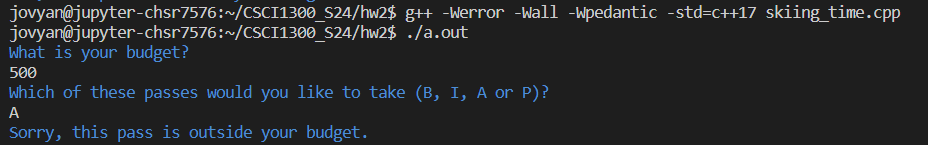

**Sample run 3**

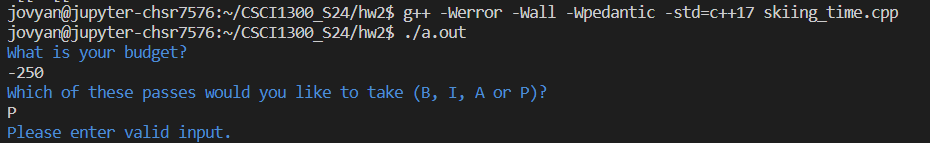

**Sample run 4**

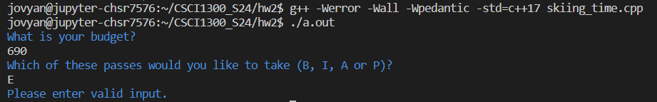

Develop and validate your solution in VS Code. Once you are happy with your solution, go to coderunner on Canvas and paste it into the answer box!

## **Question 5 (11 points): Car Rental** <a name="question5"></a>
You have decided to go on a road trip with your friends over the weekend. So, you plan to rent a car for this trip. The car rental company offers a wide range of options and has 4 categories. Each type of car has its specific base rate and price per day to rent the vehicle. Write a C++ program that calculates the Bill Total based on the car type and number of days.

|Car Type | Base Price |Price per day|
|----|----|----|
| A | $75 | $10|
| B | $100 | $20|
| C | $150 | $30|
| D | $200 | $40|

The bill total is calculated based on this formula:

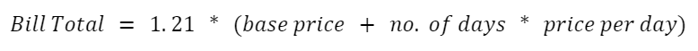

The input should be a character (for car type), a non-negative integer (for the number of days you want to rent the car), and the output should be double.

Ensure you are doing input validation. The user should input car type from one among A, B, C, or D, and the minimum number of days to rent a car is 1. If either the car type or the number of days is invalid, display ` Please enter valid input. ` and exit the program.

Note: The Bill total should be formatted with a two-digit precision. You can use the `setprecision()` function with the fixed manipulator from the `<iomanip>` library to do so. Refer to the [study guide](https://github.com/CSCI1300-StartingComputing/CSCI1300-Spring2024/blob/main/week3/StudyGuide_week3.md#rounding-to-required-decimal-places) for more details.

Bad formatting: `10.8`

Good formatting: `$10.80`

**--- Sample run ---:** (Blue is program output, and white is user input.)

**Sample run 1**

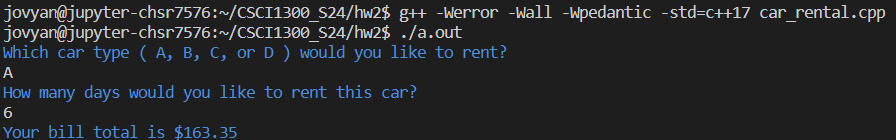

**Sample run 2**

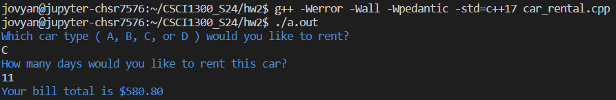

**Sample run 3**

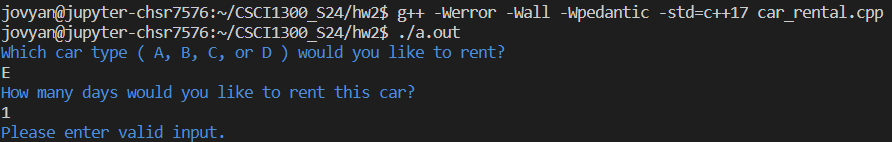

**Sample run 4**

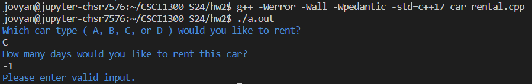

Develop and validate your solution in VS Code. Once you are happy with your solution, go to coderunner on Canvas and paste it into the answer box!

# Overview  <a name="overview"></a>
## Checklist <a name="checklist"></a>
Here is a checklist for submitting the assignment:
1. Use your solutions in VS Code to complete the **Homework 2 - coderunner** assignment on Canvas (Modules → Week 3).
2. Complete Homework 2 Quiz, which will be published on Sunday, January 28th

## Grading Rubric <a name="grading"></a>

Note: Global variables and loops are not permitted in this homework. The use of global variables or loops will result in a 0 on the entire homework.


| **Criteria**                                | Points |
| ------------------------------------------- | ------ |
| Question 1                  | 2     |
| Question 2                  | 5     |
| Question 3                  | 7     |
| Question 4                  | 10    |
| Question 5                  | 11    |
| Homework 2 Quiz             | 15    |
| Total                                    | 50    |
