#### **CSCI 1300 CS1: Starting Computing: Homework 3**
#### **Naidu/Godley - Spring 2024**
#### **Due: Friday, February 9th by 5:00pm MST**

# Table of contents
1. [Objectives](#objectives)
2. [Questions](#questions)
    1. [Question 1](#question1)
    2. [Question 2](#question2)
    3. [Planting Seeds](#question3456)
    4. [Question 3](#question3)
    5. [Question 4](#question4)
    6. [Question 5](#question5)
    7. [Question 6](#question6)
3. [Overview](#overview)
    1. [File Headers](#fileheaders)
    2. [Checklist](#checklist)
    3. [Grading Rubric](#grading)

# Objectives <a name="objectives"></a>

* Compile and run C++ code
* Understand how to implement nested if statements and functions in C++

# Questions <a name="questions"></a>

For questions that require the use of a function, coderunner will check that you have written the function correctly. DO NOT WRITE ALL YOUR CODE IN ```main()```! Your code will NOT compile if you do not have the correct function. See below for an example of what this could look like:

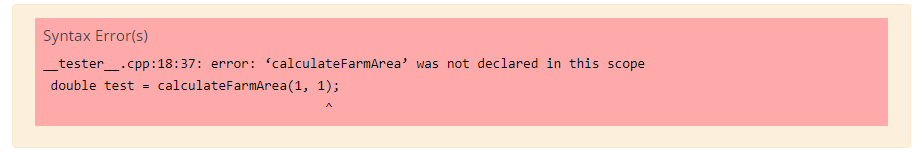

**Warning:** You are not allowed to use global variables or loops for this homework.

If you are suspected of using an outside source to complete homework, you may be called for an in-person interview and could risk losing points for the assignment.

## **Question 1 (2 points): Time to File Taxes** <a name="question1"></a>

*This question may require the use of nested if-else statements.*

You are a tax expert, and your friends have come to you for help calculating their state and federal taxes. They want to know how much tax they owe based on their `tax_type` and `income`. Write a C++ program to help them calculate their taxes using the rubric below.

<table>
  <thead>
    <tr>
      <th>Tax Type</th>
      <th>Income</th>
      <th>Tax percentage</th>
    </tr>
  </thead>
  <tbody>
    <tr>
      <td rowspan="2">State</td>
      <td>less than $5,000</td>
      <td>Nil</td>
    </tr>
    <tr>
      <td>greater than $5,000 (inclusive)</td>
      <td>4.5%</td>
    </tr>
    <tr>
      <td rowspan="2">Federal</td>
      <td>less than $11,000 </td>
      <td>11%</td>
    </tr>
    <tr>
      <td>greater than $11,000 (inclusive)</td>
      <td>22%</td>
    </tr>
  </tbody>
</table>

Make sure your program does basic input validation. The `tax_type` must be either `state` or `federal`. If the user inputs something else, print `Invalid tax type.` and exit the program. The `income` must always be greater than 0. If the user inputs a non-positive value, print `Income cannot be negative or zero.` and exit the program.

The answer-box on coderunner is pre-loaded with the following solution template for this question
```cpp
// CSCI 1300 Spring 2024
// Author: ADD YOUR NAME HERE
// TA: ADD YOUR TA'S NAME HERE
// Question 1

#include <iostream>

using namespace std;

int main()
{
    // declare all the variables
    string tax_type;
    int income;

    // prompt the user & get their input
    cout << "What is the tax type?" << endl;
    cin >> tax_type;
    cout << "What is your income?" << endl;
    cin >> income;

    _____________________________ // FILL IN THIS LINE
    {
        cout << "Invalid tax type." << endl;
        return 0;
    }

    _____________________________ // FILL IN THIS LINE
    {
        cout << "Income cannot be negative or zero." << endl;
        return 0;
    }

    // Check for tax type
    _____________________________ // FILL IN THIS LINE
    {
        // Check for income criteria
        _____________________________ // FILL IN THIS LINE
        {
            cout << "You are not required to pay taxes" << endl;
        }
        else
        {
            cout << "You are required to pay $" << 0.045*income << " in taxes" << endl;
        }
    }
    else
    {
        // Check for income criteria

        _____________________________ // FILL IN THIS LINE
        {
            cout << "You are required to pay $" << 0.11*income << " in taxes" << endl;
        }
        else
        {
            cout << "You are required to pay $" << 0.22*income << " in taxes" << endl;
        }
    }

    return 0;
}
```

Please make sure to add the file header in your program before you submit your code on coderunner. Refer to [File Headers](#fileheaders) for instructions.

Develop and validate your solution in VS Code. Once you are happy with your solution, go to coderunner on Canvas and paste the **whole program** into the answer box!

**--- Sample run ---:** (Blue is program output, and white is user input.)

**Sample run 1**

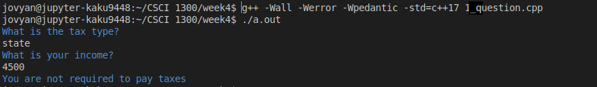

**Sample run 2**

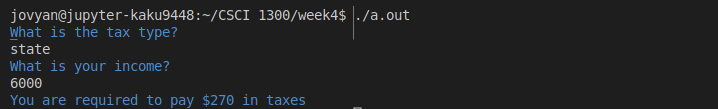

**Sample run 3**

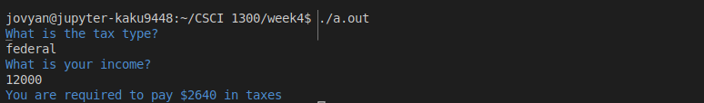

**Sample run 4**

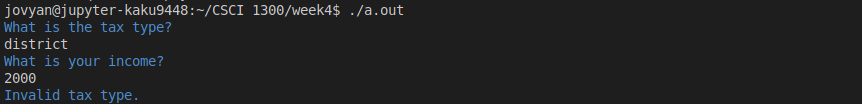

**Sample run 5**

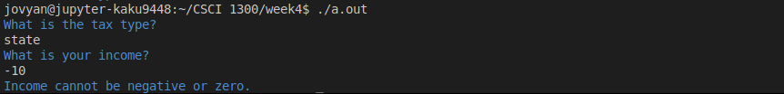

## **Question 2 (5 points): Virtual Art Gallery** <a name="question2"></a>

*This question may require the use of nested if-else statements.*

Welcome to the Virtual Art Gallery Experience! Write a C++ program that simulates exploring and reserving artworks based on different artistic styles and artists.

Based on the given table, you, as the programmer, must give step-by-step choices to the user to proceed further and make a reservation. Once the user reserves an artwork, the program displays a message: `You have reserved the artwork: <artwork>` where `<artwork>` is the name of the artwork reserved. All selections made by the user are with numbers based on the range of choices you give them.

Ensure that the user's input is present in the range of choices. Print `Please enter a valid input.` if the user inputs an invalid option and exit the program.


<table>
  <thead>
    <tr>
      <th>Style</th>
      <th>Artists</th>
      <th>Artworks</th>
    </tr>
  </thead>
  <tbody>
    <tr>
      <td rowspan="6">(1) Impressionism</td>
      <td rowspan="2">(1) Claude Monet</td>
      <td>(1) Water Lilies</td>
    </tr>
    <tr>
        <td>(2) Impression, Sunrise</td>
    </tr>
    <tr>
      <td rowspan="2">(2) Edgar Degas</td>
      <td>(1) The Dance Class</td>
    </tr>
    <tr>
        <td>(2) L'Absinthe</td>
    </tr>
     <tr>
      <td rowspan="2">(3) Pierre-Auguste Renoir</td>
      <td>(1) Luncheon of the Boating Party</td>
    </tr>
    <tr>
        <td>(2) Bal du moulin de la Galette</td>
    </tr>
    <tr>
      <td rowspan="6">(2) Surrealism</td>
      <td rowspan="2">(1) Salvador Dali</td>
      <td>(1) The Persistence of Memory</td>
    </tr>
    <tr>
        <td>(2) The Elephant</td>
    </tr>
    <tr>
      <td rowspan="2">(2) Rena Magritte</td>
      <td>(1) The Son of Man</td>
    </tr>
    <tr>
        <td>(2) The Treachery of Images</td>
    </tr>
     <tr>
      <td rowspan="2">(3) Frida Kahlo</td>
      <td>(1) The Two Fridas</td>
    </tr>
    <tr>
        <td>(2) Self-Portrait with Thorn Necklace</td>
    </tr>
  </tbody>
</table>

Please make sure that you follow [submission instructions](#submission) before you submit your code on coderunner.

Develop and validate your solution in VS Code. Once you are happy with your solution, go to coderunner on Canvas and paste the **whole program** into the answer box!

**--- Sample run ---:** (Blue is program output, and white is user input.)

**Sample run 1**

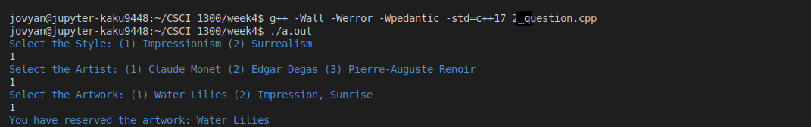

**Sample run 2**

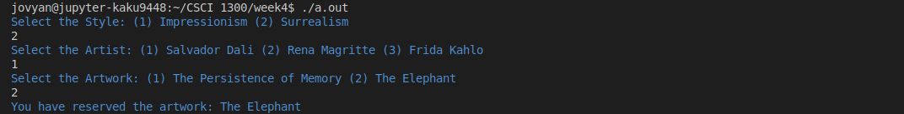

**Sample run 3**


**Sample run 4**

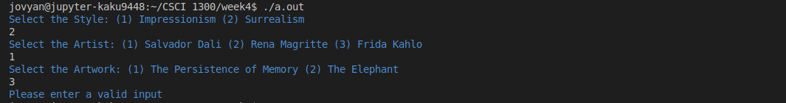

**Sample run 5**

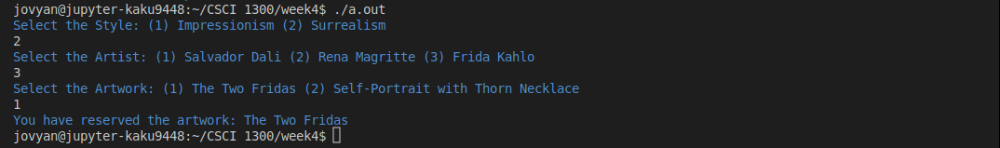


## **Questions 3, 4, 5, and 6: Planting Seeds** <a name="question3456"></a>

As a promising C++ programmer, you've been presented with an exciting opportunity by a reputable farming company. They are seeking your expertise to develop a user-friendly C++ program that streamlines the process for their customers to estimate the cost of purchasing seeds. This program will enable users to estimate the rough area of their farmland, which they can later use to calculate the required amount of seeds and their cost. Additionally, the program offers users the option to rent sowing machines from the farming company, each with their own sowing pace, to estimate the time needed to complete the sowing of the seeds.

To tackle this project, you decide to break it down into small manageable chunks.

  1. **Calculate Farm Area**: This option helps users estimate the total surface area of the farmland.
  2. **Calculate Seeds Cost**: Users can choose this option to find out the cost of the seeds required based on their farm's area.
  3. **Estimate Sowing Time**: This option allows users to estimate the time it might take to sow their seeds, considering different sowing machines.

## **Question 3 (6 points): Calculate Farm Area - Planting Seeds** <a name="question3"></a>

*This question may require declaring and calling a function.*

In this step of the Planting Seeds project, you will create a C++ program that includes a *function* to calculate the area of the farmland. For simplicity, we'll imagine every farm as a rectangle.

Based on the user's input, you should use the `calculateFarmArea()` function to calculate the farm's area.

> Note: 0 is considered non-positive.

Function Specification:

<table>

<tr>
<td>
Function:

```calculateFarmArea(double, double)```

</td>
<td>

```cpp
double calculateFarmArea(double length, double width)
```

</td>
</tr>

<tr>
<td>
Purpose:
</td>
<td>
To calculate the area of the farm given its length and width
</td>
</tr>

<tr>
<td>
Parameters:
</td>
<td>

<b>double</b> ```length``` - the length of the farmland <br>
<b>double</b> ```width``` - the width of the farmland
</td>
</tr>

<tr>
<td>
Return Value:
</td>
<td>
If successful (function parameters are positive), it returns the area of the farmland.
</td>
</tr>

<tr>
<td>
Error Handling/Boundary Conditions:
</td>
<td>

- If ```length``` or ```width``` is non-positive, 0 is returned.

</td>
</tr>

<tr>
<td>
Example:
</td>
<td>
Sample Code:

```cpp
// Assume the proper libraries are included.

// Assume the proper implementation of calculateFarmArea is included.

int main()
{
    double area = calculateFarmArea(4.5, 2);

    // Validating the area
    if (area == 0)
    {
      cout << "Length or width is invalid. Area cannot be calculated." << endl;
    }
    else
    {
      cout << "The area is: " << area << " sq ft." << endl;
    }

    return 0;
}
```

Sample Output:
```
The area is: 9.0 sq ft.
```

</td>
</tr>

</table>

Please make sure that you follow [submission instructions](#submission) before you submit your code on coderunner.

Develop and validate your solution in VS Code. Once you are happy with your solution, go to coderunner on Canvas and paste **```calculateFarmArea()``` and ```main()```** into the answer box!

**--- Sample run ---:** (Blue is program output, and white is user input.)

**Sample run 1**

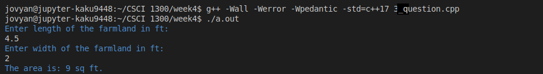

**Sample run 2**

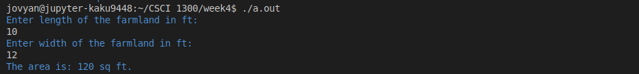

**Sample run 3**

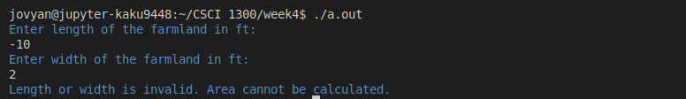

**Sample run 4**

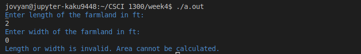

## **Question 4 (6 points): Calculate Seeds Cost - Planting Seeds** <a name="question4"></a>

*This question may require the use of if-else statements, declaring and calling a function.*

In the next phase of the Planting Seeds project, you will create a C++ program that includes a *function*  to calculate the cost of the seeds needed for the entire farm. The farming company offers three different grades of seeds, each with a specific price per square foot, depending on its quality. The cost is summarized in the table below.

| Seed Grade  | Cost per square foot |
| ------------- | ------------- |
| A | $7.5  |
| B | $12.5  |
| C | $27.5  |

Based on the user's grade choice for the seed, you will use the function `calculateSeedCost()` to calculate the cost of planting seeds on your entire farmland.

> Note: 0 is considered non-positive. Uppercase and lowercase does matter for the seed grade. 

Function Specification:

<table>

<tr>
<td>
Function:

```calculateSeedCost(double, double)```

</td>
<td>

```cpp
double calculateSeedCost(double area, char seed_grade)
```

</td>
</tr>

<tr>
<td>
Purpose:
</td>
<td>
To calculate the cost of planting seeds on the entire farmland.
</td>
</tr>

<tr>
<td>
Parameters:
</td>
<td>

<b>double</b> ```area``` - the area of the farmland <br>
<b>char</b> ```seed_grade``` - the seed grade

</td>
</tr>

<tr>
<td>
Return Value:
</td>
<td>
If successful (function parameters are positive and in the options), it returns the cost of planting a particular grade's seeds across the entire farmland.
</td>
</tr>

<tr>
<td>
Error Handling/Boundary Conditions:
</td>
<td>

- If the ```area``` is non-positive, 0 is returned. <br>
- If ```seed_grade``` is not one of the options, 0 is returned.
</td>
</tr>

<tr>
<td>
Example:
</td>
<td>
Sample Code:

```cpp
// Assume the proper libraries are included.

// Assume the proper implementation of calculateSeedCost is included.

int main()
{
    double cost = calculateSeedCost(9, 'A');

    // Validating the cost
    if (cost == 0)
    {
      cout << "Area or seed grade is invalid. Cost cannot be calculated." << endl;
    }
    else
    {
      cout << "The cost is: $" << cost << endl;
    }

    return 0;
}
```

Sample Output:
```
The cost is: $67.5
```

</td>
</tr>

</table>

Please make sure that you follow [submission instructions](#submission) before you submit your code on coderunner.

Develop and validate your solution in VS Code. Once you are happy with your solution, go to coderunner on Canvas and paste **```calculateSeedCost()``` and ```main()```** into the answer box!

**--- Sample run ---:** (Blue is program output, and white is user input.)

**Sample run 1**

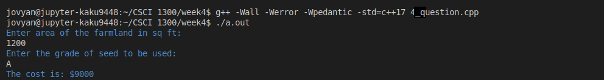

**Sample run 2**

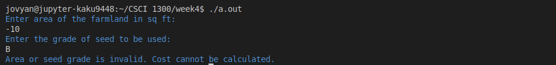

**Sample run 3**

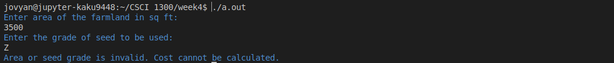

**Sample run 4**

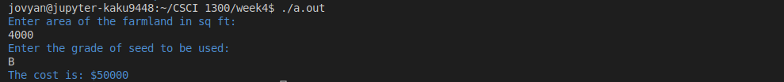

## **Question 5 (7 points): Estimate Sowing Time - Planting Seeds** <a name="question5"></a>

*This question may require the use of if-else statements, switch-case, and declaring and calling a function.*

We are making good progress. For the next step in the Planting Seeds project, you will write a C++ program that includes a function to estimate the time it takes to sow seeds on your farmland. The farming company provides 4 different kinds of sowing machines. Each machine can sow seeds at a different speed per square foot, as shown below.

| Sowing Machine  | Time taken per square foot |
| ------------- | ------------- |
| W | 5 sq ft per 12 minutes |
| X | 3 sq ft per 10 minutes |
| Y | 2 sq ft per 5 minutes |
| Z | 7 sq ft per 15 minutes |

Based on the user's input of which sowing machine to use, you will use the function `calculateSowingTime()` to calculate the amount of time it will take to plant the seeds on your farmland.

> Note: 0 is considered non-positive. Uppercase and lowercase does matter for the sowing machine.

Function Specification:

<table>

<tr>
<td>
Function:

```calculateSowingTime(double, double)```

</td>
<td>

```cpp
double calculateSowingTime(double area, char machine_type)
```

</td>
</tr>

<tr>
<td>
Purpose:
</td>
<td>
To calculate the time taken to plant seeds all over the farmland
</td>
</tr>

<tr>
<td>
Parameters:
<td>

<b>double</b> ```area``` - the area of the farmland <br>
<b>char</b> ```machine_type``` - the type of machine selected

</td>
</tr>

<tr>
<td>
Return Value:
</td>
<td>
If successful (function parameters are positive and in the options), it returns the time taken to plant seeds using a particular machine across the entire farmland.
</td>
</tr>

<tr>
<td>
Error Handling/Boundary Conditions:
</td>
<td>

- If ```area``` is non-positive, 0 is returned. <br>
- If ```machine_type``` is not one of the valid options, 0 is returned.
</td>
</tr>

<tr>
<td>
Example:
</td>
<td>
Sample Code:

```cpp
// Assume the proper libraries are included.

// Assume the proper implementation of calculateSowingTime is included.

int main()
{
    double time_taken = calculateSowingTime(9, 'W');

    // Validating the time
    if (time_taken == 0)
    {
        cout << "Area or machine type is invalid. Time cannot be calculated." << endl;
    }
    else
    {
        cout << "The time taken is: " << time_taken << " minutes." << endl;
    }

    return 0;
}
```

Sample Output:
```
The time taken is: 21.6 minutes.
```

</td>
</tr>

</table>

Please make sure that you follow [submission instructions](#submission) before you submit your code on coderunner.

Develop and validate your solution in VS Code. Once you are happy with your solution, go to coderunner on Canvas and paste **```calculateSowingTime()``` and ```main()```** into the answer box!

**--- Sample run ---:** (Blue is program output, and white is user input.)

**Sample run 1**

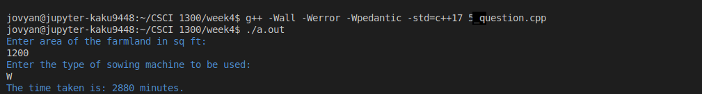

**Sample run 2**

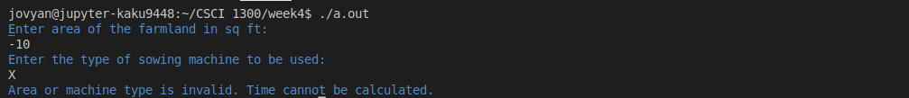

**Sample run 3**

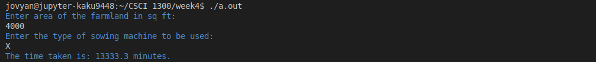

**Sample run 4**

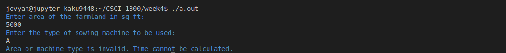

## **Question 6 (8 points): Putting it all together - Planting Seeds** <a name="question6"></a>

*This question may require the use of if-else statements, switch-case, and calling multiple functions.*

We are almost done. It's time to finalize the Planting Seeds project and deliver it to the farming company. In this step, we'll combine the solutions from previous questions to create a comprehensive C++ program that incorporates all the functionalities required for the project.

Create a menu-driven program that presents users with four options:
  1. **Calculate Farm Area**: This option helps users estimate the total surface area of their farmland.
  2. **Calculate Seeds Cost**: Users can choose this option to find out the cost of the seeds required for their farmland.
  3. **Estimate Sowing Time**: This option allows users to estimate the time it might take to sow the seeds on their farm, considering different sowing machines' speeds.
  4. **Exit**: This option exits the program.

**Note:** Recall that you have completed the functionalities needed for all the 3 options in questions 3, 4, and 5.

Please make sure that you follow [submission instructions](#submission) before you submit your code on coderunner.

Develop and validate your solution in VS Code. Once you are happy with your solution, go to coderunner on Canvas and paste the **whole program** into the answer box!

**--- Sample run ---:** (Blue is program output, and white is user input.)

**Sample run 1**

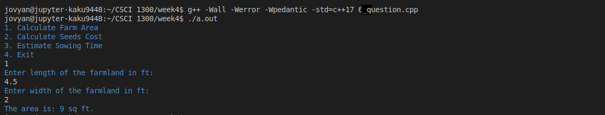

**Sample run 2**

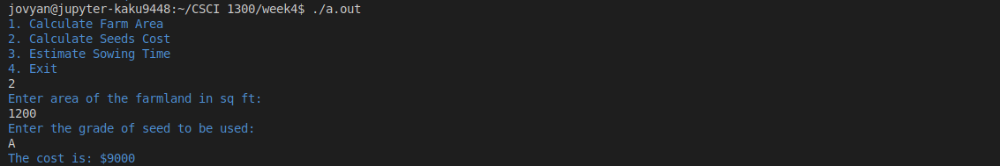

**Sample run 3**

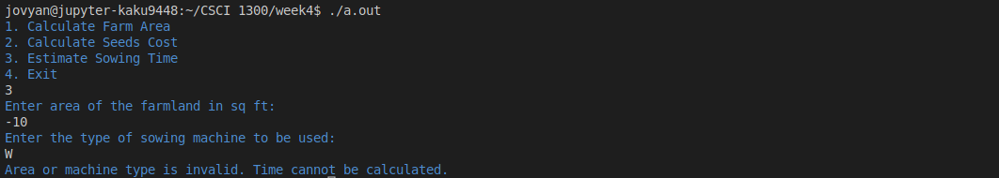

**Sample run 4**

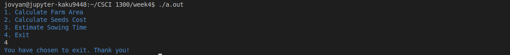

# Overview  <a name="overview"></a>

## File Headers <a name="fileheader"></a>

Before submitting your program on coderunner, ensure that you include the information below at the top of your file
```cpp
// CSCI 1300 Spring 2024
// Author: FirstName LastName
// TA: TA Name
// Question #
```

Example
```cpp
// CSCI 1300 Spring 2024
// Author: John Smith
// TA: Kaustubh
// Question 1

#include <iostream>
using namespace std;

int main()
{
    cout << "Hello World!" << endl;
    return 0;
}
```

## Checklist <a name="checklist"></a>
Here is a checklist for submitting the assignment:
1. Use your solutions in VS Code to complete the **Homework 3 - coderunner** assignment on Canvas (Modules → Week 4).
2. Complete the Homework 3 Quiz. This will be published on Sunday, February 4th.

## Grading Rubric <a name="grading"></a>
**Note:** Global variables and loops are not permitted in this homework. The use of global variables or loops will result in a 0 on the entire homework.

| **Criteria**                                | Points |
| ------------------------------------------- | ------ |
| Question 1                  | 2     |
| Question 2                  | 5     |
| Question 3                  | 6     |
| Question 4                  | 6    |
| Question 5                  | 7    |
| Question 6                  | 8    |
| Homework 3 Quiz             | 16    |
| Total                                    | 50  |
