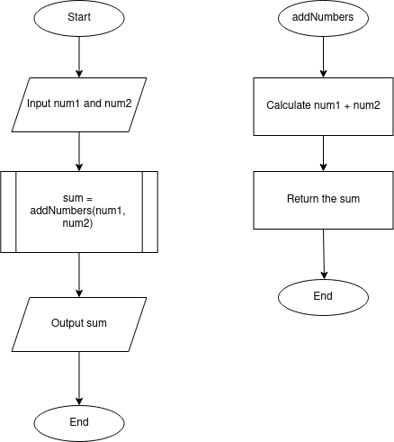
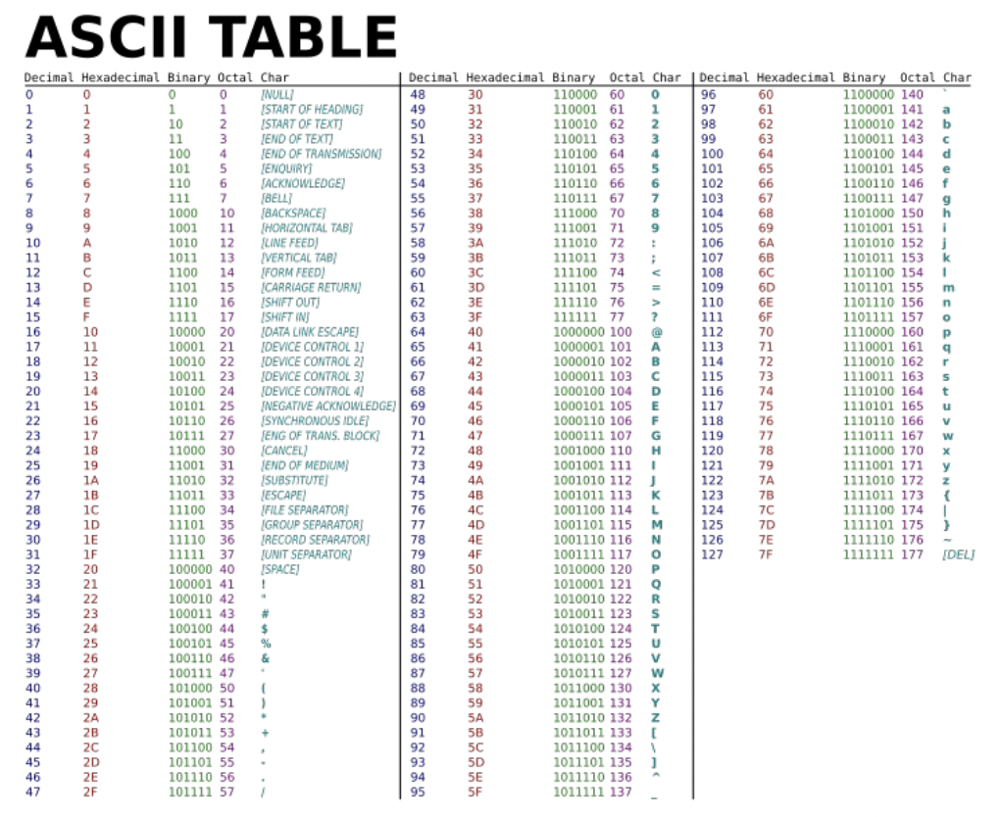

#### **CSCI 1300 CS1: Starting Computing: Study Guide: Week 5**
#### **Naidu/Godley - Spring 2024**

# Table of contents

1. [Functions](#functions)
2. [Testing Functions](#tests)
    1. [Void Functions with printed output](#void)
    2. [Non-Void Functions returning bool, int, char or string](#non-void-bool-int-char-string)
    3. [Non-Void Functions returning double](#non-void-double)
3. [Character Representation](#character)
4. [Reminder](#reminder)
5. [Vocabulary](#vocabulary)
6. [Pre-Quiz](#prequiz)

## Functions <a name="functions"></a>
A function in C++ is a block of code that performs a specific task. It is a way to group related code together and make it easier to read and understand. Functions can also be used to reuse code, which can make your programs shorter and easier to maintain.

Here is the syntax for a function declaration in C++:

```return_type functionName(parameter_list);```

  * ```return_type``` is the data type of the value that the function returns. If the function does not return a value, then ```void``` is used as the return type.
  * ```functionName``` is the name of the function.
  * ```parameter_list``` is a list of variables that are passed to the function. The variables in the parameter list are called parameters.

Here is an example of **defining** a function in C++ that adds two numbers and returns the result:

```cpp
int addNumbers(int a, int b)
{
  int c = a + b;
  return c;
}
```
The function ```addNumbers()``` takes two parameters, both of data type `int`. It adds the two parameters and returns the result.

To call a function, you use its name followed by a list of ```arguments``` enclosed in parentheses. The arguments are the values that are passed to the function. For example, the following code calls the ```addNumbers()``` function to add 10 and 5:

```cpp
int result = addNumbers(10, 5);
```

In the above code, 10 and 5 are called arguments. The ```result``` will now contain the 15.

### Function prototype

A function prototype in C++ is a declaration of a function. It tells the compiler the name of the function, its ```return type```, and the ```types of its parameters```. **The prototype does not contain the body of the function, only its signature**.

The following is a function prototype for a function that adds two numbers:

```cpp
int addNumbers(int a, int b);
```
This prototype tells the compiler that the function ```addNumbers()``` takes two parameters, a and b, which are integers, and returns an integer. **The body of the function is not specified in the prototype**.

Function prototypes are used for a variety of purposes. They can be used to:

  * Declare functions that are defined in other files.
  * Check the types of arguments passed to a function.
  * Allow the compiler to generate more efficient code.

Below is an example that uses function prototypes and functions.

```cpp
#include <iostream>
using namespace std;

int addNumbers(int a, int b); // function prototype

int main()
{
    int c = addNumbers(10, 5); // calling the function

    cout << "The sum of 10 and 5 :" << c << endl;
    return 0;
}

// function definition
int addNumbers(int a, int b)
{
  int c = a + b;
  return c;
}

```

### Function Flowchart

This is the flowchart for the `addNumbers()` function described above.



A function call is depicted by the rectangle with extra lines on the sides. Additionally, to show what the function is doing, a flowchart dedicated to the function is drawn on the side, as shown in the image above.

### Function Pseudocode

Pseudocode is used to develop algorithms. An algorithm is a procedure for solving a problem.

An algorithm describes actions to be executed and the order in which those actions are to be executed. In other words, an algorithm is merely the sequence of steps taken to solve a problem; like a recipe. An algorithm is not computer code. Algorithms are just the instructions which provide a clear path for you to write the computer code.

Pseudocode is an informal language that helps programmers develop algorithms (or recipes). Although there are no hard and fast rules for pseudocode, there are some suggestions to help make pseudocode more understandable and easy to read.

As verbs, consider using the words:
```
define, call, return, pass, assign, recieve, generate, accept, process, set, reset, increment, compute, calculate, add, sum, multiply, subtract, divide, print, display, input, output, edit, test, etc.
```

Be sure to indent if the indentation fosters understanding.
Being clear is the purpose of pseudocode, and a very desirable goal to strive for.

### Example 1.
pseudocode:
```
Define a function called canVote that accepts age as an input
Define variable voting_eligibilty
If age is greater than or equal to 18
    Assign voting_eligibilty as "True"
Else
    Assign voting_eligibilty as "False"
Return voting_eligibilty

```
C++ Source Code:
```cpp
bool canVote(int age) {
    bool voting_eligibility;
    
    if (age >= 18) {
        voting_eligibility = true;
    } 
    else {
        voting_eligibility = false;
    }
    
    return voting_eligibility;
}
```

### Example 2.
pseudocode:
```
Define a function called findGreatestSide that accepts three inputs: side_A, side_B, side_C
Define variable greatest_side

If sideA is greater than sideB and sideA is greater than sideC
    Assign greatest_side as side_A
Else If sideB is greater than sideA and sideB is greater than sideC
    Assign greatest_side as side_B
Else
    Assign greatest_side as side_C

Return greatest_side
 
```
C++ Source Code:
```cpp

double findGreatestSide(double side_A, double side_B, double side_C) {
    double greatest_side;

    if (side_A > side_B && side_A > side_C) {
        greatest_side = side_A;
    } 
    else if (side_B > side_A && side_B > side_C) {
        greatest_side = side_B;
    } 
    else {
        greatest_side = side_C;
    }

    return greatest_side;
}

```

## Testing functions <a name="tests"></a>

Every C++ program you write should include a main function that tests the function you wrote.
There will be 3 different types of test cases you are expected to write depending on the return type of the function.
Listed below is how we expect you to test different types of functions. The process will be different
if you are testing a `void` function, a non-void function that returns an `int`, `bool`, `char`, `string`, or a non-void function that returns a `double`.

### 1. Void Functions with printed output <a name="void"></a>

For **void** functions that have printed output (i.e., functions that use `cout` to print to the terminal), call the testing function in the main function. Your tests should include the expected output in the comments.

See the sample code below:
```c++
void checkDiscount(double discount)
{
    if (discount >= 50)
    {
        cout << "Great discount!" << endl;
    }
    else
    {
        cout << "Not a great discount." << endl;
    }
    return;
}
int main()
{
    // test 1 for checkDiscount
    // expected output: "Great discount!"
    checkDiscount(82.7);

    // test 2 for checkDiscount
    // expected output: "Not a great discount."
    checkDiscount(22);

    return 0;
}
```
_* For the purpose of this test code snippet, algorithm comments were not included, but they are still expected in your C++ files._

### 2. Non-Void Functions returning bool, int, char or string <a name="non-void-bool-int-char-string"></a>

For functions that return a **bool, int, char, or string**, use **assert statements** from the **cassert** library (`#include <cassert>`) with a conditional expression.

Assert statements contain a conditional expression that will evaluate to `true` if the function's actual output matches what's expected. If the conditional expression evaluates to `false`, then your program will stop running after printing an error message.

Functions that return a `bool`, `char`, `int` or `string` can be compared to a specific value using the equality operator `==`.

Your test will look something like this:

`assert(<function call> == <value to compare to>);`

* `<function call>` is where you will call the function you want to test with its function parameters.
* `<value to compare to>` is the value you expect the function to return.
* `==` is the equality operator, and it compares the equality of both sides of itself.

See the sample code below:
```c++
#include <iostream>
#include <cassert>
using namespace std;

int addInts(int num1, int num2)
{
    // add num1 and num2 before returning
    return num1 + num2;
}

// isDrivingAge() returns true if the given age passed as a parameter
// is greater than or equal to 16, otherwise it returns false.
bool isDrivingAge(int age)
{
    return age >= 16;
}

int main()
{
    // test 1 for addInts
    assert(addInts(5, 6) == 11);

    // test 2 for addInts
    assert(addInts(10, 10) == 20);

    // test 3 for drivingAge
    assert(isDrivingAge(17) == true);

    // test 4 for drivingAge
    assert(isDrivingAge(14) == false);
}
```
_* For the purpose of this test code snippet, algorithm comments were not included, but they are still expected in your C++ files._

### 3. Non-Void Functions returning double <a name="non-void-double"></a>

For functions that return a **double**, you should use an **assert statement** from the **cassert** header (`#include <cassert>`) with a conditional expression like above. The difference is that you will also need to include the following function in your program:
```c++
/**
 * doublesEqual will test if two doubles are equal to each other within two decimal places.
 */
bool doublesEqual(double a, double b, const double epsilon = 1e-2)
{
    double c = a - b;
    return c < epsilon && -c < epsilon;
}
```
Because the `double` type holds so much precision, it will be hard to compare the equality of a function that returns a
double with another double value. To overcome this challenge, we can compare `double` values within a certain range
of precision or decimal places. The function above compares the equality of two variables, `a` and `b`, up to two decimal places and returns `true` if the values of `a` and `b` are equal with each other up to two decimal places.

You will be expected to use this function in conjunction with `assert` statements to test functions that return
the type double.

Your test will look something like this:

`assert(doublesEqual(<function call>, <value to compare to>));`

 * `<function call>` is where you will call the function you want to test with its function parameters
 * `<value to compare to>` is the `double` value you expect the function to return.


See the sample code below:
```c++
#include <iostream>
#include <cassert>
using namespace std;
/**
 * doublesEqual will test if two doubles are equal to each other within two decimal places.
 */
bool doublesEqual(double a, double b, const double epsilon = 1e-2)
{
    double c = a - b;
    return c < epsilon && -c < epsilon;
}
/**
 * reciprocal returns the value of 1 divided by the number passed into the function.
 */
double reciprocal(int num)
{
    return 1.0 / num;
}
int main()
{
    // test 1 for reciprocal
    assert(doublesEqual(reciprocal(6), 0.16));
    // test 2 for reciprocal
    assert(doublesEqual(reciprocal(12), 0.083));
}
```
For test 1, `reciprocal(6)` is being called, and we expect the function to return the value `0.16`.
The return value of `reciprocal(6)` and `0.16` is passed in as parameters to the `doublesEquals` function,
which will then return `true` if these two values are equal or `false` if they are not.

_* For the purpose of this test code snippet, algorithm comments were not included, but they are still expected in your C++ files._

## Character Representation<a name="character"></a>

- **ASCII**: ASCII (American Standard Code for Information Interchange) is 7 bits long,
specifying 27 = 128 codes:
    - 26 uppercase letters A through Z
    - 26 lowercase letters a through z
    - 10 digits
    - 32 typographical symbols such as +, -, ', \...
    - 34 control characters such as space, newline
    - 32 others for controlling printers and other devices

- **Unicode**: A superset of ASCII, Unicode uses 21 bits to accommodate over 2 million characters, supporting global languages.



```cpp
// Convert 'a' to 'A'
lowercase_char = 'a';
uppercase_char = lowercase_char - 32; // Subtract the ASCII difference
cout << lowercase_char << " converted to uppercase is: " << uppercase_char << endl;
```
Output:
<pre>
a converted to uppercase is: A
</pre>

## Reminder<a name="reminder"></a>

### Rounding to required Decimal places

We use the `<iomanip>` library in C++, which helps in manipulating the output of the program. The two functions that we are going to be using here are `setprecision` and `fixed`.

**setprecision:** This function is mainly used in displaying significant digits and rounds off the last displayed digit. It takes in a parameter that defines how many digits are to be displayed in the output.

**fixed:** This function is used to display decimal numbers in fixed point notation. It enforces a consistent number of decimal places irrespective of their actual precision.

For example:
 Here's a snippet to print the speed of a sprinter in the Olympics up to 3 decimal places.
 ```cpp
 #include <iostream>
 #include <iomanip> // first we import the library

 using namespace std;

 int main()
 {
    double sprint_time = 19.1886;

    cout << fixed << setprecision(3) << "The sprint time in seconds : " << sprint_time << endl;
    return 0;
 }
 ```
Correct Output:
<pre>
The sprint time in seconds : 19.189
</pre>

If we **do not** use the `fixed` function in our `cout` statement, then
Wrong Output:
<pre>
The sprint time in seconds : 19.2
</pre>
Note: Please use the `fixed` function to set the number of decimal places to be output and use the `setprecision(x)` (here, `x` is the number of decimal places) to round to the last digit.

### Whitespace and indentation

**Whitespaces:** Whitespaces can set things off and reduce the strain on the reader's eyes. Because the compiler ignores whitespace, you can place things anywhere and format them however you want. Whitespace can come in several forms, including indentation.

**Indenting:** Increase your indentation by one increment of each brace "{" and decrease it once on each closing brace "}". Place a line break after every "{" or "}". Use Tab to increase indent and Shift+Tab to decrease indentation.

**Bad Example:** There is no indentation, and it is difficult to see where different portions of the code start and stop.
```cpp
int main(){int number = 0;
    while(number < 10){
    if(number < 5){
    cout << "Less than 5" << endl;
    }else{
    cout << "Greater than 5" << endl;
    }
    number++;
    }
}
```
Good Example: There is a proper indentation example, and the code is easier to read.
```cpp
int main()
{
    int number = 0;
    while(number < 10)
    {
        if(number < 5)
        {
            cout << "Less than 5" << endl;
        }
        else
        {
            cout << "Greater than 5" << endl;
        }
        number++;
    }
}
```

### Naming and variables
**Names:** Give variables descriptive names, such as first_name or homework_score. Avoid one-letter names like "a" or "x", except for loop counter variables such as "i".

Bad Example:
```cpp
int thing = 16;
double a = 2.2;
string x = "Michael";
```

Good Example:
```cpp
int cups_per_gallon = 16;
double lbs_per_kilo = 2.2;
string first_name = "Michael";
```
**Capitalization:** Name **functions** with “camel-casing”, where the first letter is lowercase and all subsequent words in the name start with a capital letter. **Variables** names are all lowercase with underscores between words.

Bad Example:
```cpp
int numberbananas = 10;
double NumberFish = 7;
string AGEOFPERSON = "Michael";
void play_GAME (int Players)
{
    . . .
}
```
Good Example:
```cpp
int number_bananas = 10;
double number_fish = 7;
string age_of_person = "Michael";
void playGame (int players)
{
    . . .
}
```


### Comments
* Your code should be well-commented. Use comments to explain what you are doing, especially if you have a complex code section. These comments are intended to help other developers understand how your code works. Single-line comments should begin with two forward slashes (//). Multi-line comments begin with one forward slash and an asterisk (/* ... comments here ... */).

* Examples:
    *  Single-line:
    ```cpp
    // CSCI 1300 Spring 2024
    ```
    * Multi-line:
    ```cpp
    /*
    Algorithm:
    Input: two numbers
    Output: sum of input numbers

    1. Ask the user to enter a number
    Save in variable number_1
    2. Ask the user to enter a number
    Save in variable number_2
    3. Compute sum
    sum = number_1 + number_2
    4. Display sum to user
    */
   ```

### Compiling a C++ program

Please make sure you compile every program with all the flags. Assuming the program is called `helloWorld.cpp`, the compile command would look something like the following:

``g++ -Wall -Werror -Wpedantic -std=c++17 helloWorld.cpp``

For more information about compiling a C++ program and submitting it to coderunner, please refer to [week 3 study guide](https://github.com/CSCI1300-StartingComputing/CSCI1300-Spring2024/blob/main/week3/StudyGuide_week3.md#compiling-a-c-program-).


## Vocabulary <a name="vocabulary"></a>
* **variable Initialization** - The process of assigning a value to a variable at the time of declaration.
* **function prototype** - The declaration of a function that specifies its name, return type, and parameter types, informing the compiler about the function's existence.
* **function definition** - The complete specification of a function including its name, return type, parameter types, and the body of the function.
* **function call** - A statement that invokes (starts) a function and causes the function statements to execute
* **arguments** - Variables or expressions passed to a function when it is called.
* **parameters** - Variables in the function's definition that act as placeholders for the values that will be passed to the function.
* **scope** - The region of code where a particular variable can be accessed or modified.
* **built-in functions** - Pre-defined operations in a programming language that perform specific tasks without requiring the user to write the function's code.
* **ASCII** -  (American Standard Code for Information Interchange) Character encoding standard used to represent text in computers
* **setprecision** - A manipulator in C++ used with output streams to control the number of digits displayed for floating-point numbers.
* **fixed** - A manipulator in C++ used to enforce fixed-point notation in the display of floating-point numbers, ensuring a consistent number of decimal places.
* **assert Statement** - A statement used for debugging purposes, to check assumptions made by the program and terminate the program if the assumption is false.
* **debugging** - The process of identifying, tracing, and correcting errors or bugs in a computer program to ensure it runs as intended.


## Recitation 4: Pre-Quiz <a name="prequiz"></a>

1. What are assert statements? Why are they useful?

2. Why do we need to validate user input? What can go wrong if we do not validate the input?

3. Fill in the blank with the appropriate function definition. The program below displays the cube of the number by calling the user-defined cube function.
```cpp
#include <iostream>
using namespace std;

_________________________ // FILL IN THIS LINE
{
    return num * num * num;
}

int main() {
    int number;

    cout << "Enter a number: ";
    cin >> number;

    int result = cube(number);

    cout << "The cube of " << number << " is: " << result << endl;

    return 0;
}

```

4. Fill in the blanks in the assert statements below to verify that the provided square function works correctly.

```cpp
#include <iostream>
using namespace std;

// calculate the value of x squared
int squared(int x)
{
    return x * x;
}

int main() {

    assert(squared(1) == ____________); // FILL IN THIS LINE
    // there should be two values that equal 9; test them both.
    assert(___________ == 9); // FILL IN THIS LINE
    assert(___________ == 9); // FILL IN THIS LINE
    // create an assert statement for any value(s) you want.
    assert(________________); // FILL IN THIS LINE
    return 0;
}
```

5. Fill in the blanks below. We will need a function prototype as well as two conditions: one to evaluate if a character is a lower case letter, and one to evaluate whether a provided capital letter is a consonant. For simplicity, you can say 'Y' is a consonant.

```cpp
#include <iostream>
#include <cassert>
using namespace std;

char toCapital(char);
_______________________________ // FILL IN THIS LINE

int main()
{
    assert(!isConsonant('A'));
    assert(isConsonant('B'));
    assert(!isConsonant('.'));
    assert(isConsonant('z'));
}

char toCapital(char input){
    //check if input is a lower case letter
    if (___________________________)  // FILL IN THIS LINE
    {
        return (input - 32); // convert to upper case letter
    }
    else  // if the character is already a capital letter or any other symbol, return it as is
    {
        return input;
    }
}

bool isConsonant(char input){
    // convert the letter to upper case to make the conditional simpler
    input = toCapital(input);

    if (_____________________________________) // FILL IN THIS LINE
    {
        return true;
    }
    else
    {
        return false;
    }
}

```

