#### **CSCI 1300 CS1: Starting Computing: Homework 4**
#### **Naidu/Godley - Spring 2024**
#### **Due: Friday, February 16th by 5:00pm MST**

<br/>

# Table of contents
1. [Objectives](#objectives)
2. [Questions](#questions)
    1. [Question 1](#question1)
    2. [Question 2](#question2)
    3. [Question 3](#question3)
    4. [Question 4](#question4)
    5. [Question 5](#question5)
      1. [Question 5a](#question5a)
      2. [Question 5b](#question5b)
      3. [Question 5c](#question5c)
4. [Overview](#deliverables)
    1. [File Header](#fileheader)
    2. [Checklist](#checklist)
    3. [Grading Rubric](#grading)

# Objectives <a name="objectives"></a>

* Understand how and when to use functions in C++
* Work through the assigned questions in VSCode and submit answers on coderunner

# Questions <a name="questions"></a>

For questions that require the use of a function, coderunner will check that you have written the function correctly. DO NOT WRITE ALL YOUR CODE IN ```main()```! Your code will NOT compile if you do not have the correct function. See below for an example of what this could look like:

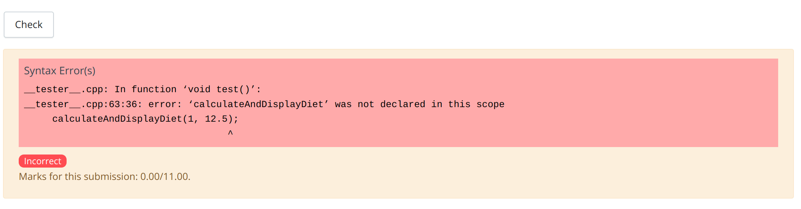

**Warning:** You are not allowed to use global variables, loops, references, pointers, or any advanced material not discussed in the lectures for this homework.

If you are suspected of using an outside source to complete homework, you may be called for an in-person interview and could risk losing points for the assignment.

## **Question 1 (1 point): Fill in the Blanks** <a name="question1"></a>
*This question requires the use of declaring and calling functions. Understanding return types and parameters is necessary as well.*
<br>
<br>
For the following code, complete the function prototype and declaration for the incomplete functions. The program is supposed to display the volume of two prisms and then display to the user which prism has a greater volume. Fill in the blanks with the corresponding C++ code. Coderunner is preloaded with this template.

```cpp
#include <iostream>
using namespace std;

________ calculateVolume(int area, int height);
void displayVolume(____________);
________ compareVolume(_______________);

int main()
{
    int area_1 = 3, height_1 = 7, area_2 = 5, height_2 = 18;

    //Calculate and display the volume of the first prism
    int volume_1 = calculateVolume(area_1, height_1);
    displayVolume(volume_1);

    //Calculate and display the volume of the second prism
    int volume_2 = calculateVolume(area_2, height_2);
    displayVolume(volume_2);

    //Decide which prism has larger volume
    compareVolume(area_1, height_1, area_2, height_2);

    return 0;
}

//This function calculates the volume of a prism
________ calculateVolume(int area, int height)
{
    int volume = 0.5 * area * height;
    return volume;
}

//This function displays the volume of a prism
void displayVolume(_____________)
{
    cout << "The volume of the prism is: " << volume << endl;
    return;
}

//This function compares the volume of a prism
_________ compareVolume(______________)
{
    int volume_1 = calculateVolume(area_1, height_1);
    int volume_2 = calculateVolume(area_2, height_2);

    if (volume_1 > volume_2)
    {
        cout << "The first prism has greater volume" << endl;
    }
    else if (volume_2 > volume_1)
    {
        cout << "The second prism has greater volume" << endl;
    }
    else
    {
        cout << "The  have equal volume" << endl;
    }

    return;
}
```

Develop and validate your solution in VS Code. Once you are happy with your solution, go to coderunner on Canvas and paste the **whole program** into the answer box! Please make sure to include your header! See [File Header](#fileheader) for instructions.

**--- Sample run ---:** (Blue is program output, and white is user input.)

**Sample run 1**

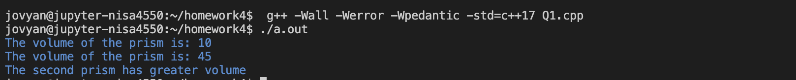

## **Question 2 (5 points): Calculating Distance Between Two Points** <a name="question2"></a>
*This question may require the use of logical and relational operators, if-else statements, declaring and calling a function, and processing user input.*
<br>
<br>
In mathematics, there are often many ways to decide how far two points are from each other.  All points are 2-dimensional; each has an x component and a y component. In other words, define: $p1 = (x1, y1), p2 = (x2, y2)$.

The first equation is defined as follows: <br>

$distance(p1, p2) = |x2 - x1| + |y2 - y1|$ <br>

This is distance type 1, called the "1-norm" or sometimes the "Manhattan Distance".

The second equation is: <br>

$distance(p1, p2) = \sqrt{(x2 - x1)^2 + (y2 - y1)^2}$ <br>

This is distance type 2, called the "2-norm" or "Euclidean Norm/Euclidean Distance".

**Note:** You can utilize the built-in functions from the `<cmath>` library for complex math operations, such as square root and absolute values.

Write a program to calculate the distance between two points using the two equations described above. Prompt the user for equation choice, x, and y co-ordinates in main() and use the function specification listed below for distance calculation. 

Function Specification:

<table>

<tr>
<td>
Function:

```calculateDistance(double, double, double, double, int)```

</td>
<td>

```cpp
double calculateDistance(double x1, double y1, double x2, double y2, int distance_type)
```

</td>
</tr>

<tr>
<td>
Purpose:
</td>
<td>
The function should calculate the distance between the points for both equation options. It should not print anything.
</td>
</tr>

<tr>
<td>
Parameters:
</td>
<td>

<b>double</b> ```x1``` - x coordinate of the first point. <br>
<b>double</b> ```y1``` - y coordinate of the first point. <br>
<b>double</b> ```x2``` - x coordinate of the second point. <br>
<b>double</b> ```y2``` - y coordinate of the second point. <br>
<b>int</b> ```distance_type``` - Which equation to use for calculating the distance.
</td>
</tr>

<tr>
<td>
Return Value:
</td>
<td>
If successful, return the distance between the points.
</td>
</tr>

<tr>
<td>
Error Handling/Boundary Conditions:

</td>
<td>

- If ```distance_type``` is outside range[1,2], -1 is returned. Check the return value in main() to decide the appropriate print statement.

</td>
</tr>
<tr>
<td>
Example:
</td>

<td>

Note: this is only an example usage of the function; you need to develop your own main function to fulfill the requirement for this problem.

Sample Code:

```cpp
// Assume the proper libraries are included.

// Assume the proper implementation of calculateDistance() is included.

int main() {
    // pass in the value for x1, y1, x2, y2, distance_type
    double dist = calculateDistance(2, 1, 1, 2, 2);
    cout << "The distance between the points is: " << dist << endl;
    return 0;
}
```

Sample Output:
```
The distance between the points is: 1.41421
```

</td>
</tr>

</table>

**--- Sample run ---:** (Blue is program output, and white is user input.)

**Sample run 1**

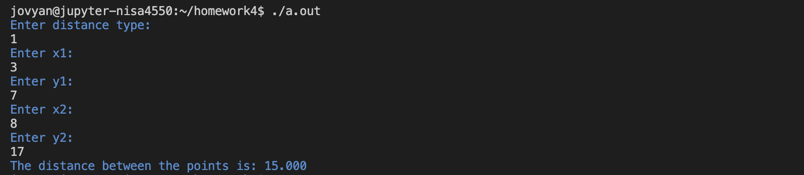

**Sample run 2**

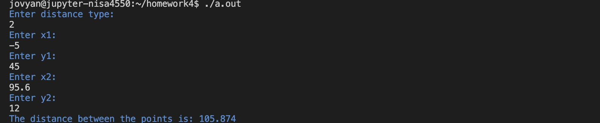

**Sample run 3**


**Sample run 4**

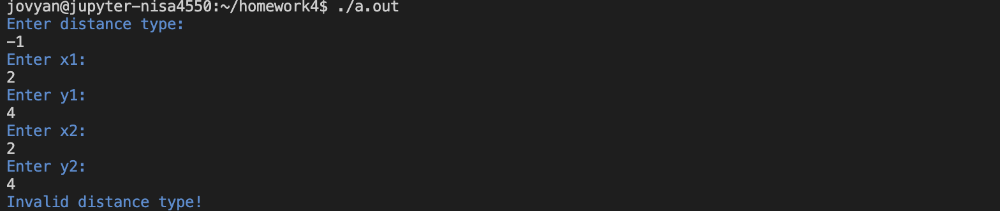


Develop and validate your solution in VS Code. Once you are happy with your solution, go to coderunner on Canvas and paste the **whole program** into the answer box! Please make sure to include your header! See [File Header](#fileheader) for instructions.

--- Sample run ---: (Blue is program output, and white is user input)

## **Question 3 (5 points): Encrypting Uppercase Letters** <a name="question3"></a>
*This question may require the use of relational operators, if-else statements, declaring and calling a function, and processing user input.*
<br>
<br>

The Caesar cipher shifts each letter by a fixed number of positions down the ASCII table. For example, with a shift of 3, 'A' would be replaced by 'D', 'B' would become 'E', and so on. If the shift is -3, 'D' would be replaced by 'A', 'E' would become 'B', etc. In this question, for simplicity, we are only encrypting uppercase letters. 

Write a program that encrypts uppercase letters using the Ceasar cipher. Prompt the user for letter and shift value in main() and use the function specification listed below for encryption.

Function Specification:

<table>

<tr>
<td>
Function:

```encryptUpper(char, int)```

</td>
<td>

```cpp
char encryptUpper(char letter, int shift_value)
```

</td>
</tr>

<tr>
<td>
Purpose:
</td>
<td>
To encrypt the letter by using the shift value. The function should not print anything.
</td>
</tr>

<tr>
<td>
Parameters:
</td>
<td>

<b>char</b> ```letter``` - The letter that are being encrypted. <br>
<b>int</b> ```shift_value``` - The shift value.
</td>
</tr>

<tr>
<td>
Return Value:
</td>
<td>
If successful, then return the newly encrypted letter.
</td>
</tr>
<tr>
<td>
Error Handling / Boundary Conditions:
</td>

<td>

- If the unencrypted letter is not uppercase, then the unencrypted letter is returned.

- If the encrypted letter cannot be displayed (all ASCII values before `SPACE` and the last ASCII value `DEL` are considered nonprintable), return the unencrypted letter. Please refer to the weekly study guide for more details on ASCII.
</td>
</tr>
<tr>
<td>
Helpful Hints / Possible issues:
</td>

<td>

Performing math operations with `char` will be displayed as a number. You can avoid the issue by storing it in a `char` type.

Possible issue 1:
```cpp
int main()
{
  // printing as a number
  char example_variable = 'A';
  cout << example_variable + 1 << endl;

  // printing as a character
  example_variable = example_variable + 1;
  cout << example_variable << endl;
}
```
Possible issue 1 output:
```cpp
66
B
```

</td>
</tr>

<tr>
<td>
Example:
</td>
<td>

Note: this is only an example usage of the function; you need to develop your own main function to fulfill the requirement for this problem.

Sample Code:

```cpp
// Assume the proper libraries are included.

// Assume the proper implementation of encryptUpper() is included.

int main() {
    char letter = 'R';
    char encrypted_letter = encryptUpper(letter, 5);
    cout << "Letter " << letter << " was encrypted to " << encrypted_letter << endl;
    return 0;
}
```

Sample Output:

```
Letter R was encrypted to B
```

</td>
</tr>

</table>


Develop and validate your solution in VS Code. Once you are happy with your solution, go to coderunner on Canvas and paste the **whole program** into the answer box! Please make sure to include your header! See [File Header](#fileheader) for instructions.

-**--- Sample run ---:** (Blue is program output, and white is user input.)

**Sample run 1**

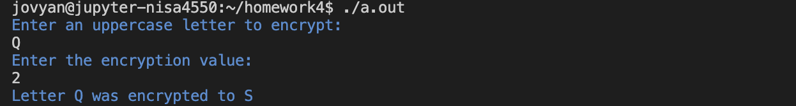

**Sample run 2**

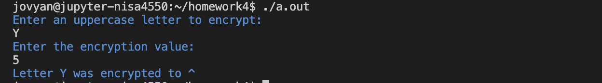

**Sample run 3**

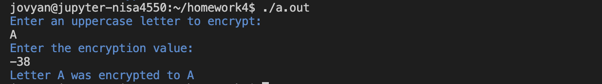

**Sample run 4**

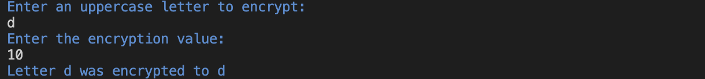

**Sample run 5**

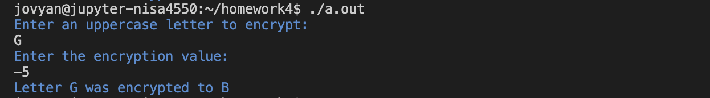

## **Question 4 (8 points): Bird Feeder Management** <a name="question4"></a>
*This question may require the use of relational operators, if-else statements, declaring and calling a function, and processing user input.*
<br>
<br>
You have three birdfeeders around your house, but some pesky squirrels keep eating all the birdseed! To make sure all three feeders are topped off, you want to write a program to tell you when you need to fill each feeder.

Below is the breakdown of feeder capacities and drain rates: <br>
| **Feeder Number** | **Capacity (oz)** | **Drain Rate (oz/day)** |
|-------------------|-------------------|-------------------------|
| 1                 | 33                | 2                       |
| 2                 | 27                | 4                       |
| 3                 | 16                | 3                       |

Function Specification:

<table>

<tr>
<td>
Function:

```manageFeeder(int, int)```

</td>
<td>

```cpp
int manageFeeder(int feeder, int days_since_last_fill)
```

</td>
</tr>

<tr>
<td>
Purpose:
</td>
<td>
To calculate how many days until the specified feeder runs out of birdseed. The function should not print anything.
</td>
</tr>

<tr>
<td>
Parameters:
</td>
<td>

<b>int</b> ```feeder``` - Integer ID of the feeder the function needs to manage. <br>
<b>int</b> ```days_since_last_fill``` - Number of days since that feeder was filled.
</td>
</tr>

<tr>
<td>
Return Value:
</td>
<td>
If successful, return the number of days remaining before the feeder must be refilled.
</td>
</tr>

<tr>
<td>
Error Handling/Boundary Conditions:
</td>
<td>

- If ```days_since_last_fill``` is negative, -1 is returned. Check the return value in main() to decide the appropriate print statement.
- If the number of days remaining before the feeder needs to be refilled (the value calculated in this function) is negative, then 0 is returned. Explanation: you cannot have negative days. The negative value indicates that the feeder is empty and should be filled immediately.
</td>
</tr>
<tr>
<td>
Example:
</td>
<td>

Note: this is only an example usage of the function; you need to develop your own main function to fulfill the requirement for this problem.

Sample Code:

```cpp
// Assume the proper libraries are included.

// Assume the proper implementation of manageFeeder is included.

int main() {
    cout << "Feeder 1 will need to be filled in " << manageFeeder(1, 3) << " days." << endl;
    return 0;
}
```

Sample Output:
```
Feeder 1 will need to be filled in 13 days.
```

</td>
</tr>

</table>

After creating the function, you would like to create a small menu system in main() and prompt the user for input based on their menu choice. Below are the possible options:

1. **Check Feeder 1**
2. **Check Feeder 2**
3. **Check Feeder 3**
4. **Check All Feeders**

**Notes:** 
* When the user selects option 4 (Check All feeders), they enter ```days_since_last_fill``` once, which is passed to all feeders.
* If the user enters a menu choice outside range [1,4] then display `Invalid menu choice!`.
* If ```manageFeeder()``` is successful then display `Feeder <feeder> will need to be filled in <days_to_fill> days.`, where `<feeder>` is the integer ID of the feeder and `<days_to_fill>` is number of days remaining before the feeder must be refilled.
* If ```manageFeeder()``` returns 0, then display `Feeder <feeder> is currently empty and should be filled immediately.`
* If ```manageFeeder()``` returns -1, then display `Invalid input for days_since_last_fill!`.

Develop and validate your solution in VS Code. Once you are happy with your solution, go to coderunner on Canvas and paste the **whole program** into the answer box! Please make sure to include your header! See [File Header](#fileheader) for instructions.

**--- Sample run ---:** (Blue is program output, and white is user input.)

**Sample run 1**

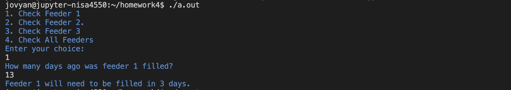

**Sample run 2**

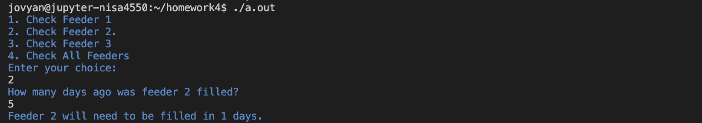

**Sample run 3**

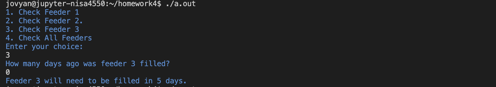

**Sample run 4**


**Sample run 5**

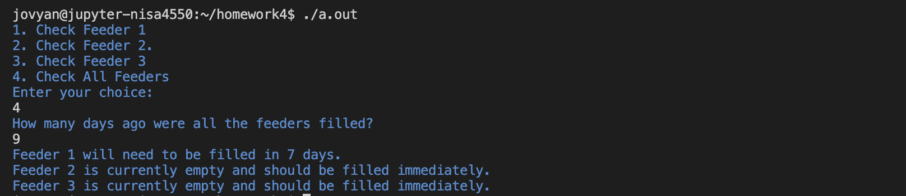

**Sample run 6**

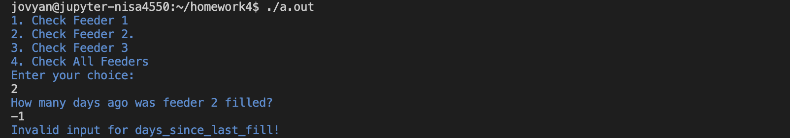

**Sample run 7**

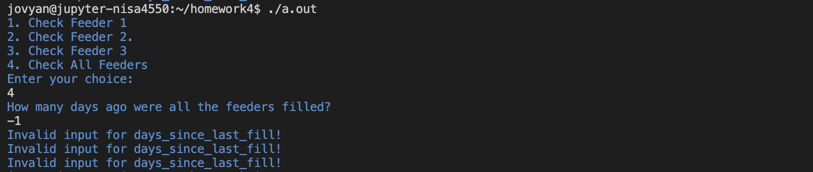

**Sample run 8**

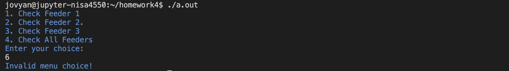

## **Question 5: Ski Pass** <a name="question5"></a>

After learning more about the best programming practices, you've realized that writing everything in `main()` is a bad habit. Therefore, you decided to go back to an old program that you did and make it better. In this case, you have decided to revise [Question 4](https://github.com/CSCI1300-StartingComputing/CSCI1300-Spring2024/blob/main/week3/homework2.md#question-4-10-points-skiing-time-) from homework 2. To better manage the program, you have decided to break the program into smaller chunks:

1. budget check: This function checks if you have enough money to purchase the pass.
2. purchase pass: This function purchases the pass and updates the budget.

As a refresher, part of the write-up of question 4 from homework 2 is below. However, the program's output has changed; therefore, some of the original write-up has been removed to avoid confusion.

You want to start skiing this season, so you plan to buy a pass from a ski resort. The resort has 4 types of passes:

|Pass | Cost|
|----|----|
| Basic | $250.15 |
| Intermediate | $479.85 |
| Advanced | $684.29 |
| Premium | $950.33 |

Write a C++ program that will take the desired pass the user wishes to purchase and their budget to determine if it is within the user's budget.

The program should take a non-negative number for budget and character input( _B, I, A, or P_ ) for ski-pass from the user. Ensure that you do input validation.

### **Question 5a (3 points): Budget Check** <a name="question5a"></a>
*This question may require the use of logical operators, if-else statements, declaring and calling a function, and processing user input.*
<br>
<br>

Create a function to verify if the user has the budget to purchase the pass they desire. 

Function Specification:
<table>

<tr>
<td>
Function:

```bool budgetCheck(double, char)```

</td>
<td>

```cpp
bool budgetCheck(double budget, char pass_type)
```

</td>
</tr>

<tr>
<td>
Purpose:
</td>
<td>
To determine whether you have enough money to purchase the pass you want. The function should not print anything.
</td>
</tr>

<tr>
<td>
Parameters:
</td>
<td>

<b>double</b> ```budget``` - The current budget available to purchase a pass.<br>
<b>char</b> ```pass_type``` - The type of ski pass the user wants to purchase.
</td>
</tr>

<tr>
<td>
Return Value:
</td>
<td>
If successful (valid user input), it returns whether the pass is within the budget. Check the return value in main() to decide the appropriate print statement.
</td>
</tr>

<tr>
<td>
Error Handling/Boundary Conditions:
</td>
<td>

- Invalid budget amount or invalid pass will return `false`.
</td>
</tr>

<tr>
<tr>
<td>
Example:
</td>
<td>

Note: this is only an example usage of the function; you need to develop your own main function to fulfill the requirement for this problem.

Sample Code:

```cpp
// Assume the proper libraries are included.

// Assume the proper implementation of budgetCheck is included.

int main() {
    bool can_purchase = budgetCheck(1000, 'B');
    if(can_purchase)
    {
        cout << "Yes, this pass is within your budget" << endl;
    }
    return 0;
}
```

Sample Output:
```
Yes, this pass is within your budget!
```

</td>
</tr>


</table>

Develop and validate your solution in VS Code. Once you are happy with your solution, go to coderunner on Canvas and paste only `budgetCheck()` into the answer box! Please make sure to include your header! See [File Header](#fileheader) for instructions.

**--- Sample run ---:** (Blue is program output, and white is user input.)

**Sample run 1**

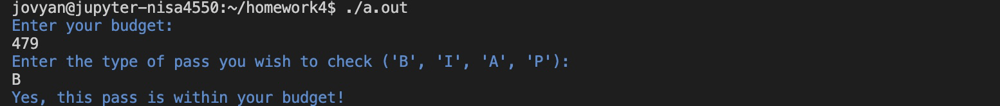

**Sample run 2**

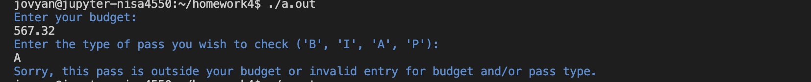

**Sample run 3**

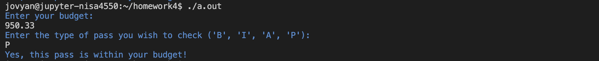

**Sample run 4**

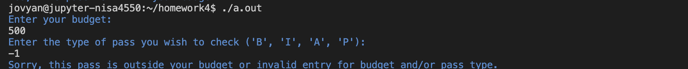

**Sample run 5**

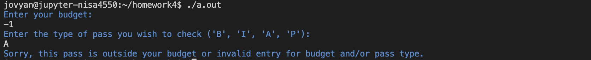

### **Question 5b (3 points): Purchase Pass** <a name="question5b"></a>

Then, create a function that will purchase the pass. **Hint:** You may use the previous function as a validation check to make sure you can purchase the pass.

Function Specification:
<table>

<tr>
<td>

Function:

```double purchasePass(double, char)```

</td>
<td>

```cpp
double purchasePass(double budget, char pass_type)
```

</td>
</tr>
<tr>
<td>
Purpose:
</td>
<td>
To purchase the ski pass and update the budget. The function should not print anything.
</td>
</tr>
<tr>
<td>
Parameters:
</td>
<td>

<b>double</b> ```budget``` - The current budget available to purchase a pass.<br>
<b>char</b> ```pass_type``` - The type of ski pass the user wants to purchase.
</td>
</tr>
<tr>
<td>
Return Value:
</td>
<td>
If successful (based on the validation check from part a), it returns the updated budget.
</td>
</tr>
<tr>
<td>
Error Handling/Boundary Conditions:
</td>
<td>

- If we cannot purchase a pass (based on the validation check from part a), we will return the unmodified budget. Check the updated budget and the original budget in main() to determine the appropriate print statement.

</td>
</tr>

<tr>
<tr>
<td>
Example:
</td>
<td>

Note: this is only an example usage of the function; you need to develop your own main function to fulfill the requirement for this problem.

Sample Code:

```cpp
// Assume the proper libraries are included.

// Assume the proper implementation of purchasePass is included.

int main() {
    double budget = 500;
    double updated_budget = purchasePass(budget, 'B');
    if(budget != updated_budget)
    {
        cout << "Pass purchased successfully. Updated budget: $" << updated_budget << endl;
    }
    return 0;
}

```

Sample Output:
```
Pass purchased successfully. Updated budget: $249.85
```

</td>
</tr>


</table>

Develop and validate your solution in VS Code. Once you are happy with your solution, go to coderunner on Canvas and paste only `purchasePass()` and `budgetCheck()` into the answer box! Please make sure to include your header! See [File Header](#fileheader) for instructions.

**--- Sample run ---:** (Blue is program output, and white is user input.)

**Sample run 1**

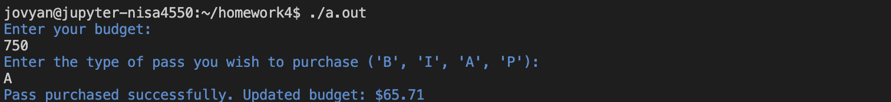

**Sample run 2**

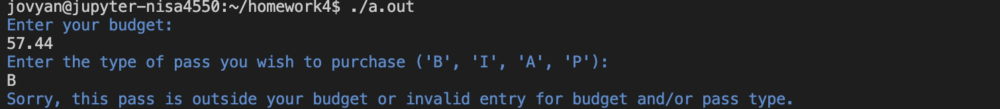

**Sample run 3**

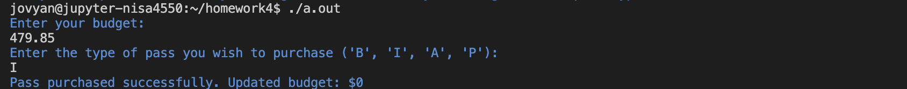

**Sample run 4**

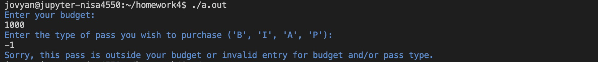

**Sample run 5**

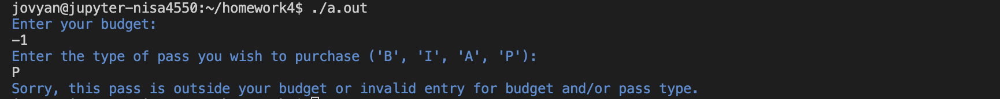

### **Question 5c (3 points): Another Pass** <a name="question5c"></a>

After purchasing the pass, your friend wants to join you. Write a program that will purchase a pass based on user input, then check whether the user can buy another pass (same type). 
* If possible, purchase the second pass and display `Another pass purchased for your friend. Remaining budget: $<budget amount>`, where `<budget amount>` is the updated budget amount.
* Otherwise, display `Insufficient budget to purchase another pass for your friend.`

**Note:** You have written all the necessary functions in 5a and 5b.

Write the main() for the program. 
* If ```purchasePass()``` was successful, display `Pass purchased successfully. Updated budget: $<budget amount>`, where `<budget amount>` is the updated budget amount.
* Otherwise, display `Sorry, this pass is outside your budget or invalid entry for budget and/or pass type.` (check the returned budget to see if we have purchased a pass).

Develop and validate your solution in VS Code. Once you are happy with your solution, go to coderunner on Canvas and paste the **whole program** into the answer box! Please make sure to include your header! See [File Header](#fileheader) for instructions.

**--- Sample run ---:** (Blue is program output, and white is user input.)

**Sample run 1**

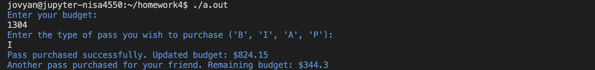

**Sample run 2**

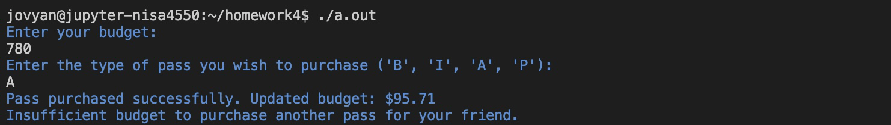

**Sample run 3**

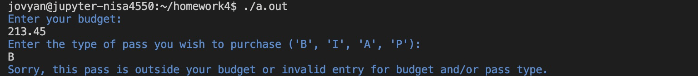

**Sample run 4**

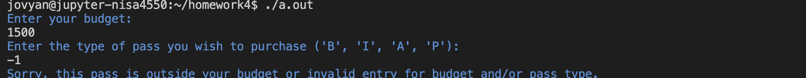

**Sample run 5**

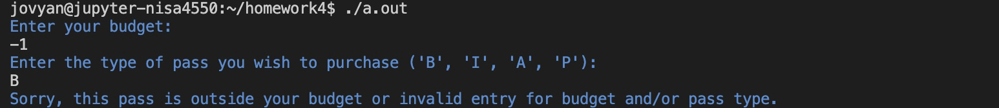


# Deliverables  <a name="deliverables"></a>

## File Headers <a name="fileheader"></a>

Before submitting your program on coderunner ensure that you include the below information at the top of your file
```cpp
// CSCI 1300 Spring 2024
// Author: FirstName LastName
// TA: TA Name
// Question #
```

Example
```cpp
// CSCI 1300 Spring 2024
// Author: John Smith
// TA: Nick
// Question 1
```

## Checklist <a name="checklist"></a>
Here is a checklist for submitting the assignment:
1. Use your solutions in VS Code to complete the **Homework 4 - coderunner** assignment on Canvas (Modules → Week 5).
2. Complete the Homework 4 Quiz. This will be published on Sunday, February 11th.

## Grading Rubric <a name="grading"></a>
**Note:** Global variables, loops, references, pointers, and any advanced material not discussed in lectures are not permitted in this homework. Using any of these materials will result in a 0 on the entire homework.

| **Criteria**                                | **Points** |
| ------------------------------------------- | ---------- |
| Question 1                                  | 1          |
| Question 2                                  | 5          |
| Question 3                                  | 5          |
| Question 4                                  | 8          |
| Question 5a                                 | 3          |
| Question 5b                                 | 3          |
| Question 5c                                 | 3          |
| Homework 4 Quiz                             | 17         |
| Total                                       | 45         |
