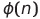
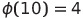

#### **CSCI 1300 CS1: Starting Computing**
#### **Naidu/Godley - Spring 2024**
#### **Challenge 5 - Week of February 19, 2024**

These exercises for this week will give you practice working with loops. The first two questions can be done with only this information. The third question will require learning nested loops

# Exercises

## Question 1: Relative Primes
Two integers are considered relatively prime when they have no common factors greater than one. For example, 8 and 15 are relatively prime. We know this because the factors of 8 are 1, 2, and 4, while the factors of 15 are 1, 3, and 5.

For this question, you will write a program that prompts the user to input two positive integers. If the user enters a number less than or equal to zero, your program should print: “Invalid input. Please enter a positive integer:” until the user does so.

Then, you should create a function to determine whether the two given numbers are relatively prime. Your function should accept the two integers as parameters and return true if the numbers are relatively prime and false otherwise. If the function returns true, your program should output: “X and Y are relative primes.” If the function returns false, your program should output “X and Y are not relative primes.” In both cases, X and Y should be replaced by the numbers entered by the user.

Example output (**bold** indicates user input)
 <pre>
    Enter a positive integer: 
    <b>24</b>
    Enter a second positive integer:
    <b>0</b>
    Invalid input. Please enter a positive integer:
    <b>3</b>
    24 and 3 are not relative primes.
</pre>

**Hint:** While there are many approaches to solve this problem, if you are stuck you may refer https://en.wikipedia.org/wiki/Euclidean_algorithm to get an idea on how to determine the greatest common divisor of two numbers.

### Question 2: Euler Phi Function

The Euler Phi function, written as: 

 

takes a positive integer and calculates the number of integers between 1 and n-1 (inclusive) that are relatively prime to n. For example:

 

This is because the numbers 1, 3, 7, and 9 are all relatively prime to 10. 

Write a program that implements the Euler Phi function. Your main function should prompt the user to enter an integer greater than one to be used as input to the Euler Phi function that you will write. If the user enters a number less than or equal to one, your program should print:  “Invalid input. Please enter an integer greater than one:” until the user does so. Your Euler Phi function should then accept the user input as a parameter and return the result of applying the Euler Phi function described above to the parameter. Finally, your main function should output "There are X positive integers relatively prime to Y." In this case, X is the value returned by the Euler Phi function and Y is the input from the user.

**Hint:** Your program should make use of the function you wrote in problem 2.

Example output 1 (**bold** indicates user input)
<pre>
    Enter an integer greater than one:
    <b>16</b>
    There are 8 positive integers relatively prime to 16.
</pre>

Example output 2 (**bold** indicates user input)
<pre>
    Enter an integer greater than one:
    <b>1</b>
    Invalid input. Please enter an integer greater than one:
    <b>5</b>
    There are 4 positive integers relatively prime to 5.
</pre>

## Question 3: Print text with border
Write a function to print a border around a text. You can design the border however you like.

Example output 1: (**bold** indicates user input)
<pre>
****
*Hi*
****
</pre>

Example output 2: (**bold** indicates user input)
<pre>
*************
*Hello World*
*************
</pre>

*Added Challenge:* Instead of a predefined text, modify your program so that it is able to print a border around user input text of any length with any specified border size.
