#### **CSCI 1300 CS1: Starting Computing: Project 1**

#### **Naidu/Godley - Spring 2024**

#### **Due: Friday, March 1st by 5:00pm MST**

<br />

# Table of contents

1. [Objectives](#objectives)
2. [Background](#background)
    1. [Caesar Cipher](#cipher)
    2. [Reminders, Tips and Pointers](#reminders)
    3. [Warnings](#warnings)
3. [Interview Grading](#interviews)
4. [Super Secret Note Passing](#project)
   1. [Overview](#overview)
   2. [Question 1](#question1)
   3. [Question 2](#question2)
   4. [Question 3](#question3)
   5. [Question 4](#question4)
   6. [Question 5](#question5)
   7. [Question 6](#question6)
   8. [Question 7](#question7)
   9. [Question 8](#question8)
   10. [Question 9](#question9)
5. [Submission Information](#submission)
   1. [File Header](#fileheader)
   2. [Checklist](#checklist)
   3. [Grading Rubric](#grading)

# Objectives <a name="objectives"></a>

- Understand and work with functions, strings, and loops
- Be able to test functions

# Background <a name="background"></a>

## Caesar Cipher <a name="cipher"></a>

The ability to encrypt or decrypt a message has been utilized by civilizations for centuries. One historic example of encryption is the [Caesar cipher](https://en.wikipedia.org/wiki/Caesar_cipher), where Caesar would protect important military messages using the cipher.

This encryption works by shifting letters of the alphabet to the right by a certain amount. Below is an example of a right shift cipher with a value of 3.

### Right Shift: <a name = "right_shift"></a>


We can encode messages using this cipher by mapping our regular alphabet to the new shifted alphabet. In the example above, instead of writing an "a" we would write a "d" instead. Note that the alphabet will wrap around, so the letter "y" would map to "b".

With a right shift of 3, the phrase `hello world` would turn into `khoor zruog`

Here is a good tool that allows you to explore the right shift cipher: [link](https://cryptii.com/pipes/caesar-cipher)

### Left Shift: <a name = "left_shift"></a>

Left shift is the word we will use when we are decrypting instead of encrypting. With a left shift of 3, the phrase `khoor zruog` would turn into `hello world`. We call it left shift because on the image above, the shift will go towards the left instead of towards the right.

## Reminders <a name="reminders"></a>
Here is a collection of useful things:

- If you switch back and forth between `cin` and `getline()` you will run into issues with floating `\n` characters in your input stream. Solutions to this include clearing your input with `cin.clear()`, or simply using only one input method instead of both.
- If you are getting a user input that is not a string, there can be errors when the user does not provide a valid input (e.x. provides a character instead of an integer). Solutions to this include checking if `cin` fails using ```cin.fail() == true```, or simply taking the input in as a string and checking if we can successfully convert it to our desired data type.
- Setting decimal points in cout (remember to include ```<iomanip>```!): <br>
    ```cout << fixed << setprecision(number of decimal points) << floating point value << endl```
    As an example, try running this program to see the difference:
    ```cpp
    #include <iostream>
    #include <iomanip>
    using namespace std;

    int main() 
    {
        cout << 7.0/13.0 << endl;
        cout << fixed << setprecision(2) << 7.0/13.0 << endl;
        return 0;
    }
    ```
- Code compilation with g++: <br>
    ```g++ -Wall -Werror -Wpedantic -std=c++17 name_of_source_file.cpp```
- Using the ```-o``` option provided by g++ to name your executable [OPTIONAL]: <br>
    ```g++ -Wall -Werror -Wpedantic -std=c++17 name_of_source_file.cpp -o nameOfExecutable```
- Good coding style: <br>
    - Name variables well, for example: ```double d = 42.0167``` is confusing, whereas ```double height_of_rectangle = 42.0167``` is clearer about what the variable represents
    - Name functions well, for example: ```int Func(int x);``` is confusing, whereas ```int calculateSquare(int x);``` is clearer about what the function does
    - Variables should be named using snake-case, where_all_words are all lowercase and separated by underscores: this_is_snake_case.
    - Functions should be named using camel-case, where all words except the first start with an uppercase letter, and there are no separators: thisIsCamelCase.
    - Indent things properly! If-else blocks should be well spaced and indented, function blocks as well, etc. Use tab to increase indent, and shift+tab to decrease indent. Here is an example: <br>
    ```cpp
    void function(void){
    if(condition) {
    <code>}else{
    <code>}return;}
    ```
    The above is very confusing and hard to understand, simply adding space and indents really helps:
    ```cpp
    void function(void)
    {
        if (condition)
        {
            <code>
        }
        else
        {
            <code>
        }
        return;
    }
    ```
    - Remember to comment your code! Comment lines start with ```//```
    - Good places to put comments include (but are not limited to!): next to function prototypes, next to variable declarations, and next to important lines, such as numerical calculations, etc...
    - These conventions will make your code easier to read and understand

<br>

## Warnings <a name="warnings"></a>

For this project:

- Use **only** `getline()` for user input and **never** `cin`. This will minimize errors. If you need the input to be of a non-string data type, you should convert it. Feel free to use the `validateInt` function from Recitation 4. 
- You are **NOT** allowed to use global variables.
- You are **NOT** allowed to use arrays.
- You are **NOT** allowed to use pointers or references.
- For questions which require the use of a function, Coderunner will check that you have written the function correctly. DO NOT WRITE ALL YOUR CODE IN `main()`! Your code will NOT compile if you do not have the correct function, see below for an example of what this could look like:<br>

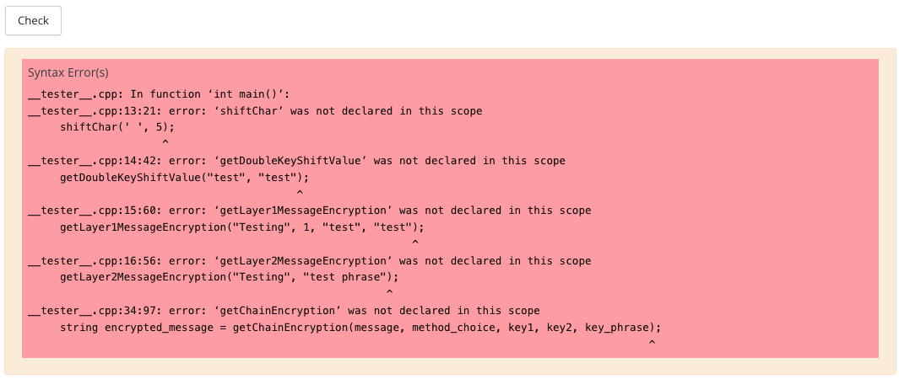

# Interview Grading <a name="interviews"></a>

You must also sign up for an interview grading slot on Canvas. Interview grading rules and the scheduler will be posted on Friday, February 23rd.

# Super Secret Note Passing <a name="project"></a>

## Overview <a name = "overview"></a>
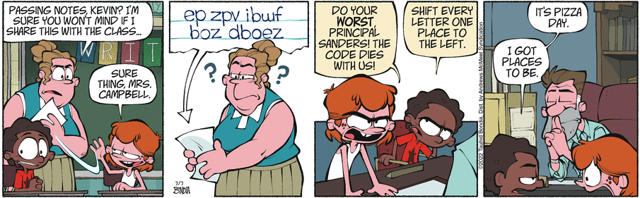 <br>
[From Crabgrass by Tauhid Bondia, July 07, 2022](https://www.gocomics.com/crabgrass/2022/07/07)<br>

You and your friend have been passing notes in your CSCI1300 class, but you don't want to get caught! Your friend suggested using a Caesar cipher for your notes, but figuring out a cipher by hand can take a while so you want to make software to speed up the process.

In the Caesar cipher, every letter in the message is always shifted by the same predetermined number. However, you are suspicious your CSCI 1300 professor would recognize a normal Caesar cipher, so you and your friend have come up with a few methods to make the cipher harder to crack and make sure your notes continue to be secret. You have come up with three main methods:

1. Shift right by 13
2. Shift right by mixed keys
3. Shift right by single key

Along with the charecter level encryption, you will also be performing chain encryption which involves encrypting a message twice using unique combination of the above methods.

All of the methods will be a right shift encryption, similar to the Caesar cipher. How many values you should shift the message will depend on different formulas.

**Throughout the entire project, you should only encrypt lowercase letters and uppercase letters. White spaces, and special characters should be returned the same.** 

Lets look at the methods in more detail and give examples.

### Method 1: <a name = "method1"></a>

Method 1 is a true Caesar cipher, which you and your friend will use as a starting point for your super secret code. Here, you will just use a right shift encryption with a shift value of 13. This means that every letter will be shifted to the right adjacent letter in the alphabet. Notice how lowercase alphabet letters wrap around if needed and all other characters are unchanged.

**Example 1:**

- Original message: `Hello, World!`
- Encrypted message: `Uryyb, Jbeyq!`

<!-- **Example 2:**

- Original message: `z ~ b`
- Encrypted message: `m ~ o` -->
### Method 2: <a name = "method2"></a>

You and your friend were talking and realized having a secret way to determine the shift number would add complexity to your encryption, and so you invented method 2.

Method 2 is a right shift encryption with a shift value that you will calculate from two keys that the user provides. The shift value will be calculated based on the number of matching letters between the two keys modulo 26.

**Example 1:**

- Key 1: `hello`
- Key 2: `world`:
  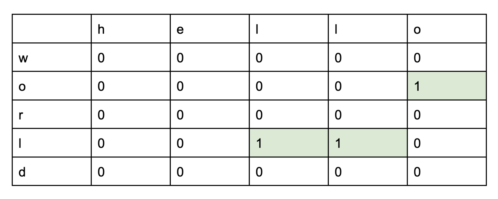

The shift value is the sum of all the matches, which in this case would be `3`.

- Original Message: `csci is great`
- Encrypted Message: `fvfl lv juhdw`

### Method 3: <a name = "method3"></a>

Finally, you realized that if you could use a different shift value for each letter, your code would be harder still to crack. Your professor will never figure it out, and your secrets will stay safe! You and your friend created the third and best method yet, where you calculate the shift value from a user provided keyphrase.

Method 3 is a right shift encryption with a shift value that you will calculate from a user provided keyphrase. First, you will decrypt the keyphrase by taking the first letter of each word in the keyphrase and construct a key from it. Convert all the characters in the key to uppercase and then you will calculate the shift value for each character of the key and encrypt only the letters of the message. The shift value will be calculated based on the position of the letter in the alphabet. For example, the letter 'A' will have a shift value of 0, 'B' will have a shift value of 1, and so on. 

**Steps:**

1) Decrypt the keyphrase and construct a key by extracting the initial letter of each word in the keyphrase. Convert all characters in the key to uppercase.

    **Example:**

    - Keyphrase: `Kratos Indus Nile Ganges`
    - Key: `KING`
    
    Note: We call this Substitution Cipher where we substitute each word with its first letter and finally concatenate them to form our key.

2) Now, we calculate the shift value for each character of the key. The shift value will be calculated based on the position of the letter in the alphabet. 

    **Example:**
$$
- Keyphrase: **K**ratos **I**ndus **N**ile **G**anges
- Key : `KING`
- Shift Values :
    <table>
      <tr>
        <th>Letter</th>
        <td>K</td>
        <td>I</td>
        <td>N</td>
        <td>G</td>
      </tr>
      <tr>
      <th>Shift Value</th>
        <td>10</td>
        <td>8</td>
        <td>13</td>
        <td>6</td>
      </tr>
    </table>
$$

3) Finally, we encrypt only the letters of the message using the shift values calculated from the key.

    **Example:**
    - Encryption :
        <table>
          <tr>
            <th>Original Message</th>
            <td>H</td>
            <td>e</td>
            <td>l</td>
            <td>l</td>
            <td>o</td>
            <td>,</td>
            <td> </td>
            <td>W</td>
            <td>o</td>
            <td>r</td>
            <td>l</td>
            <td>d</td>
            <td>!</td>
          </tr>
          <tr>
            <th>Shift Value</th>
            <td>10</td>
            <td>8</td>
            <td>13</td>
            <td>6</td>
            <td>10</td>
            <td>0</td>
            <td>0</td>
            <td>8</td>
            <td>13</td>
            <td>6</td>
            <td>10</td>
            <td>8</td>
            <td>0</td>
          <tr>
            <th>Encrypted Message</th>
            <td>R</td>
            <td>m</td>
            <td>y</td>
            <td>r</td>
            <td>y</td>
            <td>,</td>
            <td> </td>
            <td>E</td>
            <td>b</td>
            <td>x</td>
            <td>v</td>
            <td>l</td>
            <td>!</td>
          </tr>
        </table>

## Question 1 (5 points): shiftChar() <a name="question1"></a>

All of your super secret code styles will require being able to shift a character by a particular number, and so you will need a function to do this write a function named `shiftChar()` that performs the right shift operation based on the user provided shift value. See explanation above to learn more about [right shift](#caesar_cipher).
<table>

<tr>
<td>
Function:

```shiftChar(char, int)```

</td>
<td>

```cpp
char shiftChar(char letter, int shift_value)
```

</td>
</tr>

<tr>
<td>
Purpose:
</td>
<td>
The function should shift the letter to the right if the shift value is positive or to the left if the shift value is negative. It should not print anything.
</td>
</tr>

<tr>
<td>
Parameters:
</td>
<td>

<b>char</b> ```letter``` - The letter to be shifted. <br>

<b>int</b> ```shift_value``` - The shift value. <br>

</td>
</tr>

<tr>
<td>
Return Value:
</td>
<td>
If successful, return the newly shifted letter.
</td>
</tr>

<tr>
<td>
Error Handling/Boundary Conditions:

</td>
<td>

- If ```letter``` is neither an uppercase nor a lower case, then return ```letter```. <br>

- If ```shift_value``` is greater than 25, then the shift value should be adjusted accordingly to fit within the range of 0 to 25. <br>

- If ```shift_value``` is less than -25, then the shift value should be adjusted accordingly to fit within the range of -25 to 0. <br>

</td>
</tr>
<tr>
<td>
Example:
</td>

<td>

Note: this is only an example usage of the function; 

Sample Code:

```cpp
// Assume the proper libraries are included.

// Assume the proper implementation of shiftChar() is included.

int main() {
    char letter = 'A'; 
    char shifted_letter = shiftChar(letter, 27);
    cout << "Letter " << letter << " was shifted to " << shifted_letter << endl;
    return 0;
}
```

Sample Output:
```
Letter A was encrypted to B
```

</td>
</tr>

</table>

Develop and validate your solution in VS Code. Once you are happy with your solution, go to coderunner on Canvas and paste only `shiftChar()` into the answer box! Please make sure to include your header! See [File Header](#fileheader) for instructions.

**--- Sample run ---:** (Blue is program output, and white is user input.)

**Sample run 1**

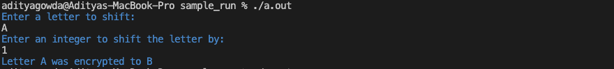

**Sample run 2**

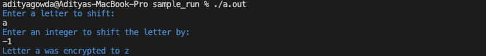

**Sample run 3**

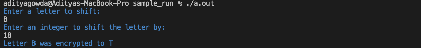

**Sample run 4**

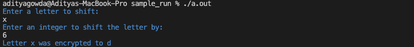

## Question 2 (5 points): getDoubleKeyShiftValue() <a name="question2"></a>

Now that you can shift an individual character by a fixed value, you can use method 1 easily. However if you want to use method 2, you will need to calculate the shift value using your super secret keyphrases. Write a function named `getDoubleKeyShiftValue()` that computes the shift value (encryption method 2) based on the two user provided encryption keys. See [Method 2](#method2) for description, equation and examples.

<table>

<tr>
<td>
Function:

```getDoubleKeyShiftValue(string, string)```

</td>
<td>

```cpp
int getDoubleKeyShiftValue(string key1, string key2)
```

</td>
</tr>

<tr>
<td>
Purpose:
</td>
<td>
The function should calculate the shift value by counting the matching characters (including non-letter characters) in both keys. It should not print anything.
</td>
</tr>

<tr>
<td>
Parameters:
</td>
<td>

<b>string</b> ```key1``` - The first key. <br>

<b>string</b> ```key2``` - The second key. <br>

</td>
</tr>

<tr>
<td>
Return Value:
</td>
<td>
If successful, return the count of matching characters in both strings.
</td>
</tr>

<tr>
<td>
Error Handling/Boundary Conditions:

</td>
<td>

- If ```key1``` or ```key2``` is an empty string, then return 0. <br>

</td>
</tr>
<tr>
<td>
Example:
</td>

<td>

Note: this is only an example usage of the function; 

Sample Code:

```cpp
// Assume the proper libraries are included.

// Assume the proper implementation of getDoubleKeyShiftValue() is included.

int main() {
    string key1 = "hello"; 
    string key2 = "world";
    int shift_distance = getDoubleKeyShiftValue(key1, key2);
    cout << "The shift distance : " << shift_distance << endl;
    return 0;
}
```

Sample Output:
```
The shift distance : 3
```

</td>
</tr>

</table>

Develop and validate your solution in VS Code. Once you are happy with your solution, go to coderunner on Canvas and paste only `getDoubleKeyShiftValue()` into the answer box! Please make sure to include your header! See [File Header](#fileheader) for instructions.

**--- Sample run ---:** (Blue is program output, and white is user input.)

**Sample run 1**

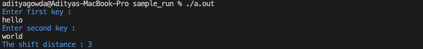

**Sample run 2**

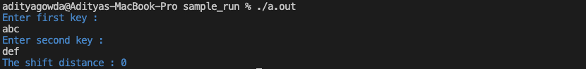

**Sample run 3**

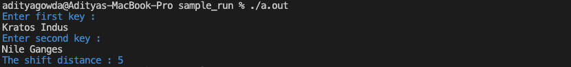

**Sample run 4**

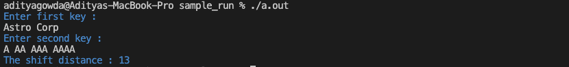


## Question 3 (5 points): getLayer1MessageEncryption() <a name="question3"></a>

Now that you know how to shift characters and how to get the shift value from a keyphrase, you want to implement method 1 and 2 so that you can use these methods before your next class.

Write a function named `getLayer1MessageEncryption()` that encrypts a message based on the user selected encryption method. 

The encryption method choices are as follow:
1. Shift right by 13
2. Shift right by mixed keys

See the [overview section](#overview) for description, equation and examples for the two encryption methods.

<table>

<tr>
<td>
Function:

```getLayer1MessageEncryption(string, int, string, string)```

</td>
<td>

```cpp
string getLayer1MessageEncryption(string message, int method_choice, string key1, string key2)
```

</td>
</tr>

<tr>
<td>
Purpose:
</td>
<td>
The function should encrypt the message based on the user selected encryption method. It should not print anything.
</td>
</tr>

<tr>
<td>
Parameters:
</td>
<td>

<b>string</b> ```message``` - The message to be encrypted. <br>

<b>int</b> ```method_choice``` - The encryption method. <br>

<b>string</b> ```key1``` - The first key. <br>

<b>string</b> ```key2``` - The second key.<br>

</td>
</tr>

<tr>
<td>
Return Value:
</td>
<td>
If successful, return the encrypted message.
</td>
</tr>

<tr>
<td>
Error Handling/Boundary Conditions:

</td>
<td>

- If ```message``` is an empty string, then return the empty string. <br>

- If ```method_choice``` is outside range[1,2], then return ```message```. <br>

- If ```method_choice``` is equal to 2 and ```key1``` or ```key2``` is an empty string, then return ```message```. <br>
  <br>
  </td>
  </tr>
  <tr>
  <td>
  Example:
  </td>

<td>

Note: this is only an example usage of the function; 

Sample Code:

```cpp
// Assume the proper libraries are included.

// Assume the proper implementation of getLayer1MessageEncryption() is included.

int main() {
    string message = "Welcome to CSCI 1300!";
    string key1 = "hello"; 
    string key2 = "world";
    int method_choice = 2;
    string encrypted_message = getLayer1MessageEncryption(message, method_choice, key1, key2);
    cout << "The encrypted message : " << encrypted_message << endl;
    return 0;
}
```

Sample Output:
```
The encrypted message : Zhofrph wr FVFL 1300!
```

</td>
</tr>

</table>

Develop and validate your solution in VS Code. Once you are happy with your solution, go to coderunner on Canvas and paste only `shiftChar()`, `getDoubleKeyShiftValue()`, `getLayer1MessageEncryption()` into the answer box! Please make sure to include your header! See [File Header](#fileheader) for instructions.

**--- Sample run ---:** (Blue is program output, and white is user input.)

**Sample run 1**

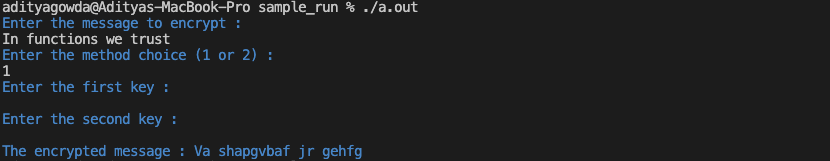

**Sample run 2**

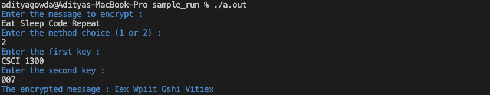

**Sample run 3**

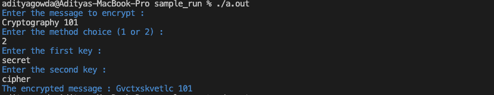

**Sample run 4**

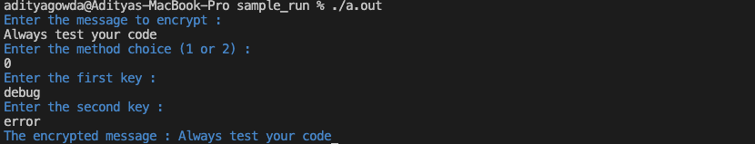

## Question 4 (5 points): getLayer1MessageDecryption() <a name="question4"></a>

 

Well, you went to class and got to use your exciting new encryption methods! Your friend passed you a note that was encrypted. However, you realized you couldn't read it -- you never wrote code to decrypt it! Now you need to write a function named `getLayer1MessageDecryption()` to decrypt your messages based on the user selected decryption method. A [left shift operation](#left_shift) should be performed for decryption.

The decrytpion method choices are as follow:
1. Shift left by 13
2. Shift left by mixed keys

See the [overview section](#overview) for description, equation and examples for the decryption methods.

<table>

<tr>
<td>
Function:

```getLayer1MessageDecryption(string, int, string, string)```

</td>
<td>

```cpp
string getLayer1MessageDecryption(string encrypted_message, int method_choice, string key1, string key2)
```

</td>
</tr>

<tr>
<td>
Purpose:
</td>
<td>
The function should decrypt the encrypted message based on the user selected decryption method. It should not print anything.
</td>
</tr>

<tr>
<td>
Parameters:
</td>
<td>

<b>string</b> ```encrypted_message``` - The message to be decrypted. <br>

<b>int</b> ```method_choice``` - The decryption method. <br>

<b>string</b> ```key1``` - The first key. <br>

<b>string</b> ```key2``` - The second key.<br>

</td>
</tr>

<tr>
<td>
Return Value:
</td>
<td>
If successful, return the decrypted message.
</td>
</tr>

<tr>
<td>
Error Handling/Boundary Conditions:

</td>
<td>

- If ```encrypted_message``` is an empty string, then return the empty string. <br>

- If ```method_choice``` is outside range[1,2], then return ```encrypted_message```. <br>

- If ```method_choice``` is equal to 2 and ```key1``` or ```key2``` is an empty string, then return ```encrypted_message```. <br>

</td>
</tr>
<tr>
<td>
Example:
</td>

<td>

Note: this is only an example usage of the function; 

Sample Code:

```cpp
// Assume the proper libraries are included.

// Assume the proper implementation of getLayer1MessageDecryption() is included.

int main() {
    string encrypted_message = "Zhofrph wr FVFL 1300!";
    string key1 = "hello"; 
    string key2 = "world";
    int method_choice = 2;
    string decrypted_message = getLayer1MessageDecryption(encrypted_message, method_choice, key1, key2);
    cout << "The decrypted message : " << decrypted_message << endl;
    return 0;
}
```

Sample Output:
```
The decrypted message : Welcome to CSCI 1300!
```

</td>
</tr>

</table>

Develop and validate your solution in VS Code. Once you are happy with your solution, go to coderunner on Canvas and paste only `shiftChar()`, `getDoubleKeyShiftValue()`, `getLayer1MessageDecryption()` into the answer box! Please make sure to include your header! See [File Header](#fileheader) for instructions.

**--- Sample run ---:** (Blue is program output, and white is user input.)

**Sample run 1**

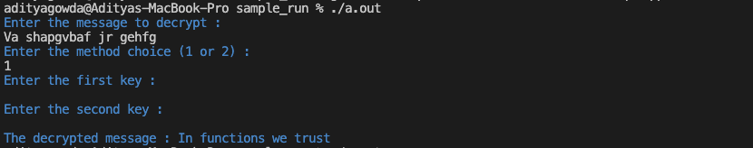

**Sample run 2**

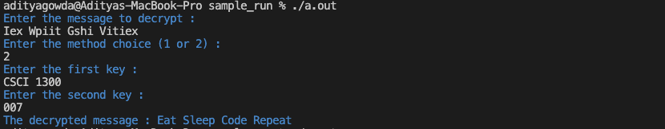

**Sample run 3**

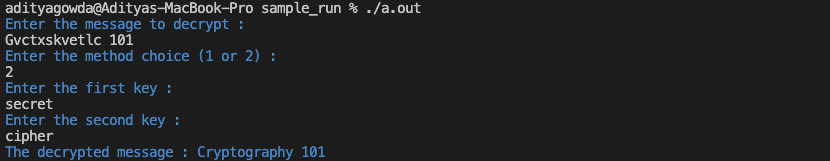

**Sample run 4**

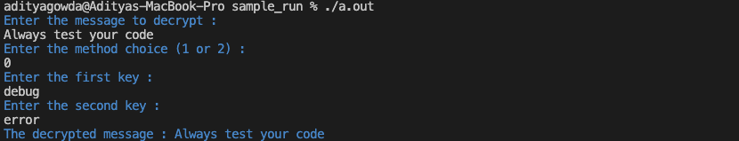

## Question 5 (5 points): getLayer2MessageEncryption() <a name="question5"></a>

Now that you can encrypt and decrypt messages using the easier methods, you are ready to work on code for your third message and make your most secure message yet. You will need to write a function named `getLayer2MessageEncryption()` that encrypts a string based on the encryption method 3. See the [overview section](#overview) for description, equation and examples.

<table>

<tr>
<td>
Function:

```getLayer2MessageEncryption(string, string)```

</td>
<td>

```cpp
string getLayer2MessageEncryption(string message, string key_phrase)
```

</td>
</tr>

<tr>
<td>
Purpose:
</td>
<td>
The function should encrypt the message based on encryption method 3. It should not print anything.
</td>
</tr>

<tr>
<td>
Parameters:
</td>
<td>

<b>string</b> `message` - The message to be encrypted. <br>

<b>string</b> `key_phrase` - The key phrase.<br>

</td>
</tr>

<tr>
<td>
Return Value:
</td>
<td>
If successful, return the encrypted message.
</td>
</tr>

<tr>
<td>
Error Handling/Boundary Conditions:

</td>
<td>

- If ```message``` is an empty string, then return the empty string. <br>

- If ```key_phrase``` is an empty string, then return ```message```. <br>

- If keyword decrypted from the ```key_phrase``` contains any special characters, then return ```message```. <br>

</td>
</tr>
<tr>
<td>
Example:
</td>

<td>

Note: this is only an example usage of the function; 

Sample Code:

```cpp
// Assume the proper libraries are included.

// Assume the proper implementation of getLayer2MessageEncryption() is included.

int main() {
    string message = "Welcome to CSCI 1300!";
    string key_phrase = "Kratos Indus Nile Ganges";
    string encrypted_message = getLayer2MessageEncryption(message, key_phrase);
    cout << "The encrypted message : " << encrypted_message << endl;
    return 0;
}
```

Sample Output:
```
The encrypted message : Gmyiyur zy KFIS 1300!
```

</td>
</tr>

</table>

Develop and validate your solution in VS Code. Once you are happy with your solution, go to coderunner on Canvas and paste only `shiftChar()` and `getLayer2MessageEncryption()` into the answer box! Please make sure to include your header! See [File Header](#fileheader) for instructions.

**--- Sample run ---:** (Blue is program output, and white is user input.)

**Sample run 1**

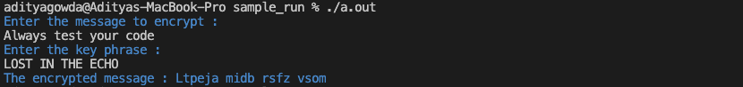

**Sample run 2**

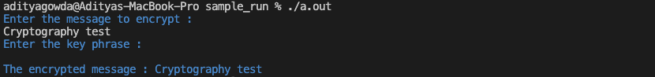

**Sample run 3**

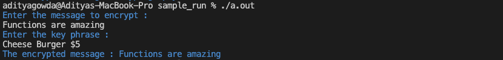

**Sample run 4**

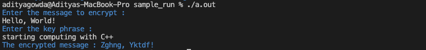

## Question 6 (5 points): getLayer2MessageDecryption() <a name="question6"></a>

Now of course, you will have to be able to decrypt these messages in order to actually read the messages your friend sends you. You need to write a function named ```getLayer2MessageDecryption()``` that decrypts a string based on the method 3. See the overview section for description, equation and examples of [method 3 above](#method3).

<table>

<tr>
<td>
Function:

```getLayer2MessageDecryption(string, string)```

</td>
<td>

```cpp
string getLayer2MessageDecryption(string encrypted_message, string key_phrase)
```

</td>
</tr>

<tr>
<td>
Purpose:
</td>
<td>
The function should decrypt the message based on decryption method 3. It should not print anything.
</td>
</tr>

<tr>
<td>
Parameters:
</td>
<td>

<b>string</b> `encrypted_message` - The message to be decrypted. <br>

<b>string</b> `key_phrase` - The key phrase. <br>

</td>
</tr>

<tr>
<td>
Return Value:
</td>
<td>
If successful, return the decrypted message.
</td>
</tr>

<tr>
<td>
Error Handling/Boundary Conditions:

</td>
<td>

- If ```encrypted_message``` is an empty string, then return the empty string. <br>

- If `key_phrase` is an empty string, then return ```encrypted_message```. <br>

- If keyword decrypted from the `key_phrase` contains any special characters, then return ```encrypted_message```. <br>

</td>
</tr>
<tr>
<td>
Example:
</td>

<td>

Note: this is only an example usage of the function; 

Sample Code:

```cpp
// Assume the proper libraries are included.

// Assume the proper implementation of getLayer2MessageDecryption() is included.

int main() {
    string encrypted_message = "Gmyiyur zy KFIS 1300!";
    string key_phrase = "Kratos Indus Nile Ganges";
    string decrypted_message = getLayer2MessageDecryption(encrypted_message, key_phrase);
    cout << "The encrypted message : " << decrypted_message << endl;
    return 0;
}
```

Sample Output:
```
The decrypted message : Welcome to CSCI 1300!
```

</td>
</tr>

</table>

Develop and validate your solution in VS Code. Once you are happy with your solution, go to coderunner on Canvas and paste only `shiftChar()` and `getLayer2MessageDecryption()` into the answer box! Please make sure to include your header! See [File Header](#fileheader) for instructions.

**--- Sample run ---:** (Blue is program output, and white is user input.)

**Sample run 1**


**Sample run 2**

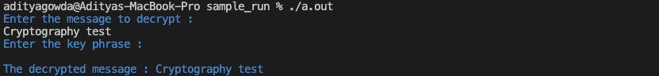

**Sample run 3**

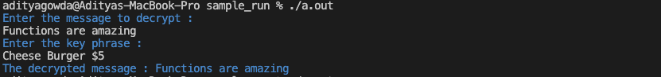

**Sample run 4**

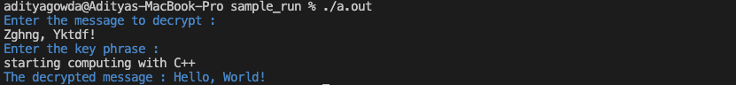

## Question 7 (5 points): getChainEncryption() <a name="question7"></a>

You have two methods to encrypt your messages, but your friend has an epiphany: what could be more secure than any one of these methods? Well, combining them, of course! You need to write a function named `getChainEncryption()` that encrypts a message by chaining the encryption methods from `getLayer1MessageEncryption()` followed by `getLayer2MessageEncryption()`. 

<table>

<tr>
<td>
Function:

```getChainEncryption(string, int, string, string, string)```

</td>
<td>

```cpp
string getChainEncryption(string message, int method_choice, string key1, string key2, string key_phrase)
```

</td>
</tr>

<tr>
<td>
Purpose:
</td>
<td>

The function should encrypt the message using `getLayer1MessageEncryption()` and encrypt the resultant message with `getLayer2MessageEncryption()`. It should not print anything.
</td>
</tr>

<tr>
<td>
Parameters:
</td>
<td>

<b>string</b> ```message``` - The message to be encrypted. <br>

<b>int</b> ```method_choice``` - The encryption method choice for ```getLayer1MessageEncryption()```. <br>

<b>string</b> ```key1``` - The first key. <br>

<b>string</b> ```key2``` - The second key. <br>

<b>string</b> `key_phrase` - The key phrase. <br>

</td>
</tr>

<tr>
<td>
Return Value:
</td>
<td>
If successful, return the encrypted message.
</td>
</tr>

<tr>
<td>
Error Handling/Boundary Conditions:

</td>
<td>

- If `message` is an empty string, then return the empty string. <br>

- If ```method_choice``` is outside range[1,2], then return ```message```. <br>

- If ```method_choice``` is equal to 2 and ```key1``` or ```key2``` is an empty string, then return ```message```. <br>

- If `key_phrase` is an empty string, then return `message`. <br>

- If keyword decrypted from the `key_phrase` contains any special characters, then return `message`. <br>

</td>
</tr>
<tr>
<td>
Example:
</td>

<td>

Note: this is only an example usage of the function; 

Sample Code:

```cpp
// Assume the proper libraries are included.

// Assume the proper implementation of getChainEncryption() is included.

int main() {
    string message = "Welcome to CSCI 1300!";
    string key_phrase = "Kratos Indus Nile Ganges";
    string key1 = "hello";
    string key2 = "world";
    int method_choice = 2;

    string encrypted_message = getChainEncryption(message, method_choice, key1, key2, key_phrase);
    cout << "The encrypted message : " << encrypted_message << endl;
    return 0;
}
```

Sample Output:
```
The encrypted message : Jpblbxu cb NILV 1300!
```

</td>
</tr>

</table>

Develop and validate your solution in VS Code. Once you are happy with your solution, go to coderunner on Canvas and paste only `shiftChar()`, `getDoubleKeyShiftValue()`, `getLayer1MessageEncryption()`, `getLayer2MessageEncryption()`, `getChainEncryption()` into the answer box! Please make sure to include your header! See [File Header](#fileheader) for instructions.

**--- Sample run ---:** (Blue is program output, and white is user input.)

**Sample run 1**

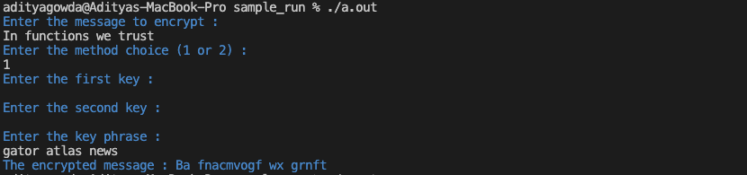

**Sample run 2**

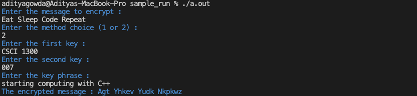

**Sample run 3**

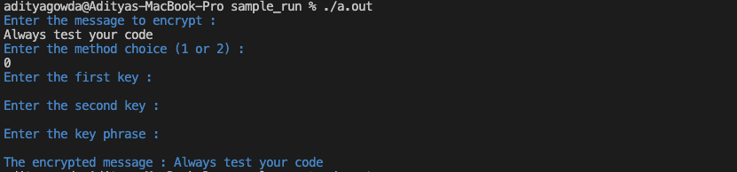

**Sample run 4**

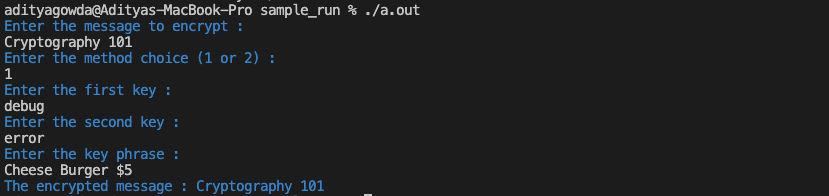

## Question 8 (5 points): getChainDecryption() <a name="question8"></a>
And of course if you are encrypting the message twice, you will need to be able to decrypt the message. Write a function named `getChainDecryption()` that decrypts a message by chaining the decryption methods from `getLayer1MessageDecryption()` followed by `getLayer2MessageDecryption()`.


<table>

<tr>
<td>
Function:

```getChainDecryption(string, int, string, string, string)```

</td>
<td>

```cpp
string getChainDecryption(string encrypted_message, int method_choice, string key1, string key2, string key_phrase)
```

</td>
</tr>

<tr>
<td>
Purpose:
</td>
<td>

The function should decrypt the message using `getLayer1MessageDecryption()` and decrypt the resultant message with `getLayer2MessageDecryption()`. It should not print anything.
</td>
</tr>

<tr>
<td>
Parameters:
</td>
<td>

<b>string</b> ```encrypted_message``` - The message to be decrypted. <br>

<b>int</b> ```method_choice``` - The decryption method choice for ```getLayer1MessageDecryption()```. <br>

<b>string</b> ```key1``` - The first key. <br>

<b>string</b> ```key2``` - The second key. <br>

<b>string</b> `key_phrase` - The key phrase. <br>

</td>
</tr>

<tr>
<td>
Return Value:
</td>
<td>
If successful, return the decrypted message.
</td>
</tr>

<tr>
<td>
Error Handling/Boundary Conditions:

</td>
<td>

- If `encrypted_message` is an empty string, then return the empty string. <br>

- If ```method_choice``` is outside range[1,2], then return ```encrypted_message```. <br>

- If ```method_choice``` is equal to 2 and ```key1``` or ```key2``` is an empty string, then return ```encrypted_message```. <br>

- If `key_phrase` is an empty string, then return `encrypted_message`. <br>

- If keyword decrypted from the `key_phrase` contains any special characters, then return `encrypted_message`. <br>

</td>
</tr>
<tr>
<td>
Example:
</td>

<td>

Note: this is only an example usage of the function; 

Sample Code:

```cpp
// Assume the proper libraries are included.

// Assume the proper implementation of getChainDecryption() is included.

int main() {
    string encrypted_message = "Jpblbxu cb NILV 1300!";
    int method_choice = 2;
    string key1 = "hello";
    string key2 = "world";
    string key_phrase = "Kratos Indus Nile Ganges";
    string decrypted_message = getChainDecryption(encrypted_message, method_choice, key1, key2, key_phrase);
    cout << "The decrypted message : " << decrypted_message << endl;
    return 0;
}
```

Sample Output:
```
The decrypted message : Welcome to CSCI 1300!
```

</td>
</tr>

</table>

Develop and validate your solution in VS Code. Once you are happy with your solution, go to coderunner on Canvas and paste only `shiftChar()`, `getDoubleKeyShiftValue()`, `getLayer1MessageDecryption()`, `getLayer2MessageDecryption()`, `getChainDecryption()` into the answer box! Please make sure to include your header! See [File Header](#fileheader) for instructions.

**--- Sample run ---:** (Blue is program output, and white is user input.)

**Sample run 1**

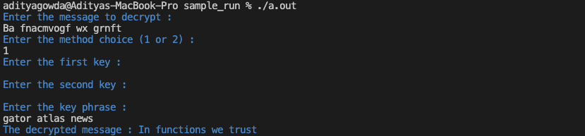

**Sample run 2**

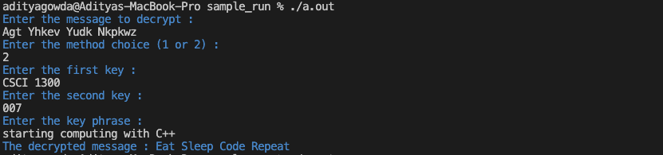

**Sample run 3**

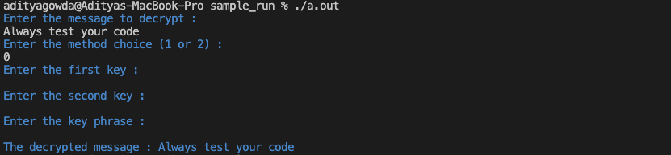

**Sample run 4**

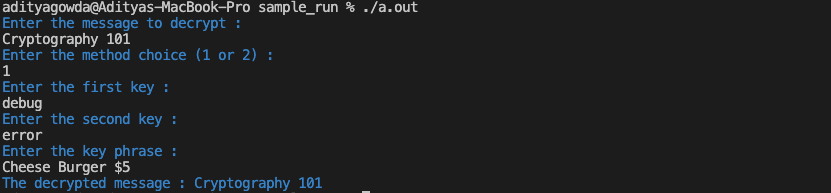

## Question 9 (20 points): Making an application <a name="question9"></a>

Now you have all these little pieces to encrypt and decrypt your code, but it is not put together yet. Using all the functions separately and modifying your main function for each message you send is not very good; your professor is starting to get suspicious about how much time you are spending distracted in class. You need your super secret code to be faster and easier than ever before! You decide to build all of these functions into a main program that can quickly encrypt and decrypt any message using any method or combination thereof. Here, you ARE responsible for writing the entire program, including the `main()` function

Your program should have a main function that allows a user to navigate a menu of options. Your menu function should present the user the following options:

Please input 1-7 followed by enter to navigate the menu:

1. Set Encryption Key 1
2. Set Encryption Key 2
3. Set Key Phrase
4. Select Message Encryption Method
5. Encrypt Message
6. Decrypt Message
7. Exit Program

Your menu should run in a loop, offering the user every option until they choose to exit the program. User inputs should direct the flow of the program utilizing the functions developed in Q1-Q8.

### Starting Off:

- Display the 7 options written above to the user.
- Get their choice as a number 1-7, handling invalid input. Any invalid input here should print `Invalid input` and then prompt them for their choice again.

### Option 1:

- Start by printing, `Enter First key:`
- Get input from the user and update the corresponding key.
- Keys should be at least 1 character long and any invalid input should display `Invalid key` and then prompt the user for input again.
- When successfully set, display `Successfully set first encryption key to [value]` Replace `[value]` with what the user typed in.

### Option 2:

- Start by printing, `Enter Second key:`
- Get input from the user and update the corresponding key.
- Keys should be at least 1 character long and any invalid input should display `Invalid key` and then prompt the user for input again.
- When successfully set, display `Successfully set second encryption key to [value]` Replace `[value]` with what the user typed in.

### Option 3
- Start by printing, `Enter keyphrase:`
- Get input from the user and update the corresponding key.
- Keys should be at least 1 character long and any invalid input should display `Invalid keyphrase` and then prompt the user for input again.
- When successfully set, display `Successfully set encryption keyphrase to [value]` Replace `[value]` with what the user typed in.

### Option 4

- Display to the user the following choices:

```
Please input 1-3 to decide encryption technique.
1. Layer 1 Message Encryption 
2. Layer 2 Message Encryption
3. Chain Encryption
```
- Any invalid input here should print `Invalid encryption choice` and then prompt the user to input something again.
- When successfully set, display `Successfully set encryption type to [type]` where `[type]` should be 1, 2, or 3 depending on what the user entered.
- If the user enters input choice `1` or `3` then display to the user the following choices:

```
Please input 1-2 to decide Layer-1 encryption technique.
1. Shift by 13
2. Shift by mixed keys
```
- Any invalid input here should print `Invalid encryption choice` and then prompt the user to input something again.

### Option 5:

- If the user has not set both of the keys, keyphrase and chosen an encryption method, this should print `You cannot do this until you set both keys, keyphrase and choose an encryption method`
- Otherwise print, `Enter your message to encrypt:` 
- Next, get input from the user and then display the encrypted input.

### Option 6:

- If the user has not set both of the keys, keyphrase and chosen an encryption method, this should print `You cannot do this until you set both keys, keyphrase and choose an encryption method`
- Otherwise print, `Enter your message to decrypt:` 
- Next, get encrypted input from the user and then display the decrypted input.

### Option 7:

- Print `Goodbye.` and terminate the program.

**NOTE** Question 9 has 45 total tests on CodeRunner. They are split up into 3 separate questions of 15 tests each. You should develop and validate your solution on VS code, then head over to Coderunner on Canvas and paste your **entire program** in each of the answer boxes for q9_part1, q9_part2, and q9_part3!

**--- Sample run ---:** (Blue is program output, and white is user input.)

**Sample run 1**

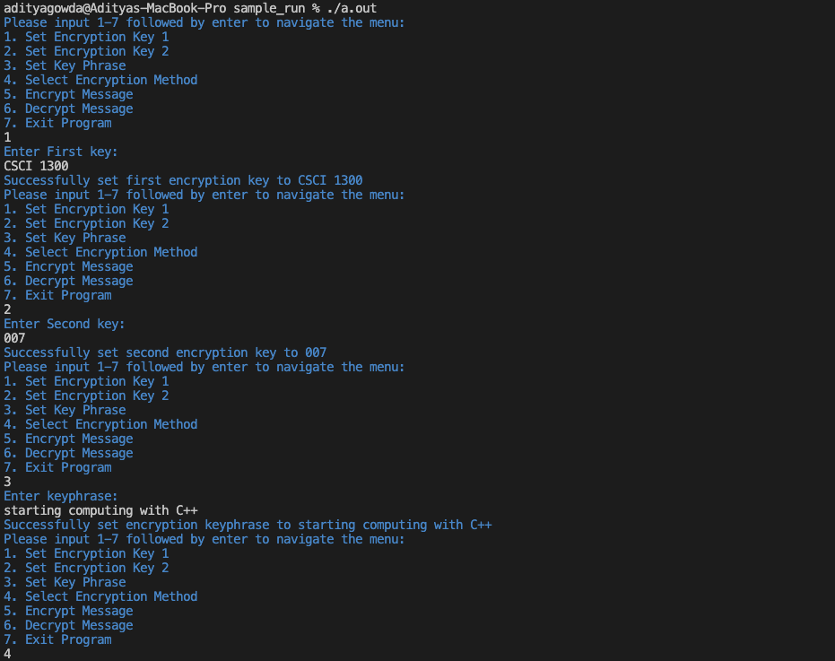
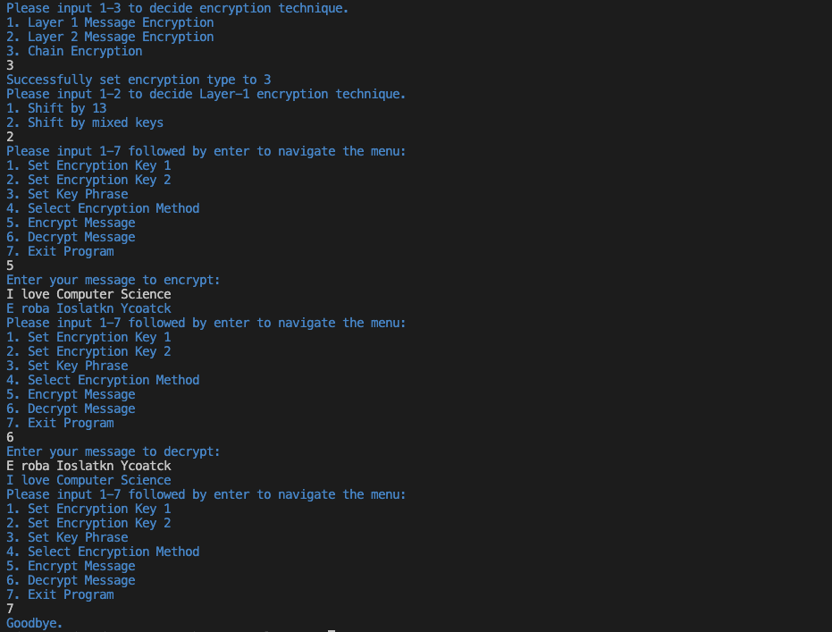
# Project 1 Overview <a name="overview"></a>

## File Headers <a name="fileheader"></a>

Before submitting your program on coderunner ensure that you include the below information at the top of your file

```cpp
// CSCI 1300 Spring 2024
// Author: FirstName LastName
// TA: TA Name
// Question #
```

Example

```cpp
// CSCI 1300 Spring 2024
// Author: John Smith
// TA: Nick
// Question 1
```

## Checklist <a name="checklist"></a>

Here is a checklist for completing the project:

1. Develop pseudocode, code solutions and test your functions in VS Code.
2. Use your solutions to complete the **Project 1 - Coderunner** assignment on Canvas (Modules → Week 7). Coderunner will be published on Thursday, February 22nd.
3. Complete the Project 1 quiz. This will be published on Monday, February 26th.
4. Sign up for a grading interview slot on Canvas. If you don't sign up or don't attend your interview then you will receive a 0 for the entire project. The interview scheduler will be made available by Friday, February 23rd.
   - During interview grading, the course staff will ask you about your implementation and conceptual questions related to the topics covered in this project. We will also review your code files for style, comments, and test cases.

## Grading Rubric <a name = "grading"></a>

Note: The use of global variables, arrays, vectors, pointers, references or any advanced topics not taught in lecture will result in a 0 on the entire project.

| **Criteria**      | Points |
| :---------------- | -----: |
| Question 1        |      5 |
| Question 2        |      5 |
| Question 3        |      5 |
| Question 4        |      5 |
| Question 5        |      5 |
| Question 6        |      5 |
| Question 7        |      5 |
| Question 8        |      5 |
| Question 9        |     20 |
| Grading Interview |     60 |
| Project 1 Quiz    |     30 |
| **Total**         |    150 |
