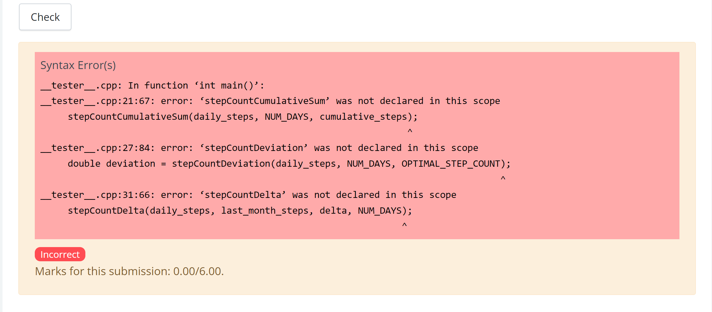
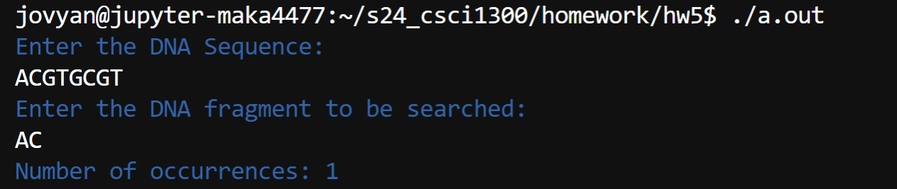
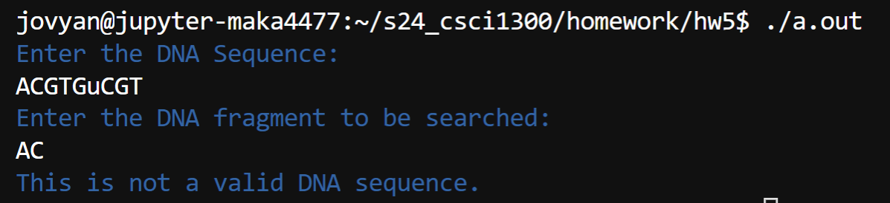
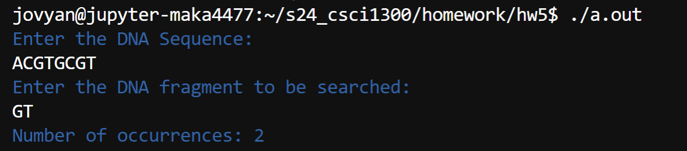

#### **CSCI 1300 CS1: Starting Computing: Homework 5**
#### **Naidu/Godley - Spring 2024**
#### **Due: Friday, March 8th by 5:00pm MST**

<br/>

# Table of contents
1. [Objectives](#objectives)
2. [Questions](#questions)
    1. [Question 1](#question1)
    2. [Question 2](#question2)
    3. [Question 3](#question3)
    4. [Question 4](#question4)
    5. [Question 5](#question5)
    6. [Question 6a](#question6a)
    7. [Question 6b](#question6b)
    8. [Question 7 (Extra Credit)](#question7)
3. [Overview](#overview)
    1. [Checklist](#checklist)
    2. [Grading Rubric](#grading)

# Objectives <a name="objectives"></a>

* Understand loops: while loops, for loops, do-while loops
* Understand how and when to use 1D and 2D arrays in C++
* Understand how to pass arrays to functions

# Questions <a name="questions"></a>

For questions that require the use of a function, coderunner will check if you have written the function correctly. DO NOT WRITE ALL YOUR CODE IN ```main()```! Your code will NOT compile if you do not have the correct function, see below for an example of what this could look like: <br>



**Warning:** You are not allowed to use global variables and stringstream for this homework.

If you are suspected of using an outside source to complete homework, you may be called for an in-person interview, and could risk losing points for the assignment.

## **Question 1 (4 points): Array Expedition** <a name="question1"></a>

*This question may require the use of arrays, if-else statements, and declaring and calling a function.*

Create the following functions using the provided specifications to populate the contents of the arrays.

*Function Specifications*:
<table>
<tr>
<td>

Function: <br>
```chemicalElements(string[], const int)```
</td>
<td>

```cpp
void chemicalElements(string elements[], const int ELEMENTS_SIZE)
```

</td>
</tr>
<tr>
<td> Purpose: </td>
<td>

Stores chemical elements "Hydrogen", "Helium", "Lithium", "Beryllium", "Boron", "Carbon", "Nitrogen", "Oxygen", "Fluorine", and "Neon" (in the same order) in the ```elements``` array.
</td>
</tr>
<tr>
<td> Parameters: </td>
<td>

string ```elements[]```  : Array of chemical elements  <br>
const int ```ELEMENTS_SIZE```  : size of the ```elements``` array; will be ```10``` for this function
</td>
</tr>
<tr>
<td> Return Value: </td>
<td>
    <ul><li> The function doesn't return any value. </li>
    <li> The function should not print anything. </li> </ul>

</td>
</tr>
<tr>
<td> Example: </td>
<td>

Note: This is only an example usage of the function; you need to develop your own main function to test this problem on VScode. <br> Make sure to print the contents of the array in the main function after the function call.

Sample Code:

```cpp
// Assume the proper libraries are included
// Assume the proper implementation of chemicalElements() is included

int main()
{
    // Initialize elements array and ELEMENTS_SIZE
    const int ELEMENTS_SIZE = 10;
    string elements[ELEMENTS_SIZE];
    chemicalElements(elements, ELEMENTS_SIZE);
    // We are printing the contents of the elements array here.
    return 0;
}
```

Sample Output:
```
Hydrogen
Helium
Lithium
Beryllium
Boron
Carbon
Nitrogen
Oxygen
Fluorine
Neon
```
</td>
</tr>
</table>


*Function Specifications*:
<table>
<tr>
<td>

Function: <br>
```squareRoots(double[], const int)```
</td>
<td>

```cpp
void squareRoots(double numbers[], const int NUMBERS_SIZE)
```

</td>
</tr>
<tr>
<td> Purpose: </td>
<td>

Stores square roots of numbers from 1 to 10 (both inclusive) in the ```numbers``` array.   <br>
You are required to use a loop to insert values into the array.
</td>
</tr>
<tr>
<td> Parameters: </td>
<td>

double ```numbers[]``` : Array of square root numbers  <br>
const int ```NUMBERS_SIZE``` : Size of the ```numbers``` array;  will be ```10``` for this function
</td>
</tr>
<tr>
<td> Return Value: </td>
<td>
    <ul><li>The function doesn't return any value. </li>
    <li>The function should not print anything.</li></ul>
</td>
</tr>
<tr>
<td> Example: </td>
<td>

Note: This is only an example usage of the function; you need to develop your own main function to test this problem on VScode.  <br> Make sure to print the contents of the array in the main function after the function call.

Sample Code:

```cpp
// Assume the proper libraries are included
// Assume the proper implementation of squareRoots() is included

int main()
{
    // Initialize numbers array and NUMBERS_SIZE
    const int NUMBERS_SIZE = 10;
    double numbers[NUMBERS_SIZE];
    squareRoots(numbers, NUMBERS_SIZE);
    // We are printing the contents of the numbers array here.
    return 0;
}
```

Sample Output:
```
1.000
1.414
1.732
2.000
2.236
2.449
2.646
2.828
3.000
3.162
```
</td>
</tr>
</table>


*Function Specifications*:
<table>
<tr>
<td>

Function: <br>
```fillNumbers(int[], const int)```
</td>
<td>

```cpp
void fillNumbers(int divisible_numbers[], const int DIVISIBLE_NUMBERS_SIZE)
```

</td>
</tr>
<tr>
<td> Purpose: </td>
<td>

Stores the numbers between 50 and 100 that are divisible by 7 in the ```divisible_numbers``` array.   <br>
You are required to use a loop to insert values into the array.
</td>
</tr>
<tr>
<td> Parameters: </td>
<td>

double ```divisible_numbers[]``` : Array of numbers divisible by 7 <br>
const int ```DIVISIBLE_NUMBERS_SIZE``` : Size of the ```divisible_numbers``` array; will be ```7``` for this function
</td>
</tr>
<tr>
<td> Return Value: </td>
<td>
    <ul><li>The function doesn't return any value. </li>
    <li>The function should not print anything.</li></ul>
</td>
</tr>
<tr>
<td> Example: </td>
<td>

Note: This is only an example usage of the function; you need to develop your own main function to test this problem on VScode.   <br> Make sure to print the contents of the array in the main function after the function call.

Sample Code:

```cpp
// Assume the proper libraries are included
// Assume the proper implementation of fillNumbers() is included

int main()
{
    // Initialize divisible_numbers array and DIVISIBLE_NUMBERS_SIZE
    const int DIVISIBLE_NUMBERS_SIZE = 7;
    int divisible_numbers[DIVISIBLE_NUMBERS_SIZE];
    fillNumbers(divisible_numbers, DIVISIBLE_NUMBERS_SIZE);
    // We are printing the contents of the divisible_numbers array here.
    return 0;
}
```

Sample Output:
```
56
63
70
77
84
91
98
```
</td>
</tr>
</table>


*Function Specifications*:
<table>
<tr>
<td>

Function: <br>
```fillLetters(char[], const int)```
</td>
<td>

```cpp
void fillLetters(char letters[], const int LETTERS_SIZE)
```

</td>
</tr>
<tr>
<td> Purpose: </td>
<td>

Stores all the uppercase and lowercase alphabets in the ```letters``` array in descending order, Z, z, Y, y, X, x, .... A, a. <br>
You are required to use a loop to insert values into the array. <br>
Hint: the ASCII table will be helpful here!

</td>
</tr>
<tr>
<td> Parameters: </td>
<td>

char ```letters[]``` : Array of uppercase and lowercase letters <br>
const int ```LETTERS_SIZE``` : Size of the ```letters``` array; will be ```52``` for this function
</td>
</tr>
<tr>
<td> Return Value: </td>
<td>
    <ul><li>The function doesn't return any value. </li>
    <li>The function should not print anything.</li></ul>
</td>
</tr>
<tr>
<td> Example: </td>
<td>

Note: This is only an example usage of the function; you need to develop your own main function to test this problem on VScode.   <br> Make sure to print the contents of the array in the main function after the function call.

Sample Code:

```cpp
// Assume the proper libraries are included
// Assume the proper implementation of fillLetters() is included

int main()
{
    // Initialize letters array and LETTERS_SIZE
    const int LETTERS_SIZE = 52;
    char letters[LETTERS_SIZE];
    fillLetters(letters, LETTERS_SIZE);
    // We are printing the contents of the letters array here.
    return 0;
}
```

Sample Output: <br>
<b>Note: Output truncated for brevity.</b>
```
Z
z
Y
y
X
x
.
.
.
B
b
A
a
```
</td>
</tr>
</table>

Develop and validate your solution in VS Code. Once you are happy with your solution, go to coderunner on Canvas and paste only ```chemicalElements()```, ```squareRoots()```, ```fillNumbers()```, ```fillLetters()``` functions into the answer box.

## **Question 2 (6 points): Fitness Statistics** <a name="question2"></a>

*This question may require the use of arrays, declaring and calling a function, and nested loops.*
<br>
<br>
Bob has been tracking his daily step count to maintain his fitness.
Help Bob analyze his findings by writing three functions: `stepCountCumulativeSum()`, `stepCountDeviation()`, and `stepCountDelta()`.
You may assume that the array will be non-empty.


*Function Specifications*:
<table>
<tr>
<td>

Function: <br>
```stepCountCumulativeSum(int[], const int, int[])```
</td>
<td>

```cpp
void stepCountCumulativeSum(int daily_steps[], const int NUM_DAYS, int cumulative_steps[])
```

</td>
</tr>
<tr>
<td> Purpose: </td>
<td>

Calculates the cumulative sum of the daily step counts and records the running total in the ```cumulative_steps``` array. The cumulative sum represents the total number of steps Bob has taken up to each respective day, providing a running total of his overall progress.

</td>
</tr>
<tr>
<td> Parameters: </td>
<td>

int ```daily_steps[]```: array of Bob's daily step count. <br>
const int ```NUM_DAYS```: Size of ```daily_steps``` array and ```cumulative_steps``` array <br>
int ```cumulative_steps[]```: Array to be filled with Bob's cumulative step count.
</td>
</tr>
<tr>
<td> Return Value: </td>
<td>
    <ul><li>The function doesn't return any value. </li>
    <li>The function should not print anything.</li></ul>
</td>
</tr>
<tr>
<td> Example: </td>
<td>

Note: This is only an example usage of the function; you need to develop your own main function to test this problem on VScode.    <br> Make sure to print the contents of the array in the main function after the function call.


Sample Code: <br>

```cpp
// Assume the proper libraries are included
// Assume the proper implementation of stepCountCumulativeSum() is included

int main()
{
    const int NUM_DAYS = 5;
    int daily_steps[NUM_DAYS] = {5000, 4000, 5000, 2000, 4000};
    int cumulative_steps[NUM_DAYS];
    stepCountCumulativeSum(daily_steps, NUM_DAYS, cumulative_steps);
    // We are printing the contents of the cumulative_steps array here.
    return 0;
}
```

The expected contents of the `cumulative_steps` array after the function call: <br>
```
5000
9000
14000
16000
20000
```
</td>
</tr>


</td>
</tr>

</table>

*Sample runs*: <br>
Refer to the example above for sample usage of the function.

<table>
<tr>
<td>

Example 1: <br>
</td>
<td>

Input for function call:

```cpp
const int NUM_DAYS = 3;
int daily_steps[NUM_DAYS] = {10000, 2000, 6000};
int cumulative_steps[NUM_DAYS];
```

The expected contents of the `cumulative_steps` array after the function call:
```cpp
10000
12000
18000
```

</td>
</tr>
<tr></tr>
<tr>
<td>
Example 2: <br>
</td>
<td>

Input for function call:
```cpp
const int NUM_DAYS = 4;
int daily_steps[NUM_DAYS] = {4000, 2000, 8000, 3000};
int cumulative_steps[NUM_DAYS];
```
The expected contents of the `cumulative_steps` array after the function call:
```cpp
4000
6000
14000
17000
```
</td>
</tr>
</table>


*Function Specifications*:
<table>
<tr>
<td>

Function: <br>
```stepCountDeviation(int[], const int, const int)```
</td>
<td>

```cpp
double stepCountDeviation(int daily_steps[], const int NUM_DAYS, const int OPTIMAL_STEP_COUNT)
```

</td>
</tr>
<tr>
<td> Purpose: </td>
<td>

Calculates the mean of daily step counts and returns the deviation <br>
```deviation =  mean - optimal step count```

</td>
</tr>
<tr>
<td> Parameters: </td>
<td>

int ```daily_steps[]```: array of Bob's daily step count. <br>
const int ```NUM_DAYS```: Size of ```daily_steps``` array <br>
const int ```OPTIMAL_STEP_COUNT```: Desired step count per day.
</td>
</tr>
<tr>
<td> Return Value: </td>
<td>

- ```double``` : The calculated deviation
- The function should not print anything.
</td>
</tr>
<tr>
<td> Example: </td>
<td>
Note: This is only an example usage of the function; you need to develop your own main function to test this problem on VScode.    <br> Make sure to print the result in the main function after the function call. <br><br>

Sample Code: <br>

```cpp
// Assume the proper libraries are included
// Assume the proper implementation of stepCountDeviation() is included

int main()
{
    const int NUM_DAYS = 5;
    int daily_steps[NUM_DAYS] = {5000, 4000, 5000, 2000, 4000};
    const int OPTIMAL_STEP_COUNT = 5000;
    double deviation = stepCountDeviation(daily_steps, NUM_DAYS, OPTIMAL_STEP_COUNT);
    // We are printing the deviation up to 3 decimal places
    cout << fixed << setprecision(3) << deviation << endl;
    return 0;
}
```

The expected value of `deviation` up to 3 decimal places: <br>
```
-1000.000
```

Explanation: <br>
```
mean = (5000 + 4000 + 5000 + 2000 + 4000)/5 = 4000
deviation = mean - OPTIMAL_STEP_COUNT = 4000 - 5000 = -1000
```
</td>
</tr>

</td>
</tr>

</table>

*Sample runs*: <br>
Refer to the example above for sample usage of the function.

<table>
<tr>
<td>

Example 1: <br>
</td>
<td>

Input for the function call:

```cpp
const int NUM_DAYS = 3;
int daily_steps[NUM_DAYS] = {10000, 2000, 6000};
const int OPTIMAL_STEP_COUNT = 5000;
```

The expected value of `deviation` up to 3 decimal places:
```cpp
1000.000
```

</td>
</tr>
<tr></tr>
<tr>
<td>
Example 2: <br>
</td>
<td>

Input for the function call:
```cpp
const int NUM_DAYS = 4;
int daily_steps[NUM_DAYS] = {4000, 2000, 8000, 3000};
const int OPTIMAL_STEP_COUNT = 750;
```
The expected value of `deviation` up to 3 decimal places:
```cpp
3500.000
```
</td>
</tr>
</table>


*Function Specifications*:
<table>
<tr>
<td>

Function: <br>
```stepCountDelta(int[], int[], int[], const int)```
</td>
<td>

```cpp
void stepCountDelta(int daily_steps[], int last_month_steps[] , int delta[], const int NUM_DAYS)
```

</td>
</tr>
<tr>
<td> Purpose: </td>
<td>

Computes the differences between the current and the last month's daily step counts and stores the results in the ```delta``` array.

Note: Assume the last month and the current month have the same number of days, i.e., the size of the arrays is equal to `NUM_DAYS`.

</td>
</tr>
<tr>
<td> Parameters: </td>
<td>

int ```daily_steps[]```: Array of Bob's current month's daily step count. <br>
int ```last_month_steps[]```: Array of Bob's last month's daily step count. <br>
int ```delta[]```: Array to store the differences between the current month's and the last month's daily step counts. <br>
const int ```NUM_DAYS```: Size of ```daily_steps``` array, ```last_month_steps``` array, and ```delta``` array.

</td>
</tr>
<tr>
<td> Return Value: </td>
<td>
    <ul><li>The function doesn't return any value. </li>
    <li>The function should not print anything.</li></ul>
</td>
</tr>
<tr>
<td> Example: </td>
<td>

Note: This is only an example usage of the function; you need to develop your own main function to test this problem on VScode.   <br>Make sure to print the contents of the array in the main function after the function call. <br>

Sample Code:

```cpp
// Assume the proper libraries are included
// Assume the proper implementation of stepCountDelta() is included
int main()
{
    const int NUM_DAYS = 5;
    int daily_steps[NUM_DAYS] = {5000, 4000, 5000, 2000, 4000};
    int last_month_steps[NUM_DAYS] = {4000, 5000, 5000, 1000, 7000};
    int delta[NUM_DAYS];
    stepCountDelta(daily_steps, last_month_steps, delta, NUM_DAYS);
    // We are printing the contents of the delta array here.
    return 0;
}
```

The expected contents of the `delta` array after the function call: <br>
```
1000
-1000
0
1000
-3000
```

</td>
</tr>

</td>
</tr>
</table>


*Sample runs*: <br>
Refer to the example above for sample usage of the function.

<table>
<tr>
<td>

Example 1: <br>
</td>
<td>

Input for the function call:

```cpp
const int NUM_DAYS = 3;
int daily_steps[NUM_DAYS] = {10000, 2000, 6000};
int last_month_steps[NUM_DAYS] = {5000, 3000, 8000};
int delta[NUM_DAYS];
```

The expected contents of the `delta` array after the function call:
```cpp
5000
-1000
-2000
```

</td>
</tr>
<tr></tr>
<tr>
<td>
Example 2: <br>
</td>
<td>

Input for the function call:
```cpp
const int NUM_DAYS = 4;
int daily_steps[NUM_DAYS] = {4000, 2000, 8000, 3000};
int last_month_steps[NUM_DAYS] = {5000, 3000, 8000, 6000};
int delta[NUM_DAYS];
```
The expected contents of the `delta` array after the function call:
```cpp
-1000
-1000
0
-3000
```
</td>
</tr>
</table>


Develop and validate your solution in VS Code. Once you are happy with your solution, go to coderunner on Canvas and paste only ```stepCountCumulativeSum()```, ```stepCountDeviation()```, ```stepCountDelta()``` functions into the answer box.


## Question 3 (7 points): DNA Searching<a name="question3"></a>
*This question may require the use of substring method, declaring and calling a function, and loops.*
<br>
<br>

DNA sequences are strings made of combinations of four letters: ```A```, ```C```,```G```, and ```T```. A substring refers to a string that is a continuous segment of a larger string; in the context of DNA, this would be a fragment of our DNA sequence.

Write a program that takes in a complete DNA sequence and finds the number of matches for a particular fragment in the sequence. Make sure to validate that the given sequence and fragment are valid DNA sequences -- i.e., they contain no letters aside from A, C, G, and T.

*Function Specifications*:

<table>
<tr>
<td>

Function: <br>
```patternSearch(string, string)```
</td>
<td>

```cpp
int patternSearch(string sequence, string fragment)
```

</td>
</tr>
<tr>
<td> Purpose: </td>
<td>

Counts the number of fragment matches found in a given DNA sequence.

</td>
</tr>
<tr>
<td> Parameters: </td>
<td>

string ```sequence```: The entire DNA sequence <br>
string ```fragment```: A DNA fragment whose occurrence is to be found in ```sequence```.

</td>
</tr>
<tr>
<td> Return Value: </td>
<td>

- ```int``` : The number of fragment matches found in the sequence
- The function should not print anything.
</td>
</tr>

<tr>
<td> Error Handling/Boundary Conditions: </td>
<td>

- Any characters other than ```A```, ```C```, ```G```, ```T``` in the sequence or the fragment are considered invalid.
- If the sequence or the fragment has invalid characters, return ```-1```. Use this return value to print ```This is not a valid DNA sequence.``` in the main function.
- All the inputs are uppercase and lowercase letters. No spaces or special characters are provided as inputs in coderunner.

</td>
</tr>
<tr></tr>
<tr>
<td> Example: </td>
<td>

Note: This is only an example usage of the function; you need to develop your own main function to fulfill the requirement for this problem. <br>Make sure to print the result in the main function after the function call. <br>

Sample Code: <br>

```cpp
// Assume the proper libraries are included
// Assume the proper implementation of patternSearch() is included

int main()
{
    string sequence = "ACGTGCGT";
    string fragment = "GT";
    int occurrences = patternSearch(sequence, fragment);
    // We are printing the result based on the return value of occurrences here.
    return 0;
}
```

Sample Output: <br>
```
Number of occurrences: 2
```


</td>
</tr>
</td>
</tr>
</table>

*Sample runs:* (Blue is program output, and white is user input) <br>

**Sample run 1**



**Sample run 2**



**Sample run 3**




Develop and validate your solution in VS Code. Once you are happy with your solution, go to coderunner on Canvas and paste the **entire program** into the answer box!


## **Question 4 (9 points): Best Time to Buy and Sell a House** <a name="question4"></a>

*This question may require the use of arrays, if-else statements, declaring and calling a function, and  **nested loops.***

Flipping is a real estate strategy that involves buying homes and selling them for a profit in a short period of time.
You want to maximize your profit by choosing a single day to buy a house and choosing a different day in the future to sell that house.

*Function Specifications*:

<table>
<tr>
<td>

Function: <br>
```maxProfit(int[], const int)```
</td>
<td>

```cpp
int maxProfit(int prices[], const int NUM_MONTHS)
```

</td>
</tr>
<tr>
<td> Purpose: </td>
<td>

Find the maximum profit achieved from buying and selling a house.

</td>
</tr>
<tr>
<td> Parameters: </td>
<td>

int ```prices[]```: Array of prices of the house every month <br>
const int ```NUM_MONTHS```: The size of ```prices``` array

</td>
</tr>
<tr>
<td> Return Value: </td>
<td>

- ```int```: The maximum profit achieved through one house flip.
- The function should not print anything.
</td>
</tr>

<tr>
<td> Error Handling/Boundary Conditions: </td>
<td>

Return ```0``` if no profit can be achieved.

</td>
</tr>
<tr></tr>


<tr>
<td> Example: </td>
<td>
Note: This is only an example usage of the function; you need to develop your own main function to fulfill the requirement for this problem. <br>Make sure to print the result in the main function after the function call. <br><br>

Sample Code: <br>

```cpp
// Assume the proper libraries are included
// Assume the proper implementation of maxProfit() is included

int main()
{
    const int NUM_MONTHS = 6;
    int prices[NUM_MONTHS] = {700000, 100000, 500000, 300000, 600000, 400000};
    int profit = maxProfit(prices, NUM_MONTHS);
    cout << "Maximum profit: " << profit << endl;
    return 0;
}
```

Sample Output: <br>
```
Maximum Profit: 500000
```

Explanation: <br>
```
Buy on month 2 (price = 100000) and sell on month 5 (price = 600000), profit = 600000-100000 = 500000.
Note: Buying on month 2 and selling on month 1 is not allowed because you must buy before you sell.

```

</td>
</tr>


</td>
</tr>

</table>

*Sample runs:* <br>
Refer to the example above for sample usage of the function.
<table>
<tr>
<td> Example 1: </td>
<td>
Input for the function call:

```cpp
const int NUM_MONTHS = 5;
int prices[NUM_MONTHS] = {700000, 600000, 400000, 300000, 100000};
```

Output: <br>
```
Maximum Profit: 0
```

Explanation: <br>
```
In this case, no profitable transactions are possible and the max profit = 0.
```
</td>
</tr>

<tr></tr>

<tr>
<td> Example 2: </td>
<td>
Input for the function call:

```cpp
const int NUM_MONTHS = 6;
int prices[NUM_MONTHS] = {700000, 300000, 400000, 100000, 400000, 100000};
```

Output: <br>
```
Maximum Profit: 300000
```

Explanation: <br>
```
Buy on month 4 (price = 100000) and sell on month 5 (price = 400000), profit = 400000-100000 = 300000.
```

</td>
</tr>
</table>


Develop and validate your solution in VS Code. Once you are happy with your solution, go to coderunner on Canvas and paste only `maxProfit()` function into the answer box.

## Question 5 (9 points): Splitting a String <a name="question5"></a>
*This question may require the use of arrays, if-else statements, declaring and calling a function, and loops.*

When you are processing data, it’s useful to break up a text string into pieces using a delimiter. Write a function split() that takes a string, splits it at every occurrence of a delimiter, and then populates an array of strings with the split pieces, up to the provided maximum number of pieces.


For this question:

* No input will have delimiters at the beginning or the end of the string. (Eg: ",apple, orange" OR "apple, orange,")
* No input will have multiple delimiters added consecutively. (Eg: "apple,,,orange,banana")


*Function Specifications*:

<table>
<tr>
<td>

Function: <br>
```split(string, char, string[], const int)```
</td>
<td>

```cpp
int split(string input_string, char separator, string arr[], const int ARR_SIZE)
```

</td>
</tr>
<tr>
<td> Purpose: </td>
<td>

Break a text string into pieces using the given delimiter and populate each piece in the array.

</td>
</tr>
<tr>
<td> Parameters: </td>
<td>

string ```input_string```: The text string containing data separated by a delimiter <br>
char ```separator```: The delimiter marking the location where the string should be split up <br>
string ```arr[]```: The array that will be used to store the input text string's individual string pieces <br>
const int ```ARR_SIZE```: The number of elements that can be stored in the array

</td>
</tr>
<tr>
<td> Return Value: </td>
<td>

- ```int```: The number of pieces the input text string is split into <br>
- Populate ```arr[]``` with the all the elements.
- The function does not print anything.
</td>
</tr>
<tr>
<td> Error Handling/Boundary Conditions: </td>
<td>

* Return ```1``` if the delimiter character is not found. Place the entire string in the array as the first element.
* Return ```-1``` if the string is split into more pieces than the size of the array. Fill the array with as many pieces of the split string as possible.
* Return ```0``` if an empty string is provided.

</td>
</tr>
<tr></tr>
<tr>
<td> Example: </td>
<td>

Note: This is only an example usage of the function; you need to develop your own main function to test this problem on VScode. <br> Make sure to print the contents of the array in the main function after the function call.

Sample Code: <br>

```cpp
// Assume the proper libraries are included
// Assume the proper implementation of split() is included

void printArray(string arr[], const int NUM_ELEMENTS)
{
    for (int i=0; i < NUM_ELEMENTS; i++)
    {
        cout << "arr["<< i << "]:" << arr[i] << endl;
    }   
}

int main()
{
    string input_string = "ABCDEFG";
    char separator = ' ';
    const int ARR_SIZE = 3;
    string arr[ARR_SIZE];
    // num_splits is the value returned by split
    int num_splits = split(input_string, separator, arr, ARR_SIZE);
    cout << "Function returned value: " << num_splits << endl;
    if(num_splits != -1)
    {
        printArray(arr, num_splits);   
    }
    else
    {
        printArray(arr, ARR_SIZE);
    }
    return 0;
}
```

Sample Output: <br>
```
Function returned value: 1
arr[0]:ABCDEFG
```

</td>
</tr>
</table>

*Sample runs:* <br>
Refer to the example above for sample usage of the function.
<table>

<tr>
<td> Example 1: </td>
<td>
Input for the function call: <br>

```cpp
string input_string = "RST,UVW,XYZ";
char separator = ',';
const int ARR_SIZE = 3;
string arr[ARR_SIZE];
```

Output: <br>
```
Function returned value: 3
arr[0]:RST
arr[1]:UVW
arr[2]:XYZ
```

</td>
</tr>
<tr></tr>

<tr>
<td> Example 2: </td>
<td>
Input for the function call: <br>

```cpp
string input_string = "Bangkok,Berlin,Birmingham,Bogota,Busan,Baton Rouge,Beaumont,Boise,Budapest";
char separator = ',';
const int ARR_SIZE = 5;
string arr[ARR_SIZE];
```

Sample Output: <br>
```
Function returned value: -1
arr[0]:Bangkok
arr[1]:Berlin
arr[2]:Birmingham
arr[3]:Bogota
arr[4]:Busan
```

</td>
</tr>
</table>

Develop and validate your solution in VS Code. Once you are happy with your solution, go to coderunner on Canvas and paste only the ```split()``` function into the answer box.

## **Question 6a (6 points): Super Bowl LVIII Watch Party** <a name="question6a"></a>

*This question may require the use of **2D arrays**, if-else statements, strings, nested loops, declaring and calling a function, and processing user input.*
<br>

Your family loves the Super Bowl. Every year, your family hosts three watch parties: your grandparents have one at their house, your parents have one at their house, and your uncle has one at his house. You and your friends all want to watch the event together, but you are all in different locations. You want to figure out how far each individual is from each of the watch parties. You are given two arrays of coordinates; one array shows the city coordinates of the watch parties, and one shows the coordinates of your friends. <br>

For example,

| **Watch Party City Locations** | **x** | **y** |
|---|----|---|
| City 1 | 2  | 10 |
| City 2 | 5  | 8 |
| City 3 | 1  | 2 |

| **Individual Locations** | **x** | **y** |
|---|----|---|
| Person 1 | 2  | 10 |
| Person 2 | 2  | 5 |
| Person 3 | 8  | 4 |
| Person 4 | 5  | 8 |
| Person 5 | 1  | 2 |

You want to fill in a table of distances between the watch parties and your friends. This requires comparing the location of a particular watch party ($p2$ in the below equation) with the location of a particular friend ($p1$ in the below equation): <br>
$distance(p1, p2) = \sqrt{(x2 - x1)^2 + (y2 - y1)^2}$

These distances will then be used to fill a table of all the distances. From the above input coordinates, the distance matrix obtained is:

|  | City 1 | City 2 | City 3 |
|---|----|---|---|
| **Person 1** | 0.00  | 3.61 | 8.06
| **Person 2** | 5.00  | 4.24 | 3.16
| **Person 3** | 8.49  | 5.00 | 7.28
| **Person 4** | 3.61  | 0.00 | 7.21
| **Person 5** | 8.06  | 7.21 | 0.00


The first value is calculated as, $d(Person 1, City 1) = \sqrt{(2 - 2)^2 + (10 - 10)^2} = 0.00$

The second value is calculated as, $d(Person 1, City 2) = \sqrt{(5 - 2)^2 + (8 - 10)^2} = 3.61$ and so on.

To this end, you will write a C++ function to automatically fill in this table for you.

*Function Specifications*:

<table>
<tr>
<td>

Function: <br>
```calculateDistanceMatrix(double[], double[], double[],  const int,  const int,  const int,  const int)```
</td>
<td>

```cpp
void calculateDistanceMatrix(double distance[][3], double individual_locations[][2], double city_locations[][2], const int I_ROWS,  const int I_COLS,  const int C_ROWS,  const int C_COLS)
```

</td>
</tr>
<tr>
<td> Purpose: </td>
<td>

Constructs the distance matrix using individual locations and city locations.
<!---
<br><br>

$distance(p1, p2) = \sqrt{(x2 - x1)^2 + (y2 - y1)^2}$
-->

</td>
</tr>
<tr>
<td> Parameters: </td>
<td>

double ```distance[][3]```: Empty distance matrix of size ```I_ROWS x C_ROWS```. <br>
double ```individual_locations[][2]```: Coordinates for clues of size ```I_ROWS x I_COLS```.<br>
double ```city_locations[][2]```: Coordinates for regions of size ```C_ROWS x C_COLS```. <br>
const int ```I_ROWS```: Number of rows for ```individual_locations[][]```. <br>
const int ```I_COLS```: Number of columns for ```individual_locations[][]```, will be 2 for this question. <br>
const int ```C_ROWS```: Number of rows for ```city_locations[][]```, will be 3 for this question. <br>
const int ```C_COLS```: Number of columns for ```city_locations[][]```, will be 2 for this question. <br>
</td>
</tr>
<tr>
<td> Return Value: </td>
<td>
        <ul><li>The function doesn't return any value. </li>
    <li>The function should not print anything.</li>
        <li>The function fills out the distance matrix using individual locations and city locations. </li></ul>
</td>
</tr>
<tr>
<td> Example: </td>
<td>
Sample Code: <br>

```cpp
// Assume the proper libraries are included
// Assume the proper implementation of calculateDistanceMatrix() is included

int main()
{
    const int I_ROWS = 5;
    const int I_COLS = 2;
    const int C_ROWS = 3;
    const int C_COLS = 2;
    double individual_locations[I_ROWS][I_COLS] = {{2, 10}, {2, 5}, {8, 4}, {5, 8}, {1, 2}};
    double city_locations[C_ROWS][C_COLS] = {{2, 10}, {5, 8}, {1, 2}};
    double distance[I_ROWS][C_ROWS];
    calculateDistanceMatrix(distance, individual_locations, city_locations, I_ROWS, I_COLS, C_ROWS, C_COLS);
    for (int i = 0; i < I_ROWS; i++)
    {
        for (int j = 0; j < C_ROWS; j++)
        {
            cout << fixed << setprecision(2) << distance[i][j] << " ";
        }
        cout << endl;
    }
    return 0;
}
```

The expected content of the `distance` array after the function call: <br>
```
0.00	3.61	8.06
5.00	4.24	3.16
8.49	5.00	7.28
3.61	0.00	7.21
8.06	7.21	0.00
```

</td>
</tr>
</table>

*Sample runs*: <br>
Refer to the example above for sample usage of the function.
<table>

<tr>
<td> Example 1: </td>
<td>
Input for the function call:

```cpp
const int I_ROWS = 3;
const int I_COLS = 2;
const int C_ROWS = 3;
const int C_COLS = 2;
double individual_locations[I_ROWS][I_COLS] = {{2, 10}, {8, 4}, {5, 8}};
double city_locations[C_ROWS][C_COLS] = {{2, 10}, {5, 8}, {1, 2}};
double distance[I_ROWS][C_ROWS];
```

The expected contents of the `distance` array after the function call: <br>
```
0.00 3.61 8.06
8.49 5.00 7.28
3.61 0.00 7.21
```

</td>
</tr>
<tr></tr>
<tr>
<td> Example 2: </td>
<td>
Input for the function call: <br>

```cpp
const int I_ROWS = 4;
const int I_COLS = 2;
const int C_ROWS = 3;
const int C_COLS = 2;
double individual_locations[I_ROWS][I_COLS] = {{2, 1}, {2, 3}, {4, 4}, {5, 8}};
double city_locations[C_ROWS][C_COLS] = {{1, 2}, {3, 6}, {5, 8}};
double distance[I_ROWS][C_ROWS];
```

The expected contents of the `distance` array after the function call: <br>
```
1.41 5.10 7.62
1.41 3.16 5.83
3.61 2.24 4.12
7.21 2.83 0.00
```

</td>
</tr>

<tr></tr>
<tr>
<td> Example 3: </td>
<td>
Input for the function call: <br>

```cpp
const int I_ROWS = 5;
const int I_COLS = 2;
const int C_ROWS = 3;
const int C_COLS = 2;
double individual_locations[I_ROWS][I_COLS] = {{2, 10}, {2, 5}, {8, 4}, {5, 8}, {1, 2}};
double city_locations[C_ROWS][C_COLS] = {{0, 0}, {5, -1}, {-1, -2}};
double distance[I_ROWS][C_ROWS];
```

The expected contents of the `distance` array after the function call: <br>
```
10.20 11.40 12.37
5.39 6.71 7.62
8.94 5.83 10.82
9.43 9.00 11.66
2.24 5.00 4.47
```

</td>
</tr>

</table>


Develop and validate your solution in VS Code. Once you are happy with your solution, go to coderunner on Canvas and paste only the ```calculateDistanceMatrix()``` function into the answer box.

## **Question 6b (9 points): Super Bowl LVIII Watch Party Continued** <a name="question6b"></a>
*This question may require the use of **1D & 2D arrays**, if-else statements, strings, nested loops, declaring and calling a function, and processing user input.*
<br>

There's a snowstorm in your area; therefore, you can only reach a watch party by driving. Due to these constraints, you and your friends decided to go to the nearest watch party individually. Let's use the `distance` matrix we filled in the question ```5a```. For each row/person, find the city that is closest to that individual. <br>

For example,

Given the below distance matrix: <br>
|  | City 1 | City 2 | City 3 |
|---|----|---|---|
| **Person 1** | 0.00  | 3.61 | 8.06
| **Person 2** | 5.00  | 4.24 | 3.16
| **Person 3** | 8.49  | 5.00 | 7.28
| **Person 4** | 3.61  | 0.00 | 7.21
| **Person 5** | 8.06  | 7.21 | 0.00

The minimum value for:

**row/person 1** is **0.00** and its corresponding city number is **1**.

**row/person 2** is **3.16** and its corresponding city number is **3**, and so on.

|  | City 1 | City 2 | City 3 | Closest City|
|---|----|---|---|---|
| **Person 1** | 0.00  | 3.61 | 8.06 | 1
| **Person 2** | 5.00  | 4.24 | 3.16 | 3
| **Person 3** | 8.49  | 5.00 | 7.28 | 2
| **Person 4** | 3.61  | 0.00 | 7.21 | 2
| **Person 5** | 8.06  | 7.21 | 0.00 | 3

**Note:** This table is only for explanation purposes. The values of the closest city are stored in a separate array.

*Function Specifications*:

<table>
<tr>
<td>

Function: <br>
```findClosestCity(double[], int[], const int,  const int)```
</td>
<td>

```cpp
void findClosestCity(double distance[][3], int closest_cities[],  const int DISTANCE_ROWS,  const int DISTANCE_COLS)
```

</td>
</tr>
<tr>
<td> Purpose: </td>
<td>

Finds the closest city for each person.

Note: You may assume that there is only 1 minimum value in each row.

</td>
</tr>
<tr>
<td> Parameters: </td>
<td>

double ```distance[][3]```: Distance matrix of size ```DISTANCE_ROWS x DISTANCE_COLS``` <br>
int ```closest_cities[]```: Empty array of size ```DISTANCE_ROWS``` <br>
const int ```DISTANCE_ROWS```: Number of rows for ```distance[][]``` <br>
const int ```DISTANCE_COLS```: Number of columns for ```distance[][]```, will be 3 for this question. <br>


</td>
</tr>
<tr>
<td> Return Value: </td>
<td>
        <ul><li>The function doesn't return any value. </li>
    <li>The function should not print anything.</li>
        <li>The function fills out the closest_cities array based on the values in the distance matrix.</li></ul>
</td>
</tr>
<tr>
<td> Example: </td>
<td>
Sample Code: <br>

```cpp
// Assume the proper libraries are included
// Assume the proper implementation of findClosestCity() is included

int main()
{
    const int DISTANCE_ROWS = 5;
    const int DISTANCE_COLS = 3;
    int closest_cities[DISTANCE_ROWS];
    double distance[DISTANCE_ROWS][DISTANCE_COLS] = {{0.00, 3.61, 8.06}, {5.00, 4.24, 3.16}, {8.49, 5.00, 7.28}, {3.61, 0.00, 7.21}, {8.06, 7.21, 0.00}};
    findClosestCity(distance, closest_cities, DISTANCE_ROWS, DISTANCE_COLS);

    // We are printing the contents of the closest_cities array here.
    for (int i = 0; i < DISTANCE_ROWS; i++)
    {
            cout << closest_cities[i] << endl;
    }
    return 0;
}
```

The expected contents of the `closest_cities` array after the function call: <br>
```
1
3
2
2
3
```
</td>

</tr>
</table>


*Sample runs*: <br>
Refer to the example above for sample usage of the function.
<table>


<tr>
<td> Example 1: </td>
<td>
Input for the function call: <br>

```cpp
const int DISTANCE_ROWS = 3;
const int DISTANCE_COLS = 3;
double distance[DISTANCE_ROWS][DISTANCE_COLS] = {{0.00, 3.61, 8.06}, {8.49, 5.00, 7.28}, {3.61, 0.00, 7.21}};
int closest_cities[DISTANCE_ROWS];
```

The expected contents of the `closest_cities` array after the function call: <br>
```
1
2
2
```

</td>

</tr>
<tr></tr>

<tr>
<td> Example 2: </td>
<td>
Input for the function call:

```cpp
const int DISTANCE_ROWS = 4;
const int DISTANCE_COLS = 3;
double distance[DISTANCE_ROWS][DISTANCE_COLS] = {{1.41, 5.10, 7.62}, {1.41, 3.16, 5.83}, {3.61, 2.24, 4.12}, {7.21, 2.83, 0.00}};
int closest_cities[DISTANCE_ROWS];
```

The expected contents of the `closest_cities` array after the function call: <br>
```
1
1
2
3
```

</td>

</tr>

</table>


Develop and validate your solution in VS Code. Once you are happy with your solution, go to coderunner on Canvas and paste only the ```findClosestCity()```, ```calculateDistanceMatrix()``` functions into the answer box.

## Question 7 (5 points): Print alphabetical triangle (Extra Credit) <a name="question7"></a>

*This question may require the use of nested loops, if-else statements, declaring and calling a function, and processing user input.*
<br><br>
Write a program that takes an integer as the height of the triangle and prints an inverted alphabetical triangle using lowercase English alphabets.

*Function Specifications*:

<table>
<tr>
<td>

Function: <br>
```printTriangle(int)```
</td>
<td>

```cpp
void printTriangle(int height)
```

</td>
</tr>
<tr>
<td> Purpose: </td>
<td>

Prints an inverted alphabetical triangle using the height provided.

</td>
</tr>
<tr>
<td> Parameters: </td>
<td>

int ```height```: Height of the triangle

</td>
</tr>
<tr>
<td> Return Value: </td>
<td>

- The function does not return any value.
- The function should print an inverted alphabetical triangle.
</td>
</tr>

<tr>
<td> Error Handling/Boundary Conditions: </td>
<td>

If the height provided is less than ```1```, print ```Invalid input.```

</td>
</tr>
<tr></tr>


<tr>
<td> Example: </td>
<td>
Note: This is only an example usage of the function; you need to develop your own main function to fulfill the requirement for this problem. <br><br>

Sample Code: <br>

```cpp
// Assume the proper libraries are included
// Assume the proper implementation of printTriangle() is included

int main()
{
    int height = 4;
    printTriangle(height);
    return 0;
}
```

Sample Output: <br>
```
abcd
efg
hi
j
```

</td>
</tr>


</td>
</tr>

</table>

*Sample runs:* <br>
Refer to the example above for sample usage of the function.
<table>
<tr>
<td> Example 1: </td>
<td>
Input for the function call: <br>

```cpp
int height = 11;
```

Output: <br>
```
abcdefghijk
lmnopqrstu
vwxyzabcd
efghijkl
mnopqrs
tuvwxy
zabcd
efgh
ijk
lm
n
```

</td>
</tr>

<tr></tr>

<tr>
<td> Example 2: </td>
<td>
Input for the function call: <br>

```cpp
int height = -19;
```

Output: <br>
```
Invalid input.
```

</td>
</tr>
</table>


Develop and validate your solution in VS Code. Once you are happy with your solution, go to coderunner on Canvas and paste only `printTriangle()` function into the answer box.


# Overview  <a name="overview"></a>

## Checklist <a name="checklist"></a>
Here is a checklist for submitting the assignment:
1. Use your solutions developed in VS Code to complete the **Homework 5 - Coderunner** assignment on Canvas (Modules → Week 8).
2. Complete the Homework 5 Quiz. This will be published on Sunday, March 3rd.
3. For 5 extra-credit points, submit your solution for question 7 on the **Homework 5: coderunner (Extra Credit)** by 5:00 pm on Friday, 8th March

## Grading Rubric <a name="grading"></a>
Note: Global variables and stringstreams are not permitted in this homework. The use of global variables will result in a 0 on the entire homework.

| **Criteria**                                | **Points** |
| ------------------------------------------- | ---------- |
| Question 1                                  | 4          |
| Question 2                                  | 6          |
| Question 3                                  | 7          |
| Question 4                                  | 9          |
| Question 5                                  | 9          |
| Question 6a                                 | 6         |
| Question 6b                                  | 9         |
| Question 7                                  | 5          |
| Homework 5 Quiz                             | 20         |
| Total                                       | 70       |
